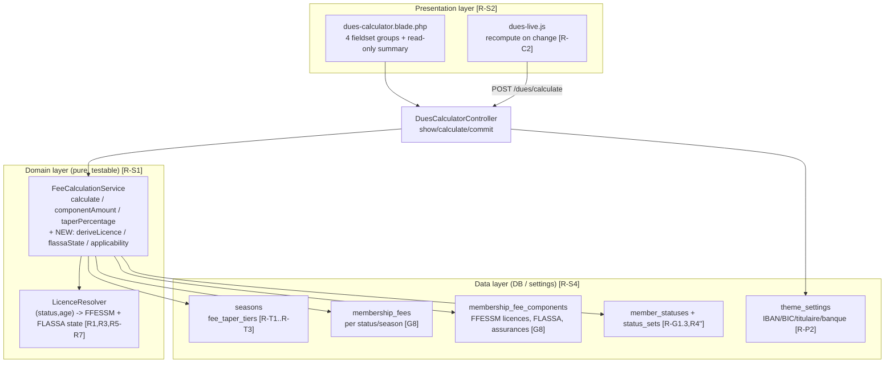
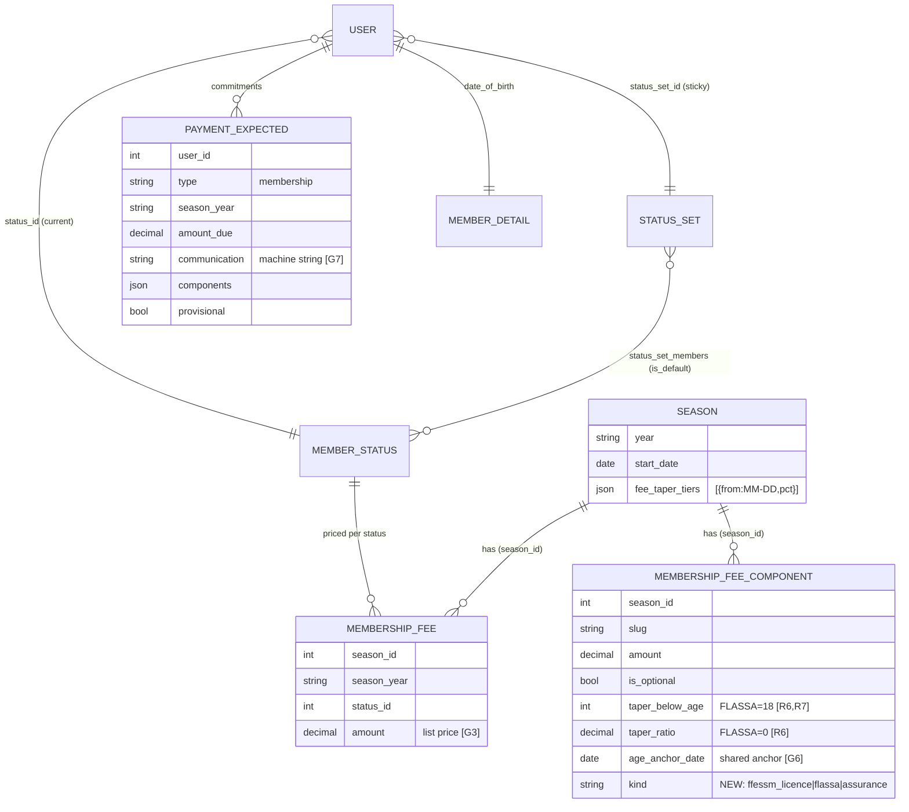
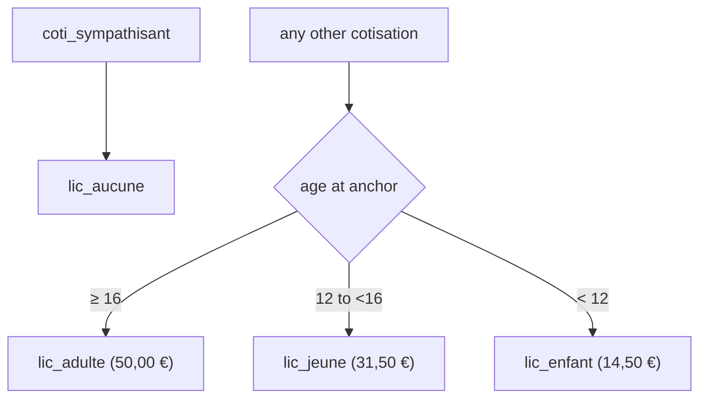
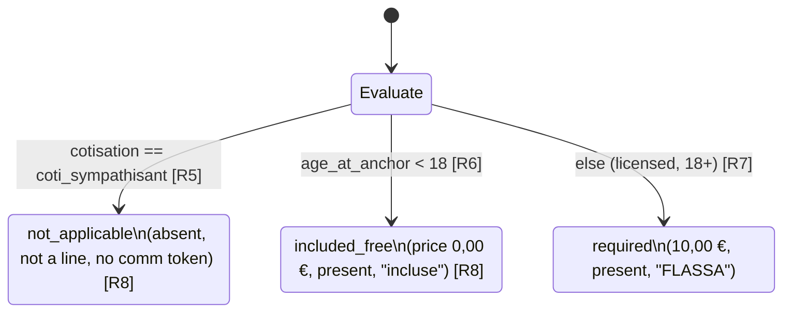
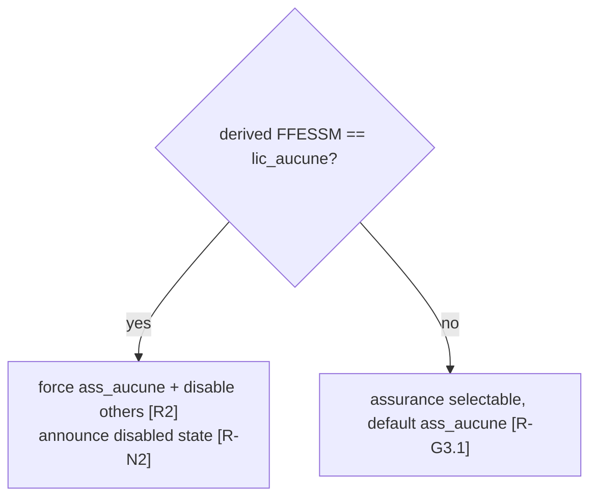
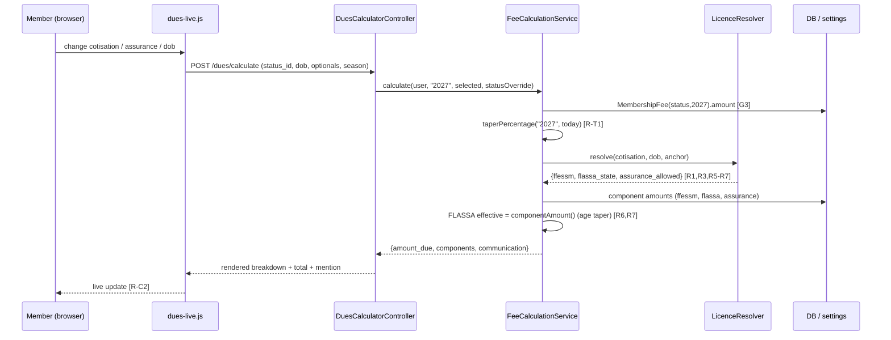

# Design — CEP Membership Dues Calculation & Bank-Transfer Preparation Screen

Traceability: every design decision below cites the requirement(s) it satisfies
from `requirements.md` (e.g. `[R1]`, `[R-T1]`, `[G7]`). Season under design:
**2027** (`Season::currentDuesYear()` = "2027" as of today) `[G3]`.

Stack: Laravel 12 / PHP 8.3 / Eloquent / Blade + Bootstrap, server-rendered with
a progressive-enhancement JS layer for live recompute `[G10, R-N2]`.

---

## 1. Layered architecture (separation of concerns)

Three layers, matching `[R-S1, R-S2, R-S3, R-S4]`:

Design decision: the licence/FLASSA derivation `[R1, R3, R5–R7]` currently does
not exist (licences are generic optional checkboxes). It is introduced as a pure
`LicenceResolver` collaborator of `FeeCalculationService`, so the four groups,
R1–R8 and the total are testable without UI `[R-S1, G9]`.

---

## 2. Data model

### 2.1 Entity relationships

### 2.2 Existing fields reused (no migration)

- `seasons.fee_taper_tiers` (JSON `[{from:"MM-DD",pct:N}]`) `[R-T1..R-T3]`.
- `membership_fees(season_year, season_id, status_id, amount, label)` — the six
  cotisation list prices per status `[G3, G8]`.
- `membership_fee_components(slug, amount, is_optional, taper_below_age,
  taper_ratio, age_anchor_date, sort_order)` — FFESSM licences, FLASSA,
  assurances `[G8]`.
- `payment_expected(amount_due, communication, components, provisional)` `[G7]`.
- `member_statuses`, `status_sets`, `status_set_members(is_default)`,
  `users.status_set_id` `[R-G1.3, R4'']`.
- `theme_settings`: `club_iban`, `club_bic`, `club_full_name` (titulaire),
  `club_short_code` (communication prefix), `fee_taper_reference_date`
  (absolute admin freeze), and NEW `dues_cutoff_grace_days` (integer grace
  offset, default 0) `[R-P2, G1]`.

### 2.3 New field (one migration)

`membership_fee_components.kind` — enum-like string
(`ffessm_licence` | `flassa` | `assurance` | `other`), nullable, default
`other`. Rationale: the resolver must tell FFESSM-licence rows, the FLASSA row,
and assurance rows apart to enforce R1/R2/R3/R5–R7 and to place FLASSA in the
licence block `[G5]`, without hard-coding slugs in domain code `[R-S4]`. Column
addition preserves all existing attributes `[Laravel v11 migration rule]`.

Design decision (traced `[R8, G9]`): FFESSM licences and FLASSA are modelled as
`membership_fee_components` with `is_optional = false` and a `kind`, NOT as
free-form optional checkboxes. Their *selection* is derived, never user-chosen
`[R-G2.1, R-G2.2, R-G4.1, R-G4.2]`.

---

## 3. Seed data for season 2027 `[G8]`

### 3.1 Cotisations → `membership_fees` (keyed by status, season_year "2027")

| status slug (set)        | cotisation option    | amount `[G3]` |
|--------------------------|----------------------|---------------|
| `fonctionnaire`          | `coti_fonctionnaire` | 120,00 €      |
| `externe` / `actif`      | `coti_externe`       | 130,00 €      |
| `junior` (16-17)         | `coti_jeune_16_17`   | 55,00 €       |
| `junior`/`enfant`(12-15) | `coti_jeune_12_15`   | 55,00 €       |
| `enfant` (<12)           | `coti_enfant`        | 55,00 €       |
| `sympathisant`           | `coti_sympathisant`  | 30,00 €       |

The three young-age cotisations all price at 55 €; the distinction (16-17 /
12-15 / <12) drives the derived FFESSM licence, not the price `[R1]`. Mapping the
three age bands onto seeded statuses is refined in `tasks.md` (see task T2).

### 3.2 FFESSM licence components (`kind = ffessm_licence`, `is_optional = false`)

Official 2026/2027 tariff and bands `[R1]`:

| slug         | label (FR)                              | amount   | age band            |
|--------------|-----------------------------------------|----------|---------------------|
| `lic_adulte` | Licence FFESSM adulte                   | 50,00 €  | 16+                 |
| `lic_jeune`  | Licence FFESSM Jeune (12 à moins de 16) | 31,50 €  | 12 à moins de 16    |
| `lic_enfant` | Licence FFESSM Enfant                   | 14,50 €  | moins de 12         |
| `lic_aucune` | Pas de licence (sympathisant)           | 0,00 €   | —                   |

### 3.3 FLASSA component (`kind = flassa`, `is_optional = false`)

| slug     | label (FR)     | amount  | taper_below_age | taper_ratio | age_anchor_date        |
|----------|----------------|---------|-----------------|-------------|------------------------|
| `flassa` | Licence FLASSA | 10,00 € | 18 `[R7]`       | 0 `[R6]`    | = prise-de-licence `[G6]` |

`age_anchor_date` MUST equal the cotisation age gate anchor `[G6]` so a 17-year-
old (`coti_jeune_16_17`) is `included_free` on every path.

### 3.4 Assurance components (`kind = assurance`, `is_optional = true`)

| slug             | label (FR)             | amount   |
|------------------|------------------------|----------|
| `ass_loisir1`    | Assurance Loisir 1     | 25,00 €  |
| `ass_loisir1top` | Assurance Loisir 1 Top | 48,00 €  |
| `ass_loisir2`    | Assurance Loisir 2     | 30,00 €  |
| `ass_loisir2top` | Assurance Loisir 2 Top | 59,50 €  |
| `ass_loisir3`    | Assurance Loisir 3     | 51,00 €  |
| `ass_loisir3top` | Assurance Loisir 3 Top | 99,00 €  |
| `ass_aucune`     | Pas d'Assurance Loisir | 0,00 €   |

Amounts are advisory; `[G3]` says the DB latest value is authoritative — the
seeder writes these as the 2027 baseline and future edits win.

---

## 4. Derivation & state rules (domain logic)

### 4.1 LicenceResolver — inputs and outputs

Input: `cotisation slug`, `date_of_birth`, `age_anchor_date` (season 2027 prise-
de-licence anchor). Output: `{ ffessm: slug, flassa_state: enum, assurance_allowed: bool }`.
Both the FFESSM band (via the age bands of R1) and the FLASSA state (R5–R7) are
computed from age at the shared anchor `[G6]`.

FFESSM derivation `[R1]` — derived from **age at the shared anchor**, not from
the cotisation label, using the federation bands (Jeune = 12 to under-16, Adulte
= 16+). 16+ divers get the *adulte* licence (full underwater permissions, pending
parental approval) `[R1-note]`:

Because the band is age-driven, the club `coti_jeune_12_15` label ("12 to
under-16") and the federation Jeune band stay aligned; a just-turned-16 member
correctly gets `lic_adulte`, and age-vs-status validation flags any DOB/label
inconsistency `[R1-caveat, R-N3]`.

### 4.2 FLASSA three-state derivation `[R5, R6, R7, R8]`

`applicable == false` (not_applicable) and `effective_price == 0`
(included_free) are two distinct states with distinct downstream behaviour and
are never collapsed `[R8]`.

### 4.3 Assurance gating `[R2, R3]`

### 4.4 Applicability matrix `[R3]`

| status         | Cotisation | Licence FFESSM | FLASSA          | Assurance          |
|----------------|------------|----------------|-----------------|--------------------|
| non-sympath.   | required   | required       | required/incl.  | optional           |
| sympathisant   | required   | `lic_aucune`   | `not_applicable`| forced `ass_aucune`|

---

## 5. Taper design `[R-T1..R-T4, R4', R4'']`

- `taper_factor` is read from `seasons.fee_taper_tiers` for season 2027 and
  evaluated at `as_of_date` `[G1, R-T1]`. `as_of_date` is computed as
  `Carbon::today()->addDays(dues_cutoff_grace_days)` (settings, default 0) so the
  cutoff falls a little later than today, giving the bureau processing time;
  `fee_taper_reference_date`, when set, overrides this with an absolute freeze
  `[G1]`. `FeeCalculationService::taperPercentage()` gains this grace-offset
  resolution (currently it only reads today or the absolute pin).
- Effective cotisation = `ceil(list_price × pct / 100)` when `pct < 100`, else
  the full list price (existing `FeeCalculationService::calculate` behaviour)
  `[R-T1]`.
- Re-inflation is not a separate mechanism: season 2027 with no elapsed tier is
  simply 100 % `[R-T3]`. The service reads only season-2027 tiers, so no
  prior-season factor can leak forward `[R4']`.
- Offered cotisation options come from the member's sticky `status_set`
  (`viewData()` already filters this), never from last season's status `[R4'']`.
- Taper token in the communication may stay anonymous or be the literal
  `Réduite`; only emitted when `pct < 100` `[R-T4, G2, R-M2]`. Because the
  delivered communication is the machine string `[G7]`, the token is a UI/display
  concern (the existing "Reduced season rate" alert), not part of the stored
  reference.

Design decision: no `is_reduite` flag and no standalone "réduite" tariff exist; a
reduced amount is only ever `list_price × taper_factor` `[R4-note]`. The historic
55 € artefact was a failed re-inflation, explicitly not modelled `[R4']`.

---

## 6. Computation flow `[R-C1, R-C2, R-C3]`

Total `[R-C1]`:
`Total = ceil(list_price × factor) + price(FFESSM) + FLASSA_effective + price(assurance)`
where `price(assurance)` is 0 when forced `ass_aucune` `[R2]`, and FLASSA is
absent from the sum when `not_applicable` `[R5]`. Two decimals `[R-C3]`.

---

## 7. Communication string `[R-M1..R-M5, G7]`

Delivered format (machine, kept): `{club_short_code}-{season}-{member_id}-{NOM PRENOM}{+optional_slugs}`
built by `FeeCalculationService::buildCommunication` (guests use the posted name;
members use `member_id`) `[R-M1, G7, R-M5]`.

The derived FFESSM licence and FLASSA state are reflected as optional slugs in
the machine string so the treasurer sees what was ordered; FLASSA appears only
when `required`/`included_free`, never when `not_applicable` `[R-M3, R5]`.

The human sentence and worked examples in requirements §7 remain as display/QA
illustrations only; they are not the stored value `[G7]`.

---

## 8. Payment summary (read-only) `[R-P1, R-P2, R-P3]`

Rendered from `ThemeSetting`: Titulaire (`club_full_name`), IBAN (`club_iban`),
Banque (label), BIC (`club_bic`), Montant (= Total), Mention (= communication).
When `club_iban` is unset, show an administrator notice instead of a partial
block `[R-P3]`. No IBAN/BIC/titulaire literal in view code `[R-S4]`.

---

## 9. Presentation & accessibility `[R-N1, R-N2, R-N3, R-S2]`

- Four `<fieldset><legend>` groups; Group 1 and Group 3 are radio sets; Group 2
  (FFESSM + FLASSA licence block) and Group 4 render as read-only derived text
  with `aria-live="polite"` so derivation changes are announced `[R-N2, G5]`.
- Forced/disabled assurance options carry `disabled` + `aria-disabled` and a
  visible + screen-reader reason when `lic_aucune` `[R2, R-N2]`.
- Age-vs-status mismatch (e.g. `coti_enfant` with an adult DOB) surfaces an
  inline `.invalid-feedback` error `[R-N3]`.
- All labels via `__()` with the verbatim French of requirements §2 `[R-N1]`.
- Live recompute is progressive enhancement: the `Calculate` submit still works
  without JS `[G10]`.

---

## 10. Impact on existing code

| File | Change | Trace |
|------|--------|-------|
| `membership_fee_components` | + `kind` column (migration) | §2.3 [R8,G9] |
| `MembershipFeeComponent` | `kind` fillable + cast | §2.3 |
| `app/Services/LicenceResolver.php` (new) | derivation R1/R3/R5–R7 | §4 [G9] |
| `FeeCalculationService` | call resolver; FFESSM+FLASSA always-on lines | §4,§6 [R1,R-C1] |
| `DuesCalculatorController` | pass DOB/age; render derived licence block | §6,§9 |
| `dues-calculator.blade.php` | 4 fieldset groups, read-only licence block, gating | §9 [R-N2] |
| `dues-live.js` (new/extended) | recompute on change | §6 [R-C2] |
| `database/seeders/Fee2027Seeder.php` (new) | seed §3 data | §3 [G8] |

Out of scope (unchanged): status/set assignment, provisional commit flow,
payment-QR retirement — all already implemented on `adv_fee_prorata`.

---

*End of design.md. `tasks.md` follows.*
