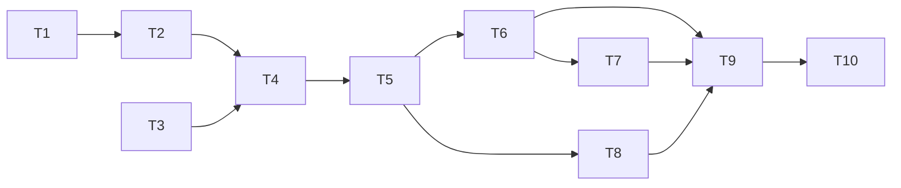

# Tasks — CEP Membership Dues Calculation & Bank-Transfer Preparation Screen

Implementation plan for season **2027**. Each task lists the requirements/design
sections it satisfies and the verification. Conventions from `AGENTS.md` apply:
Pint + PHPStan (level 6) + Deptrac clean, Form Requests for validation, factories
in tests, PHPUnit feature tests, MySQL-and-PostgreSQL compatible.

Order is dependency-first. Do not start implementation until this plan is
approved (second confirm per the workflow).

---

## T1 — Add `kind` to fee components (data foundation)
- Migration: add nullable `membership_fee_components.kind` string default
  `'other'`, preserving all existing column attributes.
- Model: add `kind` to `$fillable`; no cast needed (plain string).
- Trace: design §2.3 · `[R8, G9]`.
- Verify: `php artisan migrate` on MySQL; PHPStan clean; feature test asserts a
  component can be created with each kind.

## T2 — Seed 2027 fee data (`Fee2027Seeder`)
- Seed `membership_fees` for season_year "2027" per design §3.1
  (fonctionnaire 120, externe 130, three young 55, sympathisant 30), keyed by the
  correct `status_id`. Because the FFESSM licence band is derived from DOB (R1),
  a single `junior` status suffices for the under-18 cotisation; the three young
  bands (16-17 / 12-15 / <12) need not be separate statuses. Document the chosen
  status mapping in the seeder header.
- Seed `membership_fee_components`: FFESSM licences (§3.2, `kind=ffessm_licence`,
  `is_optional=false`), FLASSA (§3.3, `kind=flassa`, `taper_below_age=18`,
  `taper_ratio=0`, `age_anchor_date` = 2027 prise-de-licence anchor), assurances
  (§3.4, `kind=assurance`, `is_optional=true`).
- Idempotent (`updateOrCreate`). Registered in `CepSeeder::run()` (club-specific
  CEP tariffs belong with the ClubCEP.eu instance seeder, not the generic
  package `DatabaseSeeder`, which documents that it excludes club-specific data).
- Trace: design §3 · `[G3, G8, G6]`.
- Verify: seeder feature test asserts 6 fees + 4 FFESSM + 1 FLASSA + 7 assurances
  exist with exact amounts; FLASSA anchor equals the cotisation age anchor `[G6]`.

## T3 — `LicenceResolver` domain service (pure)
- New `app/Services/LicenceResolver.php`: `resolve(string $cotisationSlug,
  ?Carbon $dob, Carbon $anchor): LicenceDerivation` returning
  `{ffessm_slug, flassa_state, assurance_allowed}`.
- Implement R1 age-band derivation (Jeune = 12 to <16, Adulte = 16+, Enfant = <12,
  sympathisant → lic_aucune), R5/R6/R7 FLASSA states, R2 assurance gate, R3
  matrix. Unknown/null DOB → treat as adult for both FFESSM band and FLASSA
  (full), per existing `componentAmount` convention.
- Deptrac: Services may depend on Models/Services/Helpers only.
- Trace: design §4 · `[R1, R2, R3, R5, R6, R7, R8, G9]`.
- Verify: unit test table-drives every row of the §4.4 matrix + the four §4.1/§4.2
  derivations + the R1-note (16-17 → lic_adulte + FLASSA included_free).

## T4 — Wire resolver into `FeeCalculationService`
- In `calculate()`: after resolving status, call `LicenceResolver` to add the
  derived FFESSM licence line and the FLASSA line (effective via existing
  `componentAmount()` age taper). Force assurance to 0/absent when
  `assurance_allowed == false` `[R2]`. Exclude FLASSA from the sum when
  `not_applicable` `[R5]`.
- Extend `taperPercentage()` to resolve `as_of_date` as
  `today + dues_cutoff_grace_days` (ThemeSetting, default 0), still overridden by
  the absolute `fee_taper_reference_date` pin `[G1, R-T1]`.
- Keep the club-retained cotisation taper `[R-T1]`; do NOT taper FFESSM/assurance.
- Trace: design §5, §6 · `[R-C1, R1, R2, R5, R6, R7, R-T1, G1]`.
- Verify: unit tests for the four worked examples of requirements §7 (228,00 /
  111,50 / 105,00 / 30,00) at 100 % taper; plus one taper-<100 % case; plus a
  test that `dues_cutoff_grace_days` shifts the effective cutoff.

## T5 — Controller: pass DOB/age and render derived block
- `DuesCalculatorController::calculate/show`: accept DOB (member: from
  `detail->date_of_birth`; guest: posted date) and pass the derived
  FFESSM+FLASSA block and assurance-allowed flag to the view.
- Validation via a new `CalculateDuesRequest` Form Request (age-vs-status
  eligibility, R-N3), array-based rules matching sibling requests.
- Keep `commit()` provisional logic unchanged.
- Trace: design §6, §9 · `[R-C2, R-N3, R-G1.3, R4'']`.
- Verify: feature test posts each cotisation and asserts the derived FFESSM
  licence + FLASSA state in the response.

## T6 — Blade: four accessible groups + read-only licence block
- Rewrite `dues-calculator.blade.php` into four `<fieldset><legend>` groups:
  Group 1 radios (cotisation, filtered by set), Group 2+4 combined read-only
  licence block (FFESSM + FLASSA "incluse"/"FLASSA") with `aria-live`, Group 3
  assurance radios with forced/disabled `ass_aucune` + `aria-disabled` and a
  screen-reader reason `[R2]`.
- Verbatim French labels via `__()` `[R-N1]`; two-decimal euro `[R-C3]`.
- Trace: design §9 · `[R-G1.*, R-G2.*, R-G3.*, R-G4.*, R2, R-N1, R-N2, G5]`.
- Verify: feature test asserts group legends, disabled assurance when
  sympathisant, and FLASSA "incluse" text for a minor.

## T7 — Live recompute JS (progressive enhancement)
- `dues-live.js`: on change of cotisation/assurance/DOB, POST `/dues/calculate`
  and swap the breakdown/total/mention. Submit button still works without JS.
- No inline `onclick` — event delegation + `data-*` per project JS rules.
- Trace: design §6, §9 · `[R-C2, G10]`.
- Verify: manual + a feature test that the non-JS submit path still computes.

## T8 — Payment summary block (read-only) + grace-days setting
- Render Titulaire/IBAN/Banque/BIC/Montant/Mention from `ThemeSetting`; admin
  notice when `club_iban` unset.
- Add `dues_cutoff_grace_days` to the bureau settings screen (AJAX auto-save per
  project settings convention) so the bureau controls the cutoff offset `[G1]`.
- Trace: design §8, §5 · `[R-P1, R-P2, R-P3, G1]`.
- Verify: feature test with IBAN set (shows block) and unset (shows notice);
  setting persists and feeds `taperPercentage()`.

## T9 — Static analysis, tests, docs
- `vendor/bin/pint --dirty --format agent`; `vendor/bin/phpstan analyse
  --memory-limit=512M --no-progress`; `vendor/bin/deptrac analyse --no-progress`.
- `php artisan test --compact` for the new/affected feature + unit tests.
- Update `devdocs/payments.md` and `SPEC.md` dues sections to reference this spec.
- Trace: `[R-S1..R-S4]` + AGENTS.md quality gates.
- Verify: all three analysers clean; targeted tests green.
- **Result**: Pint pass, PHPStan level 6 clean, Deptrac 0 violations. Pure unit
  tests green (123 passed incl. 9 new `LicenceResolverTest`). DB-backed feature
  tests (`DuesWorkedExamplesTest`, `DuesCalculatorControllerTest`,
  `DuesBankSettingsTest`) run in CI only — no local MySQL/`pdo_sqlite`; they fail
  locally solely on "Connection refused", not on logic. Docs updated
  (`devdocs/payments.md`, `SPEC.md` §5.4.1/§5.4.3).

## T10 — Deploy to staging & verify
- Deploy via `deploy/deploy-dues-staging.sh` (scp → docker/artisan), run
  `Fee2027Seeder`, clear caches, fix ownership to `clubcep` per deployment rules.
- Verify on `https://test.clubcep.eu/dues`: 2027 header, four groups, derived
  FFESSM+FLASSA, forced assurance for sympathisant, machine communication, and
  the read-only bank block.
- Trace: deployment steering · `[R-P1, R-C1, G8]`.

---

## Dependencies

## Test coverage map (happy / failure / edge)

- Happy: four worked examples (§7), sympathisant path, minor included_free.
- Failure: age-vs-status mismatch (R-N3), IBAN unset (R-P3), former status
  self-claim rejected (existing commit guard).
- Edge: null DOB (charged full FLASSA), 17-year-old on `coti_jeune_16_17`
  (lic_adulte + FLASSA included_free, R1-note/G6), 16+ → adulte licence band,
  taper factor < 100 %, `dues_cutoff_grace_days` shifting the cutoff, fee-year
  fallback to a prior season's fees.

---

*End of tasks.md.*
