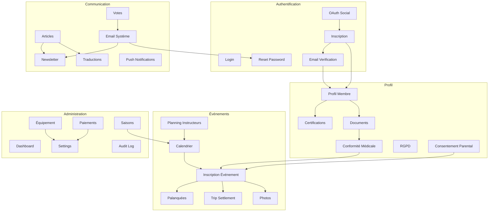

# DivingClub-Manager — Spécification Fonctionnelle Complète

> Document de référence pour recréer le système complet en une session de requirement-based development.
> Chaque fonctionnalité est décrite avec suffisamment de détail pour être implémentée par un développeur sans contexte préalable.

**Version :** 2.1
**Dernière mise à jour :** 2026-08-20
**Statut :** 🟢 Implémenté | 🟡 Partiel | 🔴 Roadmap

---

## Table des Matières

1. [Authentification & Gestion des Utilisateurs](#1-authentification--gestion-des-utilisateurs)
2. [Profil Membre & Données Personnelles](#2-profil-membre--données-personnelles)
3. [Événements, Inscriptions & Palanquées](#3-événements-inscriptions--palanquées)
4. [Communication & Contenu](#4-communication--contenu)
5. [Administration & Gestion du Club](#5-administration--gestion-du-club)
6. [Infrastructure & Transverse](#6-infrastructure--transverse)
7. [Roadmap — Fonctionnalités Non Implémentées](#7-roadmap--fonctionnalités-non-implémentées)

---

## Contexte Technique

| Composant | Choix |
|-----------|-------|
| Framework | Laravel 12 (PHP 8.3) |
| Base de données | PostgreSQL 16 (prod/CI), MySQL 8 (dev local) |
| Frontend | Blade + Vanilla JS + SCSS, pas de framework JS |
| CSS | Bootstrap 5 + Tailwind v3 (utilitaires ponctuels) |
| Queue | Redis + Laravel Horizon |
| Email | Resend API (x2 clés) + Mailjet SMTP relay, via MailBalancer |
| Auth | Laravel native + Socialite (OAuth) + spatie/laravel-permission v6 |
| Images | Intervention Image v4 |
| Déploiement | Hetzner VPS, Caddy reverse proxy, deploy user dédié |
| Tests | PHPUnit 11, PHPStan level 6, Laravel Pint |
| PWA | Service Worker, installable, page offline |

### Rôles du Système

| Rôle | Slug | Accès |
|------|------|-------|
| Président / Bureau Master | `bureau_master` | Administration complète, impersonnation, mise à jour système |
| Trésorier | `bureau_finance` | Paiements, réconciliation bancaire, rapport financier |
| Directeur Technique | `bureau_technical` | Équipement, sites de plongée, règles de palanquées |
| Moniteur Scaphandre | `instructor` | Planning instructeur, création d'événements, groupes de plongée |
| Moniteur Apnée | `instructor_apnea` | Idem mais pour les activités apnée |
| Membre | `member` | Accès aux fonctionnalités membres (profil, événements, documents) |

### Permissions Granulaires (spatie/laravel-permission)

`manage members`, `manage events`, `manage equipment`, `manage articles`, `manage payments`, `manage settings`, `send newsletters`, `manage backups`, `view audit logs`, `manage dive sites`, `manage votes`, `impersonate users`

---

## 1. Authentification & Gestion des Utilisateurs

### 1.1 Inscription 🟢

**Contexte :** Un visiteur souhaite devenir membre du club. L'inscription crée un compte utilisateur avec vérification email obligatoire.

**Comportement :**
- Formulaire : nom, prénom, email, mot de passe (min 8 caractères), confirmation mot de passe
- Protection anti-bot : champ honeypot invisible (pas de CAPTCHA externe)
- Rate limiting : 5 tentatives/minute par IP
- Vérification du nombre de membres actifs vs. limite de la licence (système RSA) : si la limite est atteinte, l'inscription est bloquée avec message explicatif
- À la soumission : création du `User` + `MemberDetail` associé, envoi d'un email de vérification
- Redirection vers la page "vérifiez votre email" (`verification.notice`)

**Dépendances :** Licence système (§6), Email (§4)

---

### 1.2 Connexion 🟢

**Contexte :** Un membre existant se connecte à son espace.

**Comportement :**
- Formulaire : email + mot de passe + checkbox "Se souvenir de moi"
- Rate limiting : 5 tentatives/minute (throttle Laravel standard)
- Lockout temporaire après 5 échecs consécutifs
- Après connexion réussie : redirection vers le profil ou la page précédente
- La locale de l'utilisateur (`preferred_locale` sur User) est appliquée à la session

**Dépendances :** Aucune

---

### 1.3 Réinitialisation de Mot de Passe 🟢

**Contexte :** Un membre a oublié son mot de passe.

**Comportement :**
- Page "Mot de passe oublié" : saisie email
- Rate limiting : 5 tentatives/minute, 3 tentatives pour la soumission du nouveau mot de passe
- Envoi d'un lien signé (token) par email (message neutre : "lien envoyé si l'email existe")
- Page de reset : token + email + nouveau mot de passe + confirmation
- Après reset : redirection vers login avec message de succès
- Fonctionne aussi pour les utilisateurs authentifiés (route séparée `password.request.send`)

**Dépendances :** Email (§4)

---

### 1.4 Vérification Email 🟢

**Contexte :** Après inscription ou ajout d'une nouvelle adresse email, l'utilisateur doit confirmer la propriété.

**Comportement :**
- L'utilisateur reçoit un email avec un lien signé (URL temporaire)
- Cliquer le lien marque l'email comme vérifié dans `users.email_verified_at` ET dans `user_emails.is_verified`
- Renvoi possible : bouton "Renvoyer le lien", limité à 6/minute
- Les routes protégées par le middleware `verified.email` sont inaccessibles tant que l'email n'est pas vérifié

**Dépendances :** Email (§4)

---

### 1.5 Connexion OAuth (Social Login) 🟡

**Contexte :** Permettre aux membres de se connecter via leur compte Google, Facebook, Microsoft ou X (Twitter), simplifiant l'authentification pour les utilisateurs non-techniques.

**Comportement :**
- Boutons dynamiques sur la page login (affichés uniquement si le provider est configuré dans `.env`)
- Flux OAuth2 standard via Laravel Socialite :
  1. Redirect vers le provider → callback avec token
  2. Si l'email OAuth correspond à un `UserEmail` existant → liaison automatique + connexion
  3. Si l'email ne correspond pas → page intermédiaire proposant : "Lier à un compte existant" (login requis) OU "Créer un nouveau compte"
- Table `user_social_accounts` : `user_id`, `provider`, `provider_id`, `provider_email`, `avatar_url`
- Un utilisateur connecté peut lier/délier des comptes sociaux depuis son profil
- Banner de suggestion : si un utilisateur se connecte par email et qu'un provider OAuth est disponible pour son domaine, suggestion non-bloquante de lier le compte

**Providers configurés :**
- Google : 🟢 fonctionnel (nécessite GOOGLE_CLIENT_ID/SECRET dans .env)
- Facebook : 🟢 fonctionnel
- Microsoft : 🟡 route existe mais driver non configuré (retourne 500 si appelé sans config)
- X (Twitter) : 🟡 bloqué par DNS/HTTPS sur le domaine actuel

**Dépendances :** Laravel Socialite v5

---

### 1.6 Déconnexion 🟢

**Comportement :**
- Route POST `/logout` (protection CSRF)
- Invalidation de la session + régénération du token
- Redirection vers la page d'accueil

---

### 1.7 Emails Multiples par Utilisateur 🟢

**Contexte :** Un membre peut avoir plusieurs adresses email (personnelle, professionnelle, institutionnelle). Le système doit pouvoir les contacter sur l'adresse de leur choix et permettre la connexion via n'importe laquelle.

**Comportement :**
- Table `user_emails` : `user_id`, `email`, `is_primary`, `is_verified`, `receives_mail`
- Ajout d'un email : envoi immédiat d'un lien de vérification
- Changement d'email principal : seul un email vérifié peut devenir principal
- Toggle `receives_mail` : permet de désactiver la réception de newsletters/notifications sur un email spécifique
- Suppression d'un email : impossible si c'est le seul email vérifié
- La connexion fonctionne avec n'importe quel email vérifié du membre

**Dépendances :** Vérification Email (§1.4)

---

## 2. Profil Membre & Données Personnelles

### 2.1 Profil — Vue d'Ensemble 🟢

**Contexte :** Chaque membre dispose d'un profil complet organisé en onglets. Le profil est accessible par le membre lui-même, et partiellement visible par les autres membres (annuaire). Les rôles bureau voient tout.

**Structure en 8 onglets :**

1. **Informations générales** — Nom, prénom, date de naissance, nationalité, avatar
2. **Données privées** — Téléphone, adresse postale, personne de contact d'urgence, employeur, n° sécurité sociale
3. **Plongée** — Niveaux de certification (multi-fédération), prérogatives, nombre de plongées
4. **Médical** — Certificat médical (upload), date de validité, alertes d'expiration
5. **Langue** — Locale préférée pour l'interface et les emails
6. **Inscriptions** — Historique des événements auxquels le membre est inscrit
7. **Équipement** — Tailles (combinaison, palmes, gants, etc.) pour le prêt de matériel
8. **Renouvellement** — Statut de cotisation, changement de statut en self-service

**Règles de visibilité :**
- Un membre ne voit PAS l'email ni le téléphone des autres membres (privacy)
- Seul le propriétaire du profil et les rôles bureau voient les données privées
- L'annuaire public affiche uniquement : nom, prénom, avatar, niveau de plongée

---

### 2.2 Avatar 🟢

**Contexte :** Photo de profil du membre, utilisée dans l'annuaire, le trombinoscope, et les palanquées.

**Comportement :**
- Upload : image (JPEG/PNG/WebP), max 5 Mo
- Redimensionnement automatique à 400×400 px via Intervention Image v4
- Stockage : `storage/app/public/avatars/{user_id}.jpg`
- Suppression possible (retour à l'avatar par défaut : initiales sur fond coloré)

**Dépendances :** Intervention Image v4

---

### 2.3 Certifications de Plongée (Multi-Fédération) 🟢

**Contexte :** Un plongeur peut avoir des certifications de plusieurs fédérations (FFESSM, PADI, SSI, BSAC, CMAS, VDST, etc.). Le système doit stocker le niveau exact et déterminer les prérogatives de profondeur et d'encadrement.

**Comportement :**
- Table `certification_levels` : `user_id`, `federation_id`, `level_name`, `level_code`, `date_obtained`, `is_primary`
- Un membre peut avoir N certifications, une seule est marquée "principale" (utilisée pour les règles de palanquées)
- Fédérations supportées (table `federations`) : FFESSM, PADI, SSI, BSAC, CMAS, VDST, NASDS, UCPA, LIFRAS
- Table `diving_prerogatives` : mapping fédération + niveau → profondeur max, peut encadrer (oui/non), niveaux encadrables
- L'admin peut ajouter/modifier les équivalences entre fédérations
- Le QR code FFESSM InfoLicencié est affiché sur le profil pour les membres FFESSM

**Dépendances :** Fédérations (§5), Règles de palanquées (§3)

---

### 2.4 Licences Fédérales 🟢

**Contexte :** Chaque membre actif doit posséder une licence fédérale annuelle (obligatoire pour l'assurance). Le système stocke le numéro de licence et la date de validité.

**Comportement :**
- Table `member_licences` : `user_id`, `federation_id`, `licence_number`, `valid_from`, `valid_until`, `federation_key`
- Le membre peut saisir/mettre à jour son numéro de licence et sa clé fédérale
- Alerte sur le tableau de bord bureau si des licences expirent dans les 30 jours
- Export CSV pour soumission groupée à la fédération (MedicalExportController)

**Dépendances :** Fédérations (§5)

---

### 2.5 Documents Personnels 🟢

**Contexte :** Les membres uploadent des documents (certificat médical, attestation d'assurance, diplômes). Le bureau peut vérifier et valider ces documents.

**Comportement :**
- Table `documents` : `user_id`, `category` (medical, insurance, diploma, other), `original_filename`, `path`, `is_current`, `verified_at`, `verified_by`
- Upload : PDF, image, max 10 Mo
- Catégories : `medical` (certificat médical), `insurance` (attestation assurance), `diploma` (brevet de plongée), `other`
- Flag `is_current` : un seul document "courant" par catégorie par membre (l'ancien passe à `is_current = false`)
- Vérification bureau : un admin peut marquer un document comme vérifié (`verified_at`, `verified_by`)
- Notification email au bureau quand un certificat médical est uploadé (job asynchrone)
- Téléchargement et prévisualisation inline (PDF viewer, lightbox image)

**Dépendances :** Email (§4), Stockage fichiers

---

### 2.6 Conformité Médicale 🟢

**Contexte :** La législation impose un certificat médical valide pour plonger. Le système vérifie la conformité et bloque l'inscription aux événements si le certificat est expiré.

**Comportement :**
- Table `medical_compliance_rules` : `federation_id`, `age_bracket_low`, `age_bracket_high`, `validity_months`, `requires_specialist`
- Le `MedicalComplianceService` évalue pour chaque membre :
  - Date d'expiration du certificat médical (basée sur la date d'upload + règle de validité applicable)
  - Statut : valide / expire bientôt (30j) / expiré
- Gate sur l'inscription aux événements : si le certificat est expiré, l'inscription est refusée avec message explicatif
- Export groupé des statuts médicaux pour envoi à la fédération (CSV + ZIP des certificats)
- Tâche planifiée : envoi de rappels email 30 jours avant expiration

**Dépendances :** Documents personnels (§2.5), Règles médicales (§5), Email (§4)

---

### 2.7 Tailles d'Équipement 🟢

**Contexte :** Pour le prêt de matériel club, les moniteurs doivent connaître les tailles de chaque plongeur (combinaison, palmes, gants, cagoule, gilet).

**Comportement :**
- Stocké dans `member_details` : champs `wetsuit_size`, `fin_size`, `glove_size`, `hood_size`, `bcd_size`, `shoe_size`
- Le membre saisit ses tailles depuis l'onglet Équipement de son profil
- L'admin voit les tailles dans la fiche membre et lors de l'attribution de prêts

**Dépendances :** Équipement (§5)

---

### 2.8 Consentement Parental (Mineurs) 🟢

**Contexte :** Les membres de moins de 18 ans doivent avoir un tuteur légal enregistré qui donne son consentement pour la participation aux activités.

**Comportement :**
- Table `guardian_links` : `minor_user_id`, `guardian_user_id` (le tuteur doit aussi être membre)
- Table `parental_consents` : `guardian_link_id`, `type` (general, trip, medical), `granted_at`, `expires_at`, `document_path`
- Le bureau lie un mineur à son tuteur
- Le tuteur signe un consentement (formulaire en ligne ou upload de document signé)
- Le consentement peut être révoqué à tout moment par le tuteur
- Gate sur inscription : un mineur sans consentement valide ne peut pas s'inscrire

**Dépendances :** Inscription événements (§3)

---

### 2.9 RGPD — Export & Effacement 🟢

**Contexte :** Conformité au Règlement Général sur la Protection des Données. Chaque membre peut exporter toutes ses données et demander l'effacement de son compte.

**Comportement :**
- **Page consentements** (`/privacy`) : liste des traitements de données avec toggle on/off
- Table `gdpr_consents` : `user_id`, `consent_type`, `granted`, `granted_at`
- **Export** (`/privacy/export`) : génère un JSON téléchargeable contenant toutes les données personnelles du membre (profil, inscriptions, documents, commentaires, votes)
- **Effacement** (`/privacy/erasure`) :
  1. Confirmation par mot de passe
  2. Anonymisation : remplace nom/prénom par "Membre supprimé", efface email, téléphone, adresse
  3. Suppression des documents uploadés (fichiers physiques)
  4. Conservation des données statistiques anonymisées (inscriptions, paiements = montants sans identité)
  5. Log d'audit de l'effacement

**Dépendances :** Audit log (§5)

---

### 2.10 Annuaire des Membres 🟢

**Contexte :** Les membres authentifiés peuvent consulter la liste des autres membres du club pour faciliter les contacts et l'organisation des sorties.

**Comportement :**
- Route `/members` : tableau paginé (25/50/100/Tous) avec recherche instantanée (JS, pas de reload)
- Colonnes : avatar, nom, prénom, niveau de certification, statut, rôle
- Filtres : statut (actif, sympathisant, ancien), moniteur (oui/non)
- Tri sur toutes les colonnes via `<x-sortable-th>`
- Clic sur une ligne → profil du membre (vue limitée : pas d'email/téléphone visibles)
- **Trombinoscope** (`/members/trombinoscope`) : grille d'avatars avec nom et niveau

**Règles de confidentialité :**
- Email et téléphone ne sont JAMAIS visibles par les autres membres
- Pour contacter un membre, utiliser le formulaire de contact interne (§2.11)

**Dépendances :** Profil (§2.1)

---

### 2.11 Contact entre Membres 🟢

**Contexte :** Puisque les coordonnées sont masquées, un système de messagerie interne permet aux membres de se contacter sans exposer leur email.

**Comportement :**
- Route `/members/{user}/contact` : formulaire avec sujet + message
- L'email est envoyé AU membre ciblé, avec l'adresse de l'expéditeur en Reply-To
- Rate limiting : 10 messages/minute par utilisateur
- Le destinataire ne voit jamais l'email de l'expéditeur directement dans l'interface (seulement dans son client mail via Reply-To)

**Dépendances :** Email (§4), Annuaire (§2.10)

---

### 2.12 Changement de Statut en Self-Service 🟢

**Contexte :** Un membre peut changer son statut d'adhésion (par exemple passer de "membre actif" à "sympathisant" ou inversement) sans intervention du bureau.

**Comportement :**
- Disponible dans l'onglet "Renouvellement" du profil
- Dropdown avec les statuts disponibles (table `member_statuses` : membre de droit, externe, associé, assimilé, sympathisant)
- Le changement est effectif immédiatement
- Log d'audit automatique du changement de statut

**Dépendances :** Statuts membres (§5)

---

### 2.13 QR Codes Personnels 🟢

**Contexte :** Le système génère des QR codes utiles pour le membre : vCard (partage coordonnées) et fédération (InfoLicencié FFESSM). Les QR de paiement SEPA/EPC ont été retirés (standard EPC déprécié, Wero devenu standard fermé) ; le paiement des cotisations se fait via l'IBAN + communication structurée affichés sur la page `/dues`.

**Comportement :**
- **vCard** (`/qr/vcard`) : QR code contenant les coordonnées du membre au format vCard 3.0
- **Fédération** (`/qr/federation/{licence}`) : QR code renvoyant vers la page InfoLicencié FFESSM du membre
- Tous générés côté serveur en PNG

**Dépendances :** Licences fédérales (§2.4), Paiements (§5)

---

## 3. Événements, Inscriptions & Palanquées

### 3.1 Calendrier des Événements 🟢

**Contexte :** Le calendrier est la pièce maîtresse du club. Il affiche toutes les activités (piscine, sorties, théorie, apnée, fosse, social) et permet aux membres de s'inscrire.

**Comportement :**
- Route `/events` : vue calendrier avec toggle mois/semaine/jour
- Les événements sont colorés par `event_type` (couleur CSS calculée ou `color_hex` personnalisé)
- Types d'événements : `pool`, `pool_kids`, `pool_pn1`, `pool_pn23`, `apnea`, `fosse`, `quarry`, `long_trip`, `theory`, `social`
- Filtres : type d'activité, mois
- Chaque événement affiche : titre, date/heure, lieu, nombre d'inscrits / max participants
- Flux iCal public (`/calendar.ics`) pour abonnement dans Google Calendar / Outlook

**Dépendances :** Saisons (§5), Sites de plongée (§5)

---

### 3.2 Détail d'un Événement 🟢

**Contexte :** La page détail d'un événement montre toutes les informations et permet l'inscription.

**Comportement :**
- Route `/events/{event}` : affichage complet
- Informations affichées :
  - Titre, type, date/heure début et fin, lieu (avec lien Google Maps si coordonnées)
  - Description (HTML riche sanitisé)
  - Responsable de l'événement + moniteur assigné + assistants
  - Nombre d'inscrits / capacité max
  - Liste des inscrits (prénom + niveau, pas d'email/téléphone)
  - Lien WhatsApp du groupe de sortie (si configuré)
  - Coût estimé, dates et montants des acomptes (si configurés)
  - Site de plongée associé (avec fiche sécurité)
  - Galerie photos de l'événement
- Bouton d'inscription (voir §3.3)
- Si `trip_settlement_enabled` : lien vers le module de répartition des frais (§3.7)

**Dépendances :** Inscription (§3.3), Trip Settlement (§3.7), Sites de plongée (§5)

---

### 3.3 Inscription aux Événements 🟢

**Contexte :** Un membre s'inscrit à un événement. Des gates (vérifications) conditionnent l'inscription.

**Comportement :**
- Table `event_registrations` : `event_id`, `user_id`, `non_member_name`, `status` (confirmed, waiting, cancelled), `comment`, `food_option`, `transit_mode`, `registered_at`, `cancelled_at`
- **Gates d'inscription (vérifications préalables) :**
  1. Certificat médical valide (non expiré selon les règles de conformité médicale)
  2. Consentement parental valide (si mineur)
  3. Inscriptions ouvertes (`inscription_open_at` ≤ now ET `inscriptions_closed` = false)
  4. Places disponibles (si `max_participants` défini)
- **Liste d'attente :** si `waiting_list_enabled` et places pleines → statut `waiting`. Si un inscrit annule, le premier en attente passe automatiquement en `confirmed` (avec notification email).
- **Champs optionnels à l'inscription :**
  - `comment` : texte libre (ex: "j'arrive à 19h30")
  - `food_option` : choix alimentaire pour les sorties avec repas
  - `transit_mode` : `van`, `fly`, `own` (pour les long trips — détermine la participation aux frais de transport)
- **Annulation :** le membre peut annuler tant que l'événement n'est pas passé
- **Confirmation requise :** si `confirmation_required = true`, le responsable doit confirmer chaque inscription (statut intermédiaire `pending`)
- Rate limiting : 10 inscriptions/minute par utilisateur

**Non-membres :** Un bureau peut inscrire un non-membre (conjoint, invité) via le champ `non_member_name` (pas de `user_id`)

**Dépendances :** Conformité médicale (§2.6), Consentement parental (§2.8), Email (§4)

---

### 3.4 Création / Modification d'Événement 🟢

**Contexte :** Les moniteurs et le bureau peuvent créer et modifier des événements.

**Comportement :**
- Routes `/events/create` et `/events/{event}/edit`
- Champs :
  - Titre, type d'événement (dropdown des 10 types)
  - Date début, heure début, heure fin, date fin (optionnelle pour les multi-jours)
  - Lieu (texte libre), site de plongée (dropdown, optionnel)
  - Description (éditeur riche)
  - Responsable (dropdown membres bureau/instructeurs)
  - Moniteur assigné (dropdown)
  - Assistants (multi-select membres)
  - Capacité max + liste d'attente (toggle)
  - Date d'ouverture des inscriptions
  - Confirmation requise (toggle)
  - Coût estimé + 3 acomptes (date + montant)
  - Lien WhatsApp du groupe
  - Couleur personnalisée (color picker, optionnel)
  - Trip settlement enabled (toggle) — active le module de répartition des frais
- **Annulation d'événement :** le responsable ou le bureau peut annuler un événement → tous les inscrits sont notifiés par email
- **Niveaux affichés :** toggle `levels_display` pour montrer/masquer les niveaux de plongée dans la liste des inscrits
- **Événement fédéré :** `is_federated` + `external_slots` (nombre de places réservées pour les clubs partenaires)

**Dépendances :** Rôles (§1), Sites de plongée (§5), Partenariats (§5)

---

### 3.5 Photos d'Événement 🟢

**Contexte :** Après une sortie, les membres peuvent uploader des photos qui constituent la galerie du club.

**Comportement :**
- Table `event_photos` : `event_id`, `uploaded_by`, `path`, `caption`, `approved`, `gdpr_consent`, `has_faces`, `quality_score`, `zone`
- Upload : images (JPEG/PNG), max 10 Mo, par tout membre inscrit à l'événement
- **Approbation :** les photos sont visibles immédiatement par les inscrits, mais doivent être approuvées par un bureau pour la galerie publique
- **RGPD / Visages :** `has_faces` flag (détection via `FaceDetectionService`) — les photos avec visages ne sont visibles publiquement que si `gdpr_consent = true`
- **Score qualité :** `ImageQualityService` attribue un score (résolution, exposition, netteté) — utilisé pour le tri et la sélection homepage
- **Zone :** tag géographique pour le filtrage par zone dans la galerie
- **Galerie** (`/gallery`) : grille responsive, lightbox, filtres par événement/zone, sélection pondérée aléatoire pour la page d'accueil
- **Suppression :** l'uploader peut supprimer ses propres photos, le bureau peut supprimer toute photo

**Dépendances :** Événements (§3.2), FaceDetectionService, ImageQualityService

---

### 3.6 Palanquées (Groupes de Plongée) 🟢

**Contexte :** Pour chaque sortie en mer/lac, les plongeurs sont répartis en palanquées (groupes de 2-5) selon leur niveau, avec un chef de palanquée certifié. C'est une obligation réglementaire (FFESSM, Code du Sport).

**Comportement :**
- Routes `/events/{event}/dive-groups` : interface Trello-style (colonnes = palanquées, cartes = plongeurs)
- Tables :
  - `dive_groups` : `event_id`, `name`, `max_depth`, `status`
  - `dive_group_members` : `dive_group_id`, `user_id`, `is_leader`, `position`
- **Création manuelle :** drag-and-drop des inscrits dans les groupes
- **Proposition automatique** (`DiveGroupProposalService`) : algorithme qui répartit les plongeurs en respectant les règles fédérales
- **Validation** : vérification en temps réel que chaque palanquée respecte les règles (§3.6.1)
- **Chef de palanquée :** toggle pour désigner le leader (doit avoir la prérogative GP/P4/DM selon la fédération)
- **Suggestion de swaps** (`SwapSuggestionService`) : propose des échanges inter-palanquées pour améliorer l'homogénéité
- **Impression** : fiche de sécurité PDF (§3.6.2)

**Dépendances :** Règles de palanquées (§3.6.1), Certifications (§2.3), Inscription (§3.3)

---

#### 3.6.1 Règles de Palanquées 🟢

**Contexte :** Les fédérations de plongée imposent des règles strictes de composition des palanquées (profondeur max par niveau, ratio encadrant/encadré, etc.).

**Comportement :**
- Table `dive_group_rules` : `federation_id`, `rule_type`, `min_level`, `max_depth`, `min_group_size`, `max_group_size`, `requires_leader_level`, `description`
- Administration : le Directeur Technique configure les règles par fédération
- **Validation automatique :** le système vérifie en temps réel :
  - Profondeur max compatible avec le niveau le plus bas de la palanquée
  - Présence d'un chef de palanquée avec prérogative suffisante
  - Taille de palanquée dans les bornes (min 2, max 5 typiquement)
  - Pas de plongeur dont le certificat médical est expiré
- **Service d'homogénéité** (`Homogeneity/`) : calcule un score d'homogénéité des niveaux au sein de chaque palanquée (facteurs : certification, expérience, âge)
- Les fédérations supportées : FFESSM, LIFRAS, BSAC (chacune avec ses propres règles)

**Dépendances :** Fédérations (§5), Certifications (§2.3)

---

#### 3.6.2 Fiche de Sécurité (PDF) 🟢

**Contexte :** Document obligatoire pour chaque plongée : liste des palanquées, niveaux, profondeurs prévues, numéros d'urgence. Doit être imprimé et présent sur le bateau.

**Comportement :**
- Route `/events/{event}/dive-groups/print` : génère un PDF imprimable
- Contenu :
  - En-tête : nom du club, date, site de plongée, conditions météo
  - Tableau des palanquées : numéro, membres, niveaux, profondeur prévue, chef de palanquée
  - Contacts d'urgence : CROSS, caisson hyperbare le plus proche, SAMU, responsable du club
  - Zone de signature du Directeur de Plongée
- Format : A4 portrait, optimisé pour impression noir et blanc

**Dépendances :** Palanquées (§3.6), Sites de plongée (§5)

---

### 3.7 Trip Settlement (Répartition des Frais de Sortie) 🟢

**Contexte :** Pour les sorties longues (voyages de plongée de plusieurs jours), les frais sont partagés entre les participants selon un algorithme en 5 étapes. Le système gère la soumission, approbation et répartition des reçus.

**Activation :** Uniquement pour les événements de type `long_trip` avec `trip_settlement_enabled = true`.

---

#### 3.7.1 Participants & Modes de Transit 🟢

**Comportement :**
- Table `trip_participants` : `event_id`, `user_id`, `non_member_name`, `transit_mode`, `driving_percentage`, `local_transit_days`, `is_supervising_instructor`, `supervising_days`, `prepaid_amount`, `dive_count`
- **Modes de transit** (choisis à l'inscription) :
  - `van` : voyage en véhicule club/collectif → paie sa part de carburant + péages
  - `fly` : voyage en avion → ne paie PAS le transit longue distance, MAIS paie un forfait "transport local" par jour sur place
  - `own` : véhicule personnel → ni transit collectif, ni transport local
- **Conducteurs :** `driving_percentage` répartit le bonus conducteur (ex: 2 conducteurs = 50%/50%, 3 = 33%/33%/34%)
- **Instructeurs superviseurs :** `supervising_days` × `instructor_daily_subsidy` (de l'event) = crédit instructeur (coût partagé par tous)
- **Non-membres :** `prepaid_amount` directement sur `trip_participants` (pas de PaymentExpected pour eux)

---

#### 3.7.2 Reçus (Receipts) 🟢

**Comportement :**
- Table `trip_receipts` : `event_id`, `user_id`, `description`, `amount`, `approved_amount`, `category`, `status` (pending/approved/rejected), `image_path`, `is_third_party`, `target_user_id`
- **Catégories de reçus :**
  - `general` : frais partagés par TOUS (hébergement, nourriture commune, location bateau)
  - `transit` : frais de transport collectif, partagés par les passagers VAN uniquement (carburant, péages, parking)
  - `diving` : facture club (centre de plongée) — apparaît en comptabilité, ne touche pas les balances individuelles directement
  - `individual` : charge attribuée à UNE personne spécifique (`target_user_id`)
  - `memo` : note informative, pas de montant comptabilisé
- **Statuts :** `pending` → `approved` ou `rejected` (par le bureau)
- **`is_third_party`** : si true, c'est une charge VERS la personne (pas une dépense PAR elle) — augmente ce qu'elle doit
- **Upload image :** photo du reçu, stockée dans `storage/trip-receipts/{event_id}/`
- **Soumission :** tout participant peut soumettre un reçu. Le bureau approuve/rejette.

---

#### 3.7.3 Algorithme de Calcul (5 étapes) 🟢

**Service :** `TripSettlementService::calculate()`

**Étapes :**
1. **Pool global** : somme des reçus `general` approuvés + subvention instructeur → divisée également entre TOUS les participants actifs (non-annulés)
2. **Subvention transport local** : membres `fly` paient `local_daily_charge × local_transit_days` (forfait journalier pour les transferts sur place)
3. **Pool transit longue distance** : somme des reçus `transit` approuvés → divisée entre les passagers VAN uniquement
4. **Bonus conducteur** : `driver_bounty_total` (montant fixe sur l'event) distribué aux conducteurs selon `driving_percentage`
5. **Balance finale** : `(doit) - (crédit_bonus + total_payé + prepaid)`. Positif = le membre doit au club. Négatif = le club doit au membre.

**Invariant :** La somme de toutes les balances des participants = 0 (conservation monétaire). Les tests vérifient cet invariant.

**Charges plongée :** `dive_unit_price × dive_count` + `nitrox_supplement × dive_count` (si EAN) → charges individuelles par plongeur.

---

#### 3.7.4 Interface de Gestion (Bureau) 🟢

**Comportement :**
- Route `/events/{event}/settlement/manage` : page bureau
- **4 cartes résumé :**
  1. Frais Partagés (global + subvention instructeur)
  2. Transit (carburant + bonus conducteurs)
  3. Plongée (facture centre vs. charges individuelles)
  4. Subvention Locale (forfait fly-in)
- **Tableau des participants :** colonnes éditables en AJAX auto-save (mode transit, jours conduite, jours supervision, dive_count, prepaid)
  - Auto-save silencieux sur `change`/`blur` avec debounce 300ms
  - Indicateur "✓ Saved" bref
  - Auto-refresh page 1.5s après save pour recalculer les totaux
- **Tableau des reçus :** approbation/rejet inline, édition montant approuvé
- **Export XLSX :** miroir de la page manage
- **Breakdown :** ventilation détaillée par participant (route `/breakdown`)
- **Statut settlement :** `open` (reçus modifiables) ou `closed` (ledger verrouillé, aucune modification)
- **Prepayment :** enregistrement des avances versées par chaque participant

---

#### 3.7.5 Interface Participant 🟢

**Comportement :**
- Route `/events/{event}/settlement` : vue membre
- Affiche :
  - Sa balance personnelle (doit / est crédité)
  - La ventilation de ses coûts (part globale, transit, plongée, etc.)
  - Ses reçus soumis + statut (pending/approved/rejected)
  - Formulaire de soumission de reçu (description, montant, catégorie, photo)
- Le participant ne peut soumettre des reçus que si le settlement est `open`

---

### 3.8 Planning Instructeurs (Disponibilités) 🟢

**Contexte :** Les moniteurs indiquent leur disponibilité pour chaque date d'activité. Le bureau peut voir d'un coup d'œil qui est disponible pour encadrer.

**Comportement :**
- Route `/availability` : grille mensuelle, colonnes = dates d'événements, lignes = instructeurs
- Table `instructor_availabilities` : `user_id`, `event_id`, `is_available`
- **Toggle AJAX** : un moniteur clique sur une cellule pour basculer disponible/indisponible (pas de rechargement)
- **Couleurs :** vert = disponible, rouge = indisponible, gris = pas encore répondu
- **Accessible à tous les membres** en lecture (pour savoir qui encadre)
- **Modifiable** uniquement par les rôles `instructor`, `instructor_apnea`, et bureau
- **10 types d'activités** avec couleurs distinctes dans la légende (pool, pool_kids, pool_pn1, pool_pn23, apnea, fosse, quarry, long_trip, theory, social)
- **Initiales instructeurs** : affichées dans les cellules (`member_details.instructor_initial` + `instructor_color`) — attribuées manuellement, stables dans le temps
- **Affichage côte-à-côte :** si plusieurs événements le même jour, ils sont affichés côte à côte (pas empilés), triés par `event_time`

**Dépendances :** Événements (§3.1), Rôles (§1)

---

### 3.9 Recherche de Binômes (Buddy Board) 🟢

**Contexte :** Un plongeur cherche un binôme pour une sortie ou un entraînement. Le buddy board permet de poster des demandes et de répondre.

**Comportement :**
- Route `/buddies` : liste des demandes actives
- Table `buddy_requests` : `user_id`, `title`, `description`, `preferred_date`, `preferred_level`, `status` (open, matched, closed)
- Table `buddy_responses` : `buddy_request_id`, `user_id`, `message`
- **Poster une demande :** formulaire avec description de ce qu'on cherche (niveau, date, type d'activité)
- **Répondre :** bouton "Je suis intéressé" + message optionnel
- **Fermer :** le demandeur peut fermer sa demande quand il a trouvé un binôme
- Les demandes expirées (date passée) sont automatiquement masquées

**Dépendances :** Aucune

---

### 3.10 Import/Export de Données de Plongée 🟢

**Contexte :** Les plongeurs utilisent des ordinateurs de plongée qui génèrent des fichiers de log. Le système permet l'import et l'export dans les formats standards de l'industrie.

**Comportement :**
- **UDDF** (Universal Dive Data Format) :
  - Import (`/dive-data/import-uddf`) : upload d'un fichier `.uddf` → parsing XML → stockage des profils de plongée
  - Export (`/dive-data/export-uddf`) : génère un fichier UDDF avec toutes les plongées du membre
- **DAN DL7** (Divers Alert Network) :
  - Export admin (`/admin/export-dan`) : génère un fichier DL7 pour soumission au réseau DAN (données anonymisées)
- Services : `UddfService` (parsing/generation XML), `DanExportService` (format DL7)

**Dépendances :** Événements (§3.1)

---

### 3.11 Flux iCal 🟢

**Contexte :** Les membres veulent synchroniser le calendrier du club avec leur agenda personnel (Google Calendar, Apple Calendar, Outlook).

**Comportement :**
- Route publique `/calendar.ics` : génère un flux iCalendar (RFC 5545)
- Contenu : tous les événements futurs avec titre, date/heure, lieu, description
- Format : texte/calendar, mise à jour à chaque requête (pas de cache long)
- Utilisable via "Ajouter un calendrier par URL" dans n'importe quel client calendrier

**Dépendances :** Événements (§3.1)

---

## 4. Communication & Contenu

### 4.1 Articles (Système de Publication) 🟢

**Contexte :** Le club publie du contenu éditorial (actualités, comptes-rendus de sortie, tutoriels, FAQ, propositions de voyages). Les articles sont le cœur du site public et du flux d'accueil.

**Comportement :**
- Table `articles` : `title`, `slug`, `body` (HTML riche), `article_type`, `featured_image`, `is_published`, `is_public`, `author_id`, `vote_id`, `expires_at`, `sort_order`
- **13 types d'articles**, chacun avec icône et couleur :
  1. `news` (📰) — Actualités du club
  2. `history` (🏛️) — Histoire du club
  3. `safety` (🛟) — Sécurité
  4. `training` (🎓) — Formation
  5. `regulation` (📋) — Règlement
  6. `trip_report` (🌊) — Compte-rendu de sortie
  7. `trip_proposal` (🗺️) — Proposition de voyage
  8. `environment` (🌿) — Environnement
  9. `gear` (🤿) — Matériel
  10. `classified` (🏷️) — Petite annonce (voir §4.2)
  11. `faq` (❓) — FAQ
  12. `newsletter` (📬) — Newsletter
  13. `video` (🎬) — Vidéo (auto-embed YouTube/Vimeo)
- **Visibilité :**
  - `is_published` : brouillon (false) ou publié (true) — unpublish sans supprimer
  - `is_public` : visible sans connexion (true) ou membres uniquement (false)
  - `expires_at` : date d'expiration optionnelle (l'article disparaît du flux après cette date)
- **Scope `active`** : `is_published = true AND (expires_at IS NULL OR expires_at > now())`
- **Page d'accueil** : affiche les articles actifs et publics, triés par date ou `sort_order`
- **7 articles épinglés** pour les pages "À propos" : emploi du temps, valeurs, contact, histoire, bureau, chiffres, moniteurs
- **SoftDeletes** : les articles supprimés sont récupérables

**Dépendances :** Traductions (§4.4), Galerie images (§4.1.1), Commentaires (§4.3)

---

#### 4.1.1 Galerie d'Images par Article 🟢

**Comportement :**
- Table `article_images` : `article_id`, `path`, `caption`, `sort_order`, `layout_hint`
- Upload multiple lors de la création/édition d'article
- `layout_hint` : indication de mise en page (full-width, half, thumbnail) — utilisé par le template de rendu
- Affichage : galerie lightbox sous le corps de l'article
- Réordonnement par drag-and-drop dans l'admin

---

#### 4.1.2 Vidéo Auto-Embed 🟢

**Comportement :**
- Pour les articles de type `video` : le corps peut contenir une URL YouTube ou Vimeo
- Le rendu détecte automatiquement les URLs et les remplace par un player embed responsive (iframe 16:9)
- Supporte : `youtube.com/watch?v=`, `youtu.be/`, `vimeo.com/`

---

### 4.2 Petites Annonces (Classifieds) 🟢

**Contexte :** Les membres peuvent publier des annonces de vente/recherche de matériel de plongée d'occasion.

**Comportement :**
- Utilise le type d'article `classified` mais avec un workflow spécifique
- Routes dédiées : `/classifieds`, `/classifieds/create`, `/classifieds/{article}/edit`
- **Tout membre** peut créer une annonce (pas besoin d'être bureau)
- **Expiration automatique** : 30 jours après publication, l'annonce expire (`expires_at`)
- **Prolongation** : le propriétaire peut prolonger de 30 jours supplémentaires avant expiration
- **Modification/suppression** : uniquement par le propriétaire de l'annonce
- Affichage : liste avec image, titre, prix, date de publication

**Dépendances :** Articles (§4.1)

---

### 4.3 Commentaires 🟢

**Contexte :** Les membres peuvent commenter les articles pour poser des questions ou partager leur expérience.

**Comportement :**
- Table `article_comments` : `article_id`, `user_id`, `body`, `parent_id` (threading)
- **Commentaires imbriqués** : réponses possibles sur un commentaire (1 niveau de profondeur)
- **Sanitisation** : le corps est nettoyé via `HtmlSanitizer::clean($body, 'comment')` (preset restrictif)
- **Suppression** : par l'auteur ou par un bureau
- Affichage sous chaque article, trié par date

**Dépendances :** Articles (§4.1), HtmlSanitizer

---

### 4.4 Traductions d'Articles (Auto) 🟢

**Contexte :** Le club est multilingue (15 locales possibles). Les articles sont rédigés en français et traduits automatiquement dans les langues activées.

**Comportement :**
- Table `article_translations` : `article_id`, `locale`, `title`, `body`, `source_hash`, `status` (ok, stale, failed), `attempts`
- **Traduction automatique** via Google Translate API (article créé → job de traduction en file)
- **Détection de changement** : hash xxh3 du contenu source. Si le hash change → la traduction est marquée `stale` et re-traduite
- **Validation qualité** :
  - Ratio de mots (30%–300% du source) — si hors bornes, flagué pour relecture admin
  - Maximum 3 tentatives avant flag `failed`
- **Interface admin** : onglets par langue sur le formulaire article, indicateur visuel (✓ ok, ⚠ stale, ✗ failed)
- **Rafraîchissement** : bouton "Re-traduire" par langue
- **14 locales non-EN** actuellement complètes (631 clés JSON chacune)
- Service : `ArticleTranslationService`

**Dépendances :** Google Translate API, Articles (§4.1)

---

### 4.5 Newsletter 🟢

**Contexte :** Le club envoie une newsletter mensuelle par email aux membres. Le système offre un éditeur visuel, un workflow d'approbation, et un envoi équilibré entre plusieurs fournisseurs email.

---

#### 4.5.1 Composition 🟢

**Comportement :**
- Route `/admin/newsletters/create` et `/{newsletter}/edit`
- Table `newsletters` : `title`, `month` (YYYY-MM), `background_image` (thème), `slots` (JSON array), `decorations` (JSON array), `published_html`, `status`, `created_by`, `sent_at`
- **5 slots d'articles** : chaque slot référence un article existant + teaser personnalisable + URL custom optionnelle
  - Slots 1-4 : grille 2×2, image + titre + teaser + lien "Lire la suite"
  - Slot 5 : bannière bottom (titre + icône seulement)
- **Thèmes visuels** : `bulles` (par défaut, bleu marine), `abyss` (noir profond), `coral` (bleu-orange), `arctic` (gris acier)
  - Chaque thème a : `header.jpg`, `footer.jpg`, slices décoratives (left/center/right par row), séparateurs
  - Stockés dans `public/images/newsletter/{theme}/`
- **Police configurable** : 4 choix (Clean/IBM Plex Sans, Classic/Libre Baskerville, Sharp/JetBrains Mono, Modern/DM Sans) — réglé dans Admin → Settings → Newsletter
- **25 décorations SVG marines** : scatter aléatoire de petites icônes en bas de la newsletter (bouton "Scatter" pour randomiser)
- **Mois label** : affiché en italique sous le header (sauf pour bulles qui l'intègre dans l'image)

---

#### 4.5.2 Prévisualisation & Test 🟢

**Comportement :**
- **Preview** (`/newsletters/{id}/preview-email`) : rendu HTML exact du mail dans le navigateur
- **Test send** (`/newsletters/{id}/test-send`) : envoie la newsletter à l'email de l'utilisateur connecté uniquement
- Le rendu utilise un template email table-based (compatibilité Outlook, Gmail, Apple Mail)
- Lien "EN ›" en bas-gauche de chaque carte si une traduction anglaise existe pour l'article

---

#### 4.5.3 Workflow d'Approbation 🟢

**Comportement :**
- **Statuts** : `draft` → `submitted` → `approved` → `sent`
- Table `newsletter_approvals` : `newsletter_id`, `user_id`, `approved` (boolean), `comment`
- **Submit** : l'auteur soumet pour relecture → tous les membres bureau reçoivent une notification
- **Review** (`/admin/newsletters/{id}/review`) : chaque bureau peut approuver ou commenter
- **Withdraw** : l'auteur peut retirer sa soumission pour modification
- **Send** : uniquement possible si statut = `approved` (au moins un bureau a approuvé)
- Après envoi : `status = 'sent'`, `sent_at` horodaté, `published_html` sauvegardé (archivage)

---

#### 4.5.4 Envoi & Load Balancing 🟢

**Comportement :**
- L'envoi utilise `MailBalancer` : répartit entre 2 clés Resend API
  - Clé primaire (domaine `clubcep.eu`) : premiers 90 emails
  - Clé secondaire (domaine `ecb.pm`) : overflow
  - Bascule automatique sur erreur de rate limit
  - Capacité combinée : 200 emails/jour (tiers gratuits)
- Destinataires : tous les membres avec `receives_mail = true` sur au moins un email vérifié
- L'envoi est asynchrone (job Redis via Horizon)
- Chaque envoi est logé dans `email_logs`

**Dépendances :** Articles (§4.1), Email (§4.6), Thème settings (§5)

---

### 4.6 Système d'Email 🟢

**Contexte :** Le bureau peut envoyer des emails ciblés aux membres (convocations, rappels, informations). Le système gère les templates, la composition, et le suivi.

---

#### 4.6.1 Templates d'Email 🟢

**Comportement :**
- Table `email_templates` : `name`, `subject`, `body` (HTML avec placeholders), `category`
- Le bureau crée et réutilise des templates (ex: "Rappel cotisation", "Bienvenue nouveau membre")
- Placeholders dynamiques : `{{name}}`, `{{first_name}}`, `{{email}}`, `{{club_name}}`
- Interface admin : CRUD templates + prévisualisation

---

#### 4.6.2 Composition & Envoi 🟢

**Comportement :**
- Route `/admin/email` : page de composition
- Sélection des destinataires par :
  - Rôle (bureau, moniteurs, tous les membres)
  - Statut (actif, sympathisant)
  - Saison (membres inscrits pour la saison en cours)
  - Événement spécifique (inscrits à un event)
  - Sélection manuelle
- Éditeur riche pour le corps du message
- **Preview** avant envoi
- **Envoi** via le `MailBalancer` (asynchrone, jobs queued)
- Table `email_logs` : `to`, `subject`, `body`, `status` (sent, failed, bounced), `sent_at`, `template_id`

---

#### 4.6.3 Alias Mail Entrant (Inbound) 🟢

**Contexte :** Le club reçoit des emails sur des alias (bureau@, moniteurs@, event.42@). Le système les redistribue automatiquement aux bons destinataires.

**Comportement :**
- Adressage plus (`+`) : `club+bureau@domain`, `club+event.42@domain` — zéro config Postfix
- Deux modes de collecte :
  - **Maildir** : lit les fichiers `.eml` dans `Maildir/new/`, déplace vers `cur/` après traitement
  - **IMAP** : connexion à une boîte distante, lecture UNSEEN, marquage Seen
- **Job `PollInboundMail`** : tourne toutes les minutes (scheduler)
- **Commande alternative `ProcessInboundMail`** : pipe Postfix pour traitement instantané
- **Résolution d'alias** (`MailAliasService`) :
  - `bureau` → membres avec `detail.bureau_member = true`
  - `instructors` / `moniteurs` → membres avec `detail.active_instructor = true`
  - `members` → tous les membres actifs avec email vérifié
  - `event.{id}` → inscrits confirmés + moniteur + responsable de l'événement
  - `members.pn1` / `members.pn2` / `members.pn3` → stagiaires par niveau de formation
  - `year={YYYY}` → membres avec cotisation payée pour l'année
  - Recherche par nom : "Michel B" → correspondance fuzzy prénom/nom
- **Directive sujet** : `(recipients: bureau, sortie=42, Michel B, simulate)` — override des destinataires depuis le sujet
- **Autorisation** : le bureau peut envoyer à tous ; les moniteurs aux événements ; les participants à leur propre événement
- **Filtrage** (`InboundMailFilter`) : anti-spam, validation From

**Dépendances :** Postfix, Redis (queue)

---

#### 4.6.4 Statistiques Email 🟢

**Comportement :**
- Route `/admin/email-stats` : tableau de bord des envois
- Service : `EmailStatsService`
- Métriques : nombre d'envois par jour/semaine/mois, taux d'échec, quota restant par provider
- Quotas Resend affichés en temps réel sur le dashboard bureau

**Dépendances :** Email logs, MailBalancer

---

### 4.7 Votes & Élections 🟢

**Contexte :** Le club organise des votes pour les décisions collectives (assemblée générale, choix de destinations, élection du bureau). Le système supporte les votes simples et les élections multi-postes.

---

#### 4.7.1 Votes Simples 🟢

**Comportement :**
- Table `votes` : `title`, `description`, `mode` (simple/election), `allow_multiple`, `allow_change`, `is_public`, `status` (draft/open/closed/cancelled), `opens_at`, `closes_at`, `created_by`, `vote_group_id`
- Table `vote_options` : `vote_id`, `label`, `description`, `sort_order`
- Table `vote_tokens` : `vote_id`, `user_id`, `token` (UUID), `used_at`
- Table `vote_ballots` : `vote_id`, `token`, `option_id`, `cast_at`
- **Mode simple** : chaque votant choisit 1 option (ou plusieurs si `allow_multiple`)
- **Accès par token** : route publique `/vote/{token}` — pas besoin d'être connecté (le token est envoyé par email)
- **Anonymat** : le bulletin (`vote_ballots`) est lié au token, pas au user_id — impossible de relier un vote à une personne après casting
- **Changement de vote** : possible si `allow_change = true` (remplace le bulletin précédent)
- **Résultats** : visibles en temps réel si `is_public = true`, sinon uniquement après fermeture
- **Tâches planifiées** : ouverture automatique à `opens_at`, fermeture automatique à `closes_at`
- **Statuts** : draft → open → closed (ou cancelled à tout moment par le bureau)

---

#### 4.7.2 Élections (Multi-Postes) 🟢

**Comportement :**
- `mode = 'election'` : l'utilisateur vote pour des PERSONNES (options = candidats)
- `num_positions` : nombre de postes à pourvoir
- `min_vote_pct` : pourcentage minimum de votes pour être élu (quorum)
- Le votant doit choisir exactement `num_positions` candidats
- Résultats : classement par nombre de voix, les N premiers sont élus

---

#### 4.7.3 Groupes de Votes 🟢

**Contexte :** Lors d'une assemblée générale, plusieurs votes sont présentés ensemble (rapport moral, rapport financier, budget, élections). Un groupe de votes les regroupe.

**Comportement :**
- Table `vote_groups` : `title`, `description`, `status`, `opens_at`, `closes_at`, `created_by`
- Un VoteGroup contient N votes (relation via `votes.vote_group_id`)
- Route publique `/vote-group/{token}` : page unique présentant tous les votes du groupe
- Ouverture/fermeture synchronisée pour tous les votes du groupe
- Tokens générés et envoyés groupés (1 token par membre pour le groupe entier)

---

#### 4.7.4 Génération & Envoi de Tokens 🟢

**Comportement :**
- Admin génère les tokens : `/admin/votes/{vote}/tokens` → crée 1 `VoteToken` par membre éligible
- Envoi par email : `/admin/votes/{vote}/send-tokens` → chaque membre reçoit son lien personnel
- Le token est un UUID unique, non-devinable
- Un token utilisé (`used_at` rempli) ne peut plus voter

**Dépendances :** Email (§4.6), Rôles (§1)

---

#### 4.7.5 Vote Embarqué dans un Article 🟢

**Comportement :**
- Un article peut référencer un vote (`articles.vote_id`)
- Si le vote est ouvert et que le lecteur a un token valide, le formulaire de vote s'affiche inline dans l'article
- Utile pour les consultations légères (sondage dans un article d'actualité)

**Dépendances :** Articles (§4.1)

---

### 4.8 Liens Utiles 🟢

**Contexte :** Page de liens externes utiles pour les plongeurs (sites fédérations, météo marine, marées, réglementation).

**Comportement :**
- Table `links` : `title`, `url`, `description`, `category`, `sort_order`
- Admin CRUD : ajout/suppression de liens
- Affichage : page publique groupée par catégorie

**Dépendances :** Aucune

---

### 4.9 Page de Contact 🟢

**Comportement :**
- Route publique `/contact` : formulaire (nom, email, sujet, message)
- Rate limiting : 5 envois/minute
- L'email est envoyé à l'adresse du club (`club_email` dans ThemeSetting)
- Protection honeypot (même mécanisme que l'inscription)

**Dépendances :** Email (§4.6)

---

### 4.10 Page "Essayer la Plongée" (Trial) 🟢

**Contexte :** Les non-plongeurs peuvent demander un baptême de plongée (séance d'essai gratuite). Le formulaire collecte leurs coordonnées pour que le bureau les recontacte.

**Comportement :**
- Route publique `/trial` : formulaire (nom, email, téléphone, message, date souhaitée)
- Table `trial_requests` : `name`, `email`, `phone`, `message`, `preferred_date`, `status` (new/contacted/done/cancelled)
- Rate limiting : 3 soumissions/minute
- Le bureau voit les demandes dans `/admin/trial-requests` et met à jour le statut
- La page est masquée pour les membres déjà certifiés (détecté via la session)

**Dépendances :** Aucune

---

### 4.11 Notifications Push (PWA) 🟢

**Contexte :** Les membres peuvent recevoir des notifications push sur leur navigateur/téléphone pour les rappels d'événements et les messages importants.

**Comportement :**
- Table `push_subscriptions` : `user_id`, `endpoint`, `public_key`, `auth_token`
- **Abonnement** (`/push/subscribe`) : le service worker demande la permission → stocke l'abonnement
- **Désabonnement** (`/push/unsubscribe`) : supprime l'abonnement
- **Envoi** : `PushNotificationService` envoie des notifications via Web Push Protocol (VAPID)
- Cas d'usage : rappel d'événement J-1, nouvelle newsletter, inscription confirmée
- Config : clés VAPID dans `.env` (`WEBPUSH_PUBLIC_KEY`, `WEBPUSH_PRIVATE_KEY`)

**Dépendances :** Service Worker (PWA), config webpush

---

## 5. Administration & Gestion du Club

### 5.1 Tableau de Bord Bureau 🟢

**Contexte :** Le bureau dispose d'un dashboard centralisé montrant l'état du club, les actions urgentes, et les statistiques clés.

**Comportement :**
- Route `/admin/dashboard`
- **Widgets statistiques :**
  - Nombre de membres actifs / total
  - Inscriptions cette saison vs. saison précédente
  - Revenus cotisations (payé vs. attendu)
  - Prochains événements (7 jours)
  - Certificats médicaux expirant sous 30 jours
- **Graphiques** (Chart.js) : évolution des inscriptions sur 12 mois, répartition par statut, par fédération
- **Worklist bureau** : liste des actions en attente (documents à vérifier, demandes de trial, inscriptions à confirmer, newsletters à approuver)
  - Navigation prev/next entre les items (IDs stockés en session)
- **Export CSV** : export des données du dashboard
- **Heartbeat des tâches planifiées** : tableau montrant les 8 jobs schedulés avec leur dernier run et statut
- **Version système** : numéro de version + commit, bouton "Mettre à jour" (bureau_master uniquement)

**Dépendances :** Tous les modules (agrège les données)

---

### 5.2 Gestion des Membres (Admin) 🟢

**Contexte :** Le bureau gère les comptes membres : vérification des profils, attribution de rôles, export pour la fédération.

**Comportement :**
- Route `/admin/members` : tableau paginé avec recherche instantanée
- **Colonnes :** nom, prénom, email, statut, rôle, fédération, licence valide (oui/non), certificat médical (valide/expiré)
- **Filtres :** statut, rôle, fédération, certificat médical expiré
- **Tri** : sur toutes les colonnes (`<x-sortable-th>`)
- **Actions par membre :**
  - Voir/éditer le profil complet (onglets Info + Privé éditables par l'admin)
  - Impersonner un membre (se connecter "en tant que" pour débugger — bureau_master uniquement)
  - Envoyer un lien de reset de mot de passe
- **Export médical** (`/admin/medical-export`) : CSV des membres avec statut certificat, pour soumission à la fédération
- **Téléchargement groupé certificats** (`/admin/medical-certificates`) : ZIP de tous les certificats médicaux courants

**Dépendances :** Profil (§2), Rôles (§5.12)

---

### 5.3 Équipement du Club 🟢

**Contexte :** Le club possède du matériel de plongée (détendeurs, gilets, combinaisons, bouteilles, lampes) prêté aux membres. Le système gère l'inventaire, les prêts et la maintenance.

---

#### 5.3.1 Inventaire 🟢

**Comportement :**
- Table `equipment` : `name`, `type`, `serial_number`, `purchase_date`, `purchase_price`, `status` (available, loaned, maintenance, retired), `location`, `size`, `notes`, `last_maintenance_at`, `next_maintenance_at`
- Route `/admin/equipment` : tableau avec recherche, filtres (type, statut, location, taille), tri sur toutes les colonnes
- **Lignes cliquables** : clic sur une ligne → page détail (pas de bouton "Voir" séparé)
- Types : détendeur, gilet (BCD), combinaison, bouteille, palmes, masque, lampe, ordinateur, accessoire
- **Page détail** (`/admin/equipment/{id}`) : infos complètes + historique des prêts + historique maintenance

---

#### 5.3.2 Prêts de Matériel 🟢

**Comportement :**
- Table `equipment_loans` : `equipment_id`, `user_id`, `loaned_at`, `due_date`, `returned_at`, `condition_out`, `condition_in`, `notes`
- **Prêt** : sélection du membre + date de retour prévue → statut équipement passe à `loaned`
- **Quick loan** : formulaire rapide pour prêter plusieurs items à un membre en une action
- **Retour** : bouton "Retourner" → saisie de l'état au retour → statut repasse à `available`
- **Alerte retards** : les prêts dépassant la `due_date` apparaissent en rouge dans la liste et sur le worklist bureau

---

#### 5.3.3 Maintenance 🟢

**Comportement :**
- Table `equipment_maintenance` : `equipment_id`, `type`, `scheduled_at`, `completed_at`, `completed_by`, `cost`, `notes`, `is_mandatory`
- **Règles de maintenance** (table `equipment_maintenance_rules`) : configurées dans Settings (§5.10)
  - Par type d'équipement : intervalle (mois), type de maintenance, obligatoire ou recommandé
  - Ex : "Révision détendeur tous les 12 mois (obligatoire)", "Inspection visuelle bouteille tous les 30 mois"
- **Planification automatique** : quand un équipement est marqué "maintenance complétée", la prochaine maintenance est calculée selon la règle applicable
- **Complétion** : un admin marque la maintenance comme faite → `completed_at`, `completed_by`
- **Alertes** : maintenance en retard = apparaît dans le worklist bureau

**Dépendances :** Membres (§5.2), Règles de maintenance (§5.10)

---

### 5.4 Paiements & Cotisations 🟢

**Contexte :** Chaque saison, les membres doivent payer leur cotisation (qui comprend l'adhésion club + licence fédérale + assurance optionnelle). Le système calcule le montant dû, génère les appels de cotisation, et aide à la réconciliation bancaire.

---

#### 5.4.1 Calcul des Cotisations 🟢

**Comportement :**
- Service : `FeeCalculationService` (+ `LicenceResolver` pour la dérivation des licences)
- **Spécification complète** : `.kiro/specs/membership-dues-calculation/` (requirements.md en EARS, design.md, tasks.md)
- **Source des tarifs** : base de données (`membership_fees` + `membership_fee_components`), plus la config héritée `cotisation.php` (désormais morte). Amorçage saison 2027 : `database/seeders/Fee2027Seeder.php`.
- **Composants du calcul** :
  - Cotisation CEP : selon le statut (fonctionnaire 120 €, externe 130 €, jeune 55 €, enfant 55 €, sympathisant 30 €)
  - Licence FFESSM : **dérivée** de l'âge à la date d'ancrage (bandes fédérales : enfant < 12, jeune 12 à moins de 16, adulte 16+ ; aucune pour sympathisant) — jamais choisie par l'utilisateur
  - Licence FLASSA : composant à trois états — `required` (10 €, 18+), `included_free` (0 €, présent, < 18), `not_applicable` (absent, sympathisant)
  - Assurance individuelle optionnelle (6 formules Loisir 1/2/3 + Top), possible uniquement si une licence est due
- **Dégressivité saisonnière** (`seasons.fee_taper_tiers`) appliquée à la seule base cotisation ; date d'évaluation = aujourd'hui + `dues_cutoff_grace_days` (réglage bureau), ou gel absolu via `fee_taper_reference_date`
- Colonne `membership_fee_components.kind` (`ffessm_licence` / `flassa` / `assurance` / `other`) : distingue les composants sans coder les slugs en dur
- Table `membership_fees` : `season_year`, `status_id`, `amount` — configurable par le bureau
- **Génération** :
  - Individuelle : `/admin/payments/{user}/generate` — calcule et crée un `PaymentExpected`
  - Bulk : `/admin/payments/generate-bulk` — génère pour tous les membres actifs sans paiement pour la saison en cours
- Table `payment_expected` : `user_id`, `season_year`, `amount_due`, `communication`, `components` (JSON, inclut `ffessm_licence` + `flassa_state`), `provisional`, `status` (pending/paid/partial/cancelled)

---

#### 5.4.2 Réconciliation Bancaire 🟢

**Contexte :** Le trésorier importe un relevé bancaire (CSV) et le système suggère automatiquement les correspondances entre les transactions et les paiements attendus.

**Comportement :**
- Route `/admin/payments/reconciliation`
- **Import** : upload CSV (format standard bancaire LU — colonnes: date, montant, description, référence)
- Table `bank_transactions` : `date`, `amount`, `description`, `reference`, `status` (unmatched/matched/ignored), `matched_payment_id`
- **Service** `BankReconciliationService` :
  - Matching par référence structurée (communication structurée dans le virement)
  - Matching fuzzy par montant + nom du membre dans la description
  - Score de confiance pour chaque suggestion
- **Interface** : liste des transactions non-matchées avec suggestion de correspondance
  - Bouton "Confirmer" → lie la transaction au paiement, marque le paiement `paid`
  - Bouton "Ignorer" → marque la transaction `ignored`
- **Ajustement** : le bureau peut modifier les composants d'un paiement avant confirmation (`/admin/payments/{payment}/adjust`)

---

#### 5.4.3 Calculateur de Cotisation Public 🟢

**Comportement :**
- Route publique `/dues` : page interactive, pilotée par la base de données (source unique de vérité : `membership_fees`, `membership_fee_components`, `member_statuses`, `status_sets`)
- Le visiteur/membre sélectionne son statut (limité à son ensemble d'éligibilité s'il est classé) + options → le montant total s'affiche
- Les composants peuvent être dégressifs selon l'âge (ratio par composant/saison ; ex. licence FLASSA gratuite sous 18 ans à une date d'ancrage)
- **IBAN + BIC + communication structurée** affichés pour le virement (pas de QR de paiement — voir §2.13)
- Un membre connecté peut **s'engager à payer** (`I commit to paying this`) → écrit un `payment_expected` ; si le membre n'est pas encore classé par le bureau, l'engagement est marqué `provisional` pour revue

**Dépendances :** Fees & composants DB (§5), Ensembles de statuts, QR codes (§2.13)

**Spécification détaillée :** `.kiro/specs/membership-dues-calculation/` — quatre groupes d'options (Cotisation CEP, Licence FFESSM + FLASSA dérivées en lecture seule, Assurance), règles de dérivation R1–R8, taper R-T1–R-T4, chaîne de communication et bloc de virement en lecture seule.

---

### 5.5 Saisons 🟢

**Contexte :** Le club fonctionne par saison (septembre à juin). Chaque saison définit un calendrier récurrent d'activités (piscine le mercredi, théorie le lundi, etc.). Le système génère automatiquement les événements à partir de patterns.

**Comportement :**
- Table `seasons` : `name`, `start_date`, `end_date`, `is_active`
- Table `season_patterns` : `season_id`, `day_of_week`, `time_start`, `time_end`, `event_type`, `title`, `location`, `instructor_id`, `max_participants`
- Table `season_holidays` : `season_id`, `date`, `label` (jours fériés / vacances scolaires → pas d'événement)
- **Workflow :**
  1. Créer une saison (dates début/fin)
  2. Définir les patterns récurrents (ex: "Mercredi 17h-18h30, piscine enfants, max 12")
  3. Ajouter les jours fériés/vacances (pour les exclure)
  4. **Preview** (`/admin/seasons/{id}/preview`) : montre tous les événements qui SERAIENT générés
  5. **Generate** (`/admin/seasons/{id}/generate`) : crée effectivement tous les événements dans la base
- **Activation** : une seule saison active à la fois (la saison en cours)
- Les patterns génèrent 2 blocs le mercredi (17h-18h30 et 18h30-20h) pour la piscine

**Dépendances :** Événements (§3)

---

### 5.6 Sites de Plongée 🟢

**Contexte :** Le club répertorie ses sites de plongée habituels (carrières, lacs, mer) avec toutes les informations pratiques et de sécurité.

**Comportement :**
- Table `dive_sites` : `name`, `description`, `location`, `latitude`, `longitude`, `max_depth`, `difficulty`, `access_notes`, `emergency_info`, `weather_widget_url`, `safety_document_path`
- CRUD complet dans l'admin (`/admin/dive-sites`)
- **Informations par site :**
  - Description, profondeur max, difficulté (débutant/confirmé/expert)
  - Coordonnées GPS + carte intégrée (Google Maps si clé configurée)
  - Notes d'accès (parking, chemin, mise à l'eau)
  - Informations d'urgence (numéro caisson hyperbare, CROSS, hôpital le plus proche)
  - Widget météo marine (URL iframe configurable)
  - Document de sécurité (PDF uploadable — fiche de sécurité spécifique au site)
- **Association aux événements** : un événement peut référencer un `dive_site_id`
- Affichage sur la page détail événement + fiche de sécurité PDF (§3.6.2)

**Dépendances :** Événements (§3), Palanquées (§3.6)

---

### 5.7 Bibliothèque de Documents (Admin) 🟢

**Contexte :** Le bureau stocke et partage des documents internes (statuts, PV d'AG, formulaires, guides) dans une arborescence de dossiers.

**Comportement :**
- Table `library_files` : `filename`, `original_filename`, `path`, `folder`, `size`, `mime_type`, `description`, `visibility` (public/members/bureau), `uploaded_by`
- Route `/admin/library` : gestionnaire de fichiers
- **Fonctionnalités :**
  - Upload drag-and-drop (multiple fichiers)
  - Création de dossiers
  - Renommage, déplacement entre dossiers
  - Suppression (individuelle et bulk)
  - Recherche full-text (noms + descriptions)
  - Téléchargement individuel ou groupé en ZIP
  - Prévisualisation inline (PDF, images)
  - Miniatures générées automatiquement (`ThumbnailController`)
- **Visibilité :** chaque fichier peut être public, membres-only, ou bureau-only
- **Vue membre** (`/documents`) : arborescence filtrée par le niveau de visibilité de l'utilisateur

**Dépendances :** Thumbnails (Intervention Image)

---

### 5.8 Journal d'Audit 🟢

**Contexte :** Toutes les actions sensibles sont tracées pour la conformité et le débuggage.

**Comportement :**
- Table `audit_logs` : `user_id`, `action`, `auditable_type`, `auditable_id`, `old_values` (JSON), `new_values` (JSON), `ip_address`, `user_agent`, `created_at`
- **Trait `Auditable`** : appliqué sur les modèles sensibles (Event, User, Equipment, etc.) → log automatique des create/update/delete
- **Log explicite** : `AuditLog::create([...])` pour les actions spéciales (impersonnation, envoi d'email, export données)
- **Note** : `$timestamps = false` sur le modèle, `created_at` toujours passé explicitement via `now()`
- **Admin UI** (`/admin/audit-logs`) :
  - Tableau paginé avec filtres : utilisateur, action, type d'entité, plage de dates
  - Détail d'un log : diff old/new values
  - Export CSV
  - **Purge** : suppression des logs antérieurs à X mois (configurable)
  - **Rétention** : réglage de la durée de conservation

**Dépendances :** Aucune (module transversal)

---

### 5.9 Sauvegardes 🟢

**Contexte :** Le système crée des sauvegardes régulières de la base de données et des fichiers uploadés. Le bureau peut déclencher, télécharger, et supprimer des backups.

**Comportement :**
- Service : `BackupService`
- Route `/admin/backups` : interface de gestion
- **Contenu d'un backup :**
  - Dump PostgreSQL complet (toutes les tables)
  - Dossier `storage/app/public/` (avatars, documents, images)
- **Format** : `.tar.gz` ou `.zip`
- **Automatique** : tâche planifiée hebdomadaire (cron)
- **Manuel** : bouton "Créer un backup maintenant"
- **Actions** : télécharger, supprimer, voir les détails (taille, date, contenu)
- Stockage local dans `storage/app/backups/`

**Dépendances :** Scheduler (cron)

---

### 5.10 Paramètres du Club 🟢

**Contexte :** Page centralisée de configuration du club, organisée en sections accordion.

**Comportement :**
- Route `/admin/settings` : page unique avec sections dépliables
- **Stockage** : table `theme_settings` (clé/valeur) via `ThemeSetting::get(key)` / `ThemeSetting::set(key, value)`
- **Sections :**

#### 5.10.1 Fédérations 🟢
- CRUD des fédérations (acronyme, nom complet, pays, site web)
- Utilisées pour les certifications, licences, et règles de palanquées

#### 5.10.2 Statuts Membres 🟢
- CRUD des statuts (slug, nom, description)
- Ex : membre_de_droit, externe, associé, assimilé, sympathisant

#### 5.10.3 Règles Médicales 🟢
- CRUD des règles de conformité médicale par fédération et tranche d'âge
- Champs : fédération, âge min, âge max, durée de validité (mois), spécialiste requis (oui/non)

#### 5.10.4 Règles de Maintenance Équipement 🟢
- CRUD : type d'équipement, intervalle (mois), type de maintenance, obligatoire (toggle)

#### 5.10.5 Cotisations 🟢
- Configuration des montants par saison et par statut
- Table `membership_fees` : `season_year`, `status_id`, `amount`

#### 5.10.6 Thème & Branding 🟢
- Couleurs (primary, secondary, accent, gradient header, footer bg, body bg/color)
- Logo (texte + emoji + upload image)
- Identité club (nom complet, adresse, téléphone, email, pays, code court)
- Largeur layout, style cartes, bulles header
- **Presets** : choix rapide de palettes prédéfinies (ThemeService::presets())
- **UI style** : modern, classic, minimal (ThemeService::stylePresets())
- **Site layout** : default, professional, minimal (ThemeService::layoutPresets())
- Dark mode via classe `.dark-mode` (toggle utilisateur)
- Cache invalidé après chaque changement (`theme_css`, `theme_settings`)

#### 5.10.7 Réseaux Sociaux 🟢
- URLs : Facebook, Instagram, YouTube, TikTok, X, WhatsApp
- Publication automatique (`social_auto_publish`) — via `SocialPublishService`
- Configuration Facebook groupe (ID, fermé/ouvert), Instagram account ID

#### 5.10.8 Newsletter 🟢
- Article base URL (pour les liens dans les emails)
- Police de la newsletter (clean/classic/sharp/modern)

#### 5.10.9 Bancaire (IBAN / SEPA) 🟢
- IBAN du club, BIC, nom du bénéficiaire
- Affichés (IBAN + BIC + communication) sur la page cotisation et les panneaux de paiement d'événement pour le virement manuel (les QR de paiement SEPA/EPC ont été retirés)

#### 5.10.10 Localisation 🟢
- Locale par défaut du site
- Locales activées (checkbox parmi les 15 disponibles)

#### 5.10.11 Entrepôt / Local 🟢
- Adresse du local matériel (warehouse)
- Coordonnées GPS (lat/lon) pour la carte

**Dépendances :** ThemeService, LicenseService, Cache Laravel

---

### 5.11 Rapport Annuel 🟢

**Contexte :** À chaque assemblée générale, le bureau présente un rapport annuel d'activité. Le système le génère automatiquement à partir des données.

**Comportement :**
- Route `/admin/annual-report` : page imprimable
- **Contenu généré :**
  - Nombre de membres (par statut, par fédération)
  - Nombre d'événements organisés (par type)
  - Statistiques de participation (moyenne par événement, taux de remplissage)
  - Nombre de baptêmes (trial requests → done)
  - Revenus cotisations
  - Équipement : acquisitions, maintenance effectuée, prêts
- Format : page web optimisée impression (CSS print), pas de PDF généré

**Dépendances :** Tous les modules (lecture seule)

---

### 5.12 Rôles & Permissions 🟢

**Contexte :** Gestion des rôles via spatie/laravel-permission. Le bureau master attribue les rôles aux membres.

**Comportement :**
- Route `/admin/roles` : liste des rôles avec leurs permissions
- **6 rôles** : bureau_master, bureau_finance, bureau_technical, instructor, instructor_apnea, member
- **12 permissions** granulaires assignables aux rôles
- **Actions :**
  - Voir les membres de chaque rôle (`/admin/roles/{role}/members`)
  - Ajouter un membre à un rôle
  - Retirer un membre d'un rôle
  - Modifier les permissions d'un rôle (bureau_master uniquement)
- **Middleware route** : `role:bureau_master,bureau_finance,bureau_technical` protège les routes admin
- **Form Request authorize()** : vérification fine dans chaque FormRequest

**Dépendances :** spatie/laravel-permission v6

---

### 5.13 Guide Administrateur (In-App) 🟢

**Contexte :** Documentation intégrée à l'application pour aider les nouveaux membres du bureau à utiliser le système.

**Comportement :**
- Route `/admin/guide` : index des 20 pages de guide
- Route `/admin/guide/{section}` : page individuelle
- Contenu : vues Blade statiques, écrites en français
- Couvre : premiers pas, gestion membres, événements, paiements, newsletters, équipement, saisons, votes, paramètres, etc.

**Dépendances :** Aucune

---

### 5.14 Audit Financier (Réviseur aux Comptes) 🟢

**Contexte :** Le réviseur aux comptes (élu en AG) doit pouvoir consulter les données financières sans pouvoir les modifier.

**Comportement :**
- Route `/admin/audit-finances` : vue lecture seule
- Affiche : tous les paiements, transactions bancaires, réconciliations
- Accessible aux rôles bureau (pas de rôle "auditeur" séparé — c'est un membre bureau)

**Dépendances :** Paiements (§5.4)

---

### 5.15 Partenariats Inter-Clubs 🟢

**Contexte :** Le club peut établir des partenariats avec d'autres clubs pour partager des événements (sorties communes). Un club partenaire peut inscrire ses membres à nos événements via une API fédérée.

**Comportement :**
- Table `club_partnerships` : `name`, `api_url`, `api_key`, `status` (active/inactive)
- Table `external_registrations` : `event_id`, `partnership_id`, `external_member_name`, `external_member_email`, `external_member_phone`, `external_member_federation`, `external_member_licence_no`, `external_member_emergency_contact`, `external_member_iban`, `cert_level`, `medical_valid_until`, `status`
- **Admin UI** (`/admin/partnerships`) :
  - CRUD des partenariats
  - Voir les événements distants d'un club partenaire (`/partnerships/{id}/remote-events`)
  - Gérer les inscriptions externes (`/partnerships/registrations`) : approuver/rejeter
- **API fédérée** (`/api/federation/`) :
  - `GET /events` : liste les événements ouverts aux externes
  - `POST /register` : inscrit un membre externe
  - Authentification par API key (header `X-Api-Key`)
- L'événement a `is_federated = true` + `external_slots` (nombre de places réservées)

**Dépendances :** Événements (§3), API (routes/api.php)

---

### 5.16 Mise à Jour Automatique 🟢

**Contexte :** Le système peut se mettre à jour depuis GitHub en un clic (bureau_master uniquement).

**Comportement :**
- Route `/admin/system/update` (POST)
- Service : `UpdateService`
- **Vérification** : appel GitHub API pour comparer la version locale au dernier tag/commit (cache 6h)
- **Processus de mise à jour :**
  1. `git pull origin main`
  2. `composer install --no-dev`
  3. `npm run build`
  4. `php artisan migrate --force`
  5. `php artisan optimize:clear`
- **Confirmation** : dialogue de confirmation avant exécution
- **Affichage** : version actuelle + commit sur le dashboard, badge si mise à jour disponible
- Réservé au `bureau_master`

**Dépendances :** Git, GitHub API

---

### 5.17 Homepage Layout Editor 🟢

**Contexte :** La page d'accueil est composée de widgets configurables. Le bureau peut réorganiser, activer/désactiver les widgets par drag-and-drop.

**Comportement :**
- Route `/admin/homepage-layout` (POST) : sauvegarde la disposition
- Controller : `HomepageLayoutController`
- Les widgets disponibles incluent : derniers articles, prochains événements, galerie photos, météo, inscription rapide, statistiques club
- Disposition stockée en JSON dans `ThemeSetting` (clé `homepage_layout`)
- **Bouton ⚙** sur chaque widget (mode admin) : ouvre un panel de configuration du widget
- Drag-and-drop pour réordonner

**Dépendances :** ThemeSettings (§5.10)

---

### 5.18 Wizard d'Installation 🟢

**Contexte :** Lors du premier déploiement (base vide), un wizard guide le bureau dans la configuration initiale.

**Comportement :**
- Routes `/install` : accessible uniquement si la table `migrations` n'a pas de données ou si les utilisateurs sont vides
- **Étapes :**
  1. Nom du club, pays, email admin
  2. Choix des langues à activer
  3. Création du compte administrateur (bureau_master)
  4. Configuration minimale (IBAN, fédération principale)
- Après complétion : redirection vers le dashboard admin

**Dépendances :** Aucune (point d'entrée initial)

---

## 6. Infrastructure & Transverse

### 6.1 Internationalisation (i18n) 🟢

**Contexte :** Le club est multinational (Luxembourg, frontaliers FR/DE/BE). L'interface doit supporter 15 langues, avec le français comme langue de référence pour le contenu.

**Comportement :**
- **15 locales disponibles** : en, fr, de, lb (luxembourgeois), pt (portugais européen PT-PT), it, nl, es, pl, hu, ro, el, et, sk, fi
- **Configuration** : `config/languages.php` — chaque locale a un label, un flag emoji, et le nom natif
- **Locales activées** : sous-ensemble choisi par l'admin, stocké en JSON dans `ThemeSetting('enabled_locales')`
- **Switch de langue** : route `/locale/{locale}` → stocke en session + met à jour `user.preferred_locale` si connecté
- **Middleware** : applique la locale de la session (ou du user connecté) à chaque requête
- **Fichiers de traduction** : `lang/{locale}.json` — 631+ clés par locale
- **Règle** : toutes les chaînes user-facing wrappées dans `__()`, contenu français dans les seeds/fixtures, code en anglais
- **Portugais** : toujours PT-PT (européen), jamais brésilien. Le code locale `pt` est mappé à `pt-PT` dans Google Translate API.

**Dépendances :** Google Translate API (pour traduction auto des articles §4.4)

---

### 6.2 PWA (Progressive Web App) 🟢

**Contexte :** L'application est installable sur mobile comme une app native, avec support offline.

**Comportement :**
- **Service Worker** : intercepte les requêtes, cache les assets statiques (CSS, JS, images)
- **Manifest** (`manifest.json`) : nom du club, icônes, couleur thème, display: standalone
- **Installable** : banner "Ajouter à l'écran d'accueil" sur mobile
- **Page offline** (`/offline`) : message informatif quand pas de réseau et que la page n'est pas en cache
- **Cache strategy** : network-first pour les pages dynamiques, cache-first pour les assets

**Dépendances :** HTTPS obligatoire (Caddy)

---

### 6.3 Système de Licence (RSA) 🟢

**Contexte :** L'application est distribuable à d'autres clubs. Un système de licence RSA limite le nombre de membres et active/désactive les fonctionnalités premium.

**Comportement :**
- Service : `LicenseService`
- **Clé de licence** : stockée dans `ThemeSetting('license_key')`
- **Format** : JWT signé RSA (la clé publique est embarquée dans l'app, la clé privée est chez le distributeur)
- **Payload** : `club_name`, `max_members`, `expires_at`, `features` (array)
- **Free tier** : ≤ 100 membres sans clé de licence
- **Vérification** : à l'inscription (bloque si limite atteinte), au login (affiche watermark si expiré)
- **Watermark** : discret en bas de page si licence invalide/expirée ("Powered by DivingClub-Manager — License required")
- **Admin** : saisie de la clé dans Settings → Thème, avec feedback immédiat (valide/invalide/expirée)
- Cache : le résultat de la vérification est caché pour éviter le recalcul RSA à chaque requête

**Dépendances :** Settings (§5.10)

---

### 6.4 Sanitisation HTML 🟢

**Contexte :** Tout contenu HTML saisi par les utilisateurs (articles, commentaires, descriptions) doit être nettoyé pour prévenir les attaques XSS.

**Comportement :**
- Helper : `App\Helpers\HtmlSanitizer::clean($html, $preset)`
- **3 presets :**
  - `rich` : pour articles et événements — autorise titres, listes, liens, images, tableaux, emphases
  - `basic` : pour les petites annonces — autorise liens, emphases, listes
  - `comment` : pour les commentaires — autorise uniquement emphases et liens
- Implémentation : HTMLPurifier (standard de l'industrie)
- **Règle** : ne JAMAIS instancier HTMLPurifier directement dans un controller — toujours via `HtmlSanitizer::clean()`

**Dépendances :** HTMLPurifier (package)

---

### 6.5 Publication Sociale Automatique 🟢

**Contexte :** Quand un article est publié, le système peut poster automatiquement un résumé sur les réseaux sociaux du club.

**Comportement :**
- Service : `SocialPublishService`
- Table `social_publish_logs` : `article_id`, `platform`, `status`, `posted_at`, `external_id`, `error`
- **Activation** : `ThemeSetting('social_auto_publish')` = true
- **Platforms configurables** :
  - Facebook (groupe fermé ou ouvert, via Graph API)
  - Instagram (via IG Content Publishing API)
- **Contenu publié** : titre + teaser + lien vers l'article + image featured
- **Déclenchement** : automatique à la publication de l'article (job asynchrone)

**Dépendances :** Articles (§4.1), Settings Social (§5.10.7)

---

### 6.6 Tâches Planifiées (Scheduler) 🟢

**Contexte :** Plusieurs tâches automatiques tournent en arrière-plan via le cron Laravel.

**Tâches configurées :**

| Tâche | Fréquence | Description |
|-------|-----------|-------------|
| `PollInboundMail` | Chaque minute | Collecte et redistribue les emails entrants |
| Rappel médical | Quotidien | Envoie un rappel aux membres dont le certificat expire dans 30j |
| Vote auto-open | Chaque minute | Ouvre les votes dont `opens_at` ≤ now |
| Vote auto-close | Chaque minute | Ferme les votes dont `closes_at` ≤ now |
| Backup hebdomadaire | Dimanche 3h | Crée un backup complet automatique |
| Expiration classifieds | Quotidien | Marque les annonces dépassant 30j comme expirées |
| Nettoyage sessions | Quotidien | Supprime les sessions expirées |
| Heartbeat | Chaque minute | Met à jour le tableau de monitoring des jobs sur le dashboard |

- **Heartbeat** (`ScheduleHeartbeat` service) : chaque tâche log son dernier run réussi → affiché sur le dashboard admin
- **Cron endpoints sécurisés** : les routes `/cron/*` acceptent un header `X-Cron-Key` ou un query param, avec rate limiting

**Dépendances :** Redis (Horizon), Supervisor

---

### 6.7 Staging & Environnements 🟢

**Contexte :** L'application tourne sur plusieurs environnements avec des comportements différents.

**Comportement :**
- **Production** (`APP_ENV=production`) : envoi d'emails réel, pas de debug
- **Staging** (`STAGING_MODE=true`) :
  - `MAIL_ALWAYS_TO` : tous les emails sont redirigés vers une seule adresse (pas d'envoi aux vrais membres)
  - `STAGING_USE_SMTP=true` : utilise SMTP local au lieu de Resend
  - **Mail viewer** (`/staging-mail`) : interface pour lire les emails envoyés en staging (accessible uniquement en local/staging/acceptance)
- **Acceptance** : Docker (Caddy + PostgreSQL + mailserver + Roundcube) sur ecb.pm
- **Testing** (`APP_ENV=testing`) : base SQLite en mémoire, pas d'envoi d'email

---

### 6.8 Sécurité 🟢

**Comportement :**
- **Headers** (Caddy) : CSP, X-Frame-Options: DENY, Permissions-Policy, X-Content-Type-Options: nosniff
- **Firewall** : UFW (8 règles), SSH key-only, fail2ban
- **Rate limiting** : 12 routes throttlées (login, register, reset, trial, contact, vote, verification, crons)
- **CSRF** : toutes les routes POST protégées par `@csrf`
- **Honeypot** : champ invisible sur les formulaires publics (inscription, contact, trial)
- **Sanitisation** : HTMLPurifier sur tous les inputs rich-text (§6.4)
- **Sessions** : `SESSION_SECURE_COOKIE` en production, régénération après login
- **Mot de passe** : minimum 8 caractères, bcrypt hashing

---

### 6.9 Frontend (Architecture CSS/JS) 🟢

**Contexte :** Le frontend est vanilla — pas de framework JS, pas de build complexe. Bootstrap + SCSS + JS natif.

**Comportement :**
- **CSS** : Bootstrap 5 + 11 fichiers SCSS partiels :
  - `_base` (reset, variables), `_dark-mode` (toggle classe), `_header` (navbar), `_cards`, `_tabs`, `_footer`, `_bubbles` (animations header), `_tables`, `_components`, `_ux` (transitions), `_planning` (couleurs activités)
- **Variables CSS** : `var(--dc-spacing-*)` pour l'espacement
- **Dark mode** : classe `.dark-mode` sur `<body>`, toggle par l'utilisateur, jamais via `@media (prefers-color-scheme)`
- **JavaScript** :
  - `table-utils.js` : recherche instantanée, tri, lignes cliquables (composants réutilisables)
  - `showToast(message, type)` : notifications toast
  - Event delegation via `data-*` attributs (jamais `onclick` inline)
  - AJAX auto-save sur les pages de gestion (debounce 300ms, indicateur "✓ Saved")
- **Build** : `npm run build` (Vite) pour compilation SCSS + bundling JS

---

### 6.10 Composants UI Réutilisables 🟢

**Contexte :** L'application utilise des composants Blade réutilisables pour la cohérence UI.

**Composants :**
- `<x-layout>` : layout membre (navbar + footer + sidebar)
- `<x-admin-layout>` : layout bureau (navbar admin + sidebar + breadcrumbs)
- `<x-sortable-th>` : en-tête de colonne triable avec flèches ↑↓
- `<x-per-page>` : sélecteur de pagination (25/50/100/Tous)
- `<x-filter-bar>` : barre de filtres Excel-style avec auto-submit
- `<x-breadcrumb>` : fil d'Ariane sur toutes les pages admin
- `@icon('emoji')` : directive Blade pour les icônes (UNIQUEMENT au niveau template, jamais dans `{{ }}` ou JS)

**Règles de data tables :**
- Headers triables obligatoires (`<x-sortable-th>`)
- Recherche instantanée (`data-instant-search="table-id"`)
- Lignes cliquables (`data-href` + composant `clickable-rows`) — pas de bouton "Voir" séparé
- État vide : `
{{ __('No items found.') }}
`
- Pagination via `<x-per-page>`, défaut 25 lignes

---

## 7. Roadmap — Fonctionnalités Non Implémentées

### 7.1 OAuth — Providers Manquants 🔴

#### 7.1.1 Yahoo OAuth
- **Besoin** : 11 membres ont des adresses Yahoo (yahoo.com, yahoo.fr, yahoo.co.uk)
- **Effort** : Faible — ajouter le driver Socialite Yahoo + config .env
- **Dépendance** : §1.5 (Social Login existant)

#### 7.1.2 EU Login (CAS / ECAS)
- **Besoin** : 8 membres utilisent des emails d'institutions européennes (ec.europa.eu, curia.europa.eu, eib.org, eif.org)
- **Contexte** : Le code est PRÊT (`EuLoginController`, routes, bouton UI, package `apereo/phpcas`)
- **Bloqueur** : ECAS restreint les URLs de service aux domaines d'institutions européennes. Un site externe comme `test.clubcep.eu` nécessite une approbation explicite de l'équipe ECAS (ticket SMT à `DIGIT NUPS IAM BO` ou email `EC-IAM-SERVICE-DESK@ec.europa.eu`)
- **Alternative** : endpoint `laxValidate` (au lieu de `proxyValidate`) pour autoriser les utilisateurs externes
- **Bibliothèque officielle** : `ecphp/cas-lib` sur code.europa.eu
- **Statut** : Probablement non-approuvable pour un site non-institutionnel

---

### 7.2 Microsoft OAuth — Configuration 🟡

- **Besoin** : La route existe mais retourne 500 si appelée sans configuration
- **Fix** : Configurer `MICROSOFT_CLIENT_ID` / `MICROSOFT_CLIENT_SECRET` dans .env, ou masquer le bouton dynamiquement si non configuré
- **Effort** : Faible (config + inscription Azure AD app)

---

### 7.3 X (Twitter) OAuth 🟡

- **Besoin** : Bouton présent dans l'UI
- **Bloqueur** : Nécessite HTTPS + DNS correctement configuré sur le domaine de callback
- **Effort** : Faible une fois le DNS résolu (§7.8)

---

### 7.4 Sortable Headers — Extension 🟡

- **Besoin** : Les en-têtes triables (`<x-sortable-th>`) ne sont pas encore sur toutes les listes
- **Pages manquantes** : événements, articles (admin), paiements
- **Effort** : Faible par page (ajout du composant + paramètre `sort`/`dir` dans le controller)
- **Dépendance** : Aucune

---

### 7.5 Per-Page Selector — Extension 🟡

- **Besoin** : Le composant `<x-per-page>` existe mais n'est pas sur toutes les vues paginées
- **Pages manquantes** : certaines listes admin secondaires
- **Effort** : Trivial (composant prêt, controllers déjà compatibles)

---

### 7.6 Paiement par Carte (Stripe) 🔴

- **Besoin** : Permettre le paiement de la cotisation par carte bancaire en plus du virement SEPA
- **Scope** :
  - Intégration Stripe Checkout (page de paiement hébergée)
  - Webhook pour confirmation de paiement → marque automatiquement le `PaymentExpected` comme payé
  - Pas de stockage de carte côté serveur
- **Effort** : Moyen (1-2 jours)
- **Dépendance** : Paiements (§5.4)

---

### 7.7 Email Open/Click Tracking 🔴

- **Besoin** : Savoir quels membres ouvrent les newsletters et cliquent sur les liens
- **Scope** :
  - Pixel invisible 1×1 dans le footer email (track ouverture)
  - Réécriture des liens pour passer par un redirect tracker (track clics)
  - Dashboard de statistiques : taux d'ouverture, taux de clic, top articles
- **Effort** : Moyen
- **Dépendance** : Newsletter (§4.5), Email (§4.6)

---

### 7.8 DNS Migration (Cloudflare) 🔴

- **Contexte** : Le domaine `clubcep.eu` est chez Internet.bs/TopDNS. Le transfert de zone depuis heberg.ch est cassé depuis ~1 an.
- **Action** : Soumettre un ticket support GreatHeberg, ou migrer vers Cloudflare DNS
- **Impact** : Résout les problèmes d'OAuth callbacks (§7.3), permet HTTPS universel, améliore la latence DNS
- **Effort** : Moyen (migration DNS + propagation 24-48h)

---

### 7.9 GitHub Deploy Key 🔴

- **Besoin** : Le serveur Hetzner n'a pas encore sa clé SSH configurée dans les deploy keys du repo GitHub
- **Clé** : `ssh-ed25519 AAAAC3NzaC1lZDI1NTE5AAAAIMxLCl4Q47VL3CFnISw1vw6KW1IXwvEyBYH+M6kRD8BB hetzner-deploy`
- **Impact** : Bloque le `git pull` de la mise à jour automatique (§5.16)
- **Effort** : Trivial (ajouter dans GitHub → Settings → Deploy keys)

---

### 7.10 Réservation d'Équipement en Self-Service 🔴

- **Besoin** : Permettre aux membres de réserver du matériel club avant une sortie (au lieu de demander au bureau)
- **Scope** :
  - Page membre `/equipment/reserve` : vue de l'inventaire disponible avec dates
  - Formulaire de réservation : équipement + date début/fin
  - Validation automatique (pas de conflit de dates, matériel disponible)
  - Annulation possible jusqu'à J-1
  - Le bureau voit les réservations et peut les annuler
- **Effort** : Moyen (nouveau controller, vues, table `equipment_reservations`)
- **Dépendance** : Équipement (§5.3)

---

### 7.11 Code Quality — Refactoring 🟡

**Items identifiés (priorité décroissante) :**

| ID | Item | Priorité | Effort |
|----|------|----------|--------|
| REQ-01 | Extraire Form Request classes (64 validations inline restantes) | High | Moyen |
| REQ-02 | Policies d'autorisation (remplacer les checks inline par des Policy classes) | High | Moyen |
| REQ-03 | Couverture de tests > 80% routes (134 tests actuels, 260 routes) | High | Élevé |
| REQ-04 | Découper les fat controllers (> 200 lignes) | High | Moyen |
| REQ-05 | Supprimer les closures inline des routes (7 auth closures dans web.php) | High | Faible |
| REQ-10 | Pattern d'autorisation cohérent (gates vs. middleware vs. form request) | Medium | Moyen |
| REQ-11 | Versioning API (/api/v1/) | Low | Faible |
| REQ-12 | Remplacer ThemeSetting statique par un service injectable | Low | Faible |
| REQ-13 | Scope le watermark licence via View Composer (pas global) | Low | Trivial |
| REQ-14 | Transactions DB cohérentes (wraps sur les opérations multi-table) | Low | Moyen |
| — | Audit N+1 eager loading | Medium | Moyen |
| — | Supprimer `$guarded = []` sur 3 modèles | Medium | Trivial |
| — | `SESSION_SECURE_COOKIE=true` en production | Medium | Trivial |
| — | Revue config CORS | Low | Trivial |

---

### 7.12 Port 25 Hetzner 🔴

- **Contexte** : Hetzner bloque le port 25 sortant par défaut (anti-spam)
- **Impact** : Impossible d'envoyer des emails en SMTP direct — contourné par Resend API + Mailjet relay
- **Action** : Soumettre un ticket de déblocage (les deux serveurs)
- **Bénéfice** : Permettrait l'envoi SMTP direct sans dépendre de providers tiers
- **Effort** : Trivial (ticket support)

---

### 7.13 Mailjet Sender Validation 🔴

- **Contexte** : Mailjet requiert la validation de chaque adresse expéditrice
- **Action** : Valider `*@test.clubcep.eu` ou utiliser un wildcard `*@clubcep.eu`
- **Impact** : Permet l'utilisation de Mailjet comme 3ème provider dans le MailBalancer
- **Effort** : Trivial

---

## Diagramme de Dépendances (Mermaid)

---

## Schéma de Données Simplifié (Mermaid)

```mermaid
erDiagram
    User ||--o{ MemberDetail : has
    User ||--o{ UserEmail : has
    User ||--o{ UserSocialAccount : has
    User ||--o{ CertificationLevel : has
    User ||--o{ MemberLicence : has
    User ||--o{ Document : uploads
    User ||--o{ EventRegistration : registers
    User ||--o{ PaymentExpected : owes
    User ||--o{ GdprConsent : consents

    Event ||--o{ EventRegistration : has
    Event ||--o{ DiveGroup : has
    Event ||--o{ EventPhoto : has
    Event ||--o{ TripParticipant : has
    Event ||--o{ TripReceipt : has
    Event }o--|| Season : belongs_to
    Event }o--|| DiveSite : at

    Article ||--o{ ArticleTranslation : has
    Article ||--o{ ArticleImage : has
    Article ||--o{ ArticleComment : has

    Newsletter ||--o{ NewsletterApproval : has

    Vote ||--o{ VoteOption : has
    Vote ||--o{ VoteToken : has
    Vote ||--o{ VoteBallot : has
    VoteGroup ||--o{ Vote : contains

    Equipment ||--o{ EquipmentLoan : has
    Equipment ||--o{ EquipmentMaintenance : has

    Season ||--o{ SeasonPattern : has
    Season ||--o{ SeasonHoliday : has

    DiveGroup ||--o{ DiveGroupMember : has

    ClubPartnership ||--o{ ExternalRegistration : receives

    Federation ||--o{ DiveGroupRule : has
    Federation ||--o{ MedicalComplianceRule : has
```

