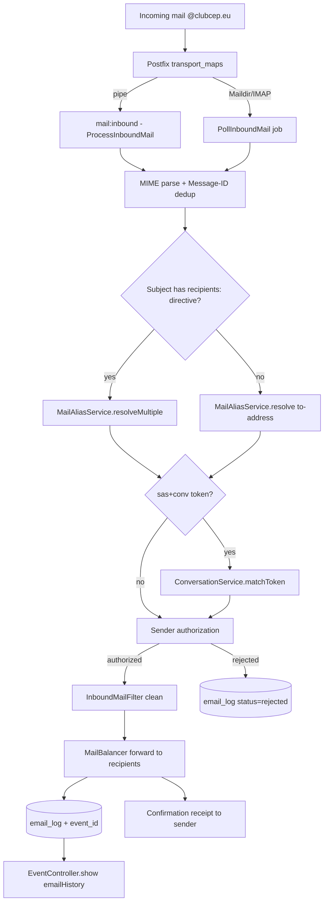
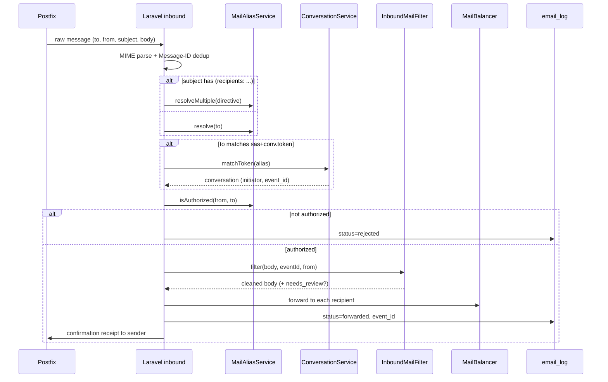

# email-cases.md — Inbound Patterns & Outbound Flows

This document is the authoritative reference for how the Laravel email pipeline
replaces the legacy PHP 5.6 `mailer.php` / `mailercodeV5.php` scripts. It
enumerates every inbound address pattern that is detected, how each is acted
upon, and every outbound path (who may send, how, and what information is
exposed along the way).

Companion documents:

- `devdocs/email.md` — architecture overview (outbound providers, inbound modes)
- `devdocs/events.md` — event participant email (`event-{id}@`) and event-page append
- `deploy/mail/setup-postfix-cutover.sh` — MX cutover runbook

---

## 1. Ingestion Overview

Mail for `@clubcep.eu` arrives at Postfix on the VPS. Postfix delivers it to
Laravel through one of two entry points, both of which converge on the same
resolution and forwarding logic:

| Entry point | Trigger | Class |
|-------------|---------|-------|
| `mail:inbound` artisan command | Postfix pipe (`transport_maps` → `laravel-pipe`) | `App\Console\Commands\ProcessInboundMail` |
| `PollInboundMail` job | Scheduler, every minute | `App\Jobs\PollInboundMail` (Maildir or IMAP) |

Both delegate alias resolution to `App\Services\MailAliasService` and content
cleaning to `App\Services\InboundMailFilter`.



---

## 2. Inbound Address Patterns

The routing part is the local part of the recipient address. Two address
styles are accepted for every group:

- **Legacy dotted form** — e.g. `bureau@`, `members.b@`, `members.s42@`.
- **Plus-addressing form** — e.g. `cep+bureau@`, `cep+event.42@`. The tag after
  `+` is extracted and normalized (`event.42` → `event-42`).

The mailbox prefix for plus-addressing comes from `config('club.mail_address')`
(`CLUB_MAIL_ADDRESS`, e.g. `cep@clubcep.eu`).

### 2.1 Group Aliases (list distribution)

Each row is a distinct case handled by `MailAliasService::resolve()`. The
"Resolves to" column states the exact query. The "Authorization" column states
who may send to that alias (enforced by `MailAliasService::isAuthorized()`).

| # | Pattern(s) | Resolves to | Auth level | Label |
|---|-----------|-------------|-----------|-------|
| 1 | `bureau`, `members.b`, `cep+bureau` | Members with `member_details.bureau_member = true` | `bureau` | Bureau |
| 2 | `members`, `all`, `cep+members` | Members whose `member_statuses.slug` is one of `actif`, `membre_de_droit`, `fonctionnaire` AND `users.email_verified_at` is not null | `bureau` | All active members |
| 3 | `instructors`, `moniteurs`, `members.m`, `cep+instructors` | Members with `member_details.active_instructor = true` | `bureau_or_instructor` | Instructors |
| 4 | `event-{id}`, `cep+event.{id}` | Confirmed registrations for event `{id}`, plus the event's instructor and responsible | `participant` | `Event: {title}` |
| 5 | `members.s{id}` (legacy trip form) | Same as case 4, resolved by event `{id}` | `participant` | `Event: {title}` |
| 6 | `members.pn{n}` (n = 1, 2, 3) | Members whose `member_details.training_enrollments` JSON contains `N{n}` AND email verified | `bureau_or_instructor` | `Training N{n}` |
| 7 | `year={YYYY}` | Members whose `member_details.cotisation_years` JSON contains `{YYYY}` AND email verified | `bureau` | `Members {YYYY}` |

### 2.2 SAS Privacy-Proxy Aliases

The legacy `sas` prefix implemented an email privacy proxy. Under the new
system it is split into two sub-cases with different owners during migration.

| # | Pattern | Handled by | Migration routing |
|---|---------|-----------|-------------------|
| 8 | `sas+conv.{token}` | Laravel `ConversationService::matchToken()` | Routed to Laravel (new) |
| 9 | `sas.{nickname}` (legacy static vanity alias) | Legacy `mailercodeV5.php` on the old host | Routed away from Laravel by Postfix |
| 10 | `sas+{name}-at-{domain}` (legacy on-the-fly proxy) | Legacy `mailercodeV5.php` on the old host | Routed away from Laravel by Postfix |

Case 8 is the new, first-class conversation reply channel (see §4). Cases 9 and
10 remain on the legacy host until fully retired; Postfix `transport_maps`
directs `sas.` and legacy `sas+` traffic to the old system while sending
`sas+conv.*` to Laravel. See `deploy/mail/postfix-split-routing.md`.

### 2.3 Subject Directive Override

If the subject contains `(recipients: ...)`, the parenthesized list overrides
the to-address routing. It is parsed by both entry points and passed to
`MailAliasService::resolveMultiple()`.

Accepted tokens inside the directive:

- Any group alias tag from §2.1 (e.g. `bureau`, `instructors`, `members.pn1`).
- Legacy synonyms, normalized on the way in: `sortie=` → `members.s`,
  `moniteurs` → `instructors`.
- `year={YYYY}`.
- A bare email address (validated with `FILTER_VALIDATE_EMAIL`) — added verbatim.
- A person name (e.g. `Michel B`) — resolved via `MailAliasService::findByName()`
  against `member_details.first_name` / `last_name`.
- `simulate` — see §2.6.

Multiple tokens are comma-separated; results are merged and deduplicated.

### 2.4 Unknown Alias Fallback

If neither the to-address nor a directive resolves to any recipients, the
message is re-routed to the Bureau and the subject is prefixed with
`[Unknown: {to}]`, so the Bureau can triage it. If the sender is also unknown
(no `users.primary_email` match) the message is rejected and logged with
`status = rejected`, `error = "Unknown alias + unknown sender"`.

### 2.5 Sender Authorization

Authorization runs after resolution. A sender is a known user only if their
`from` address matches `users.primary_email`.

- For a **direct alias**, `MailAliasService::isAuthorized(from, to)` checks the
  resolved `auth_level`:
  - `bureau` → sender must satisfy `User::isBureau()` (roles `bureau_master`,
    `bureau_finance`, `bureau_technical`).
  - `bureau_or_instructor` → bureau OR Spatie role `instructor`.
  - `participant` → bureau, instructor, or a confirmed registrant of that event.
- For a **subject directive**, the sender must be bureau or instructor.
- On failure the message is logged with `status = rejected`,
  `error = "Unauthorized sender"` and nothing is forwarded.

### 2.6 Simulation Mode

If the directive contains `simulate`, no mail is forwarded. Instead a report
listing the resolved label and the full recipient list is sent back to the
sender, and the attempt is logged with `status = simulated`. This mirrors the
legacy `memtest` / `members.t` dry-run behaviour.

### 2.7 Deduplication (Message-ID)

Before forwarding, the pipeline extracts the `Message-ID` header, sanitizes it
to a cache-safe key, and checks a 3-day store (replicating the legacy
`mailIds/` folder). A previously-seen ID short-circuits with no forwarding and
no duplicate `email_log` row. This prevents duplicate blasts when a queued job
is retried or a Maildir/IMAP message is re-read after a mid-batch failure.

### 2.8 Content Cleaning

`InboundMailFilter::filter(body, eventId, senderEmail)` cleans a forwarded body
through the following ordered steps:

1. HTML signature stripping via DOM/XPath using per-domain anchors from
   `config/mail_signatures.php`, then the Outlook reply-separator heuristic.
2. Plain-text signature stripping: per-domain anchors, then global device
   footers (every entry in `config('mail_signatures.global_device_footers')`),
   then standard delimiters (`-- `, `___`, `Cordialement`, `Best regards`,
   `Kind regards`, `Mit freundlichen Grüßen`).
3. Quoted-reply removal: `willdurand/email-reply-parser` splits the visible
   reply from quoted history; the regex/blockquote fallback handles cases the
   parser leaves behind.
4. Corporate disclaimer stripping (confidentiality notices, `DISCLAIMER`,
   `AVERTISSEMENT`, `HAFTUNGSAUSSCHLUSS`, European Commission legal notices,
   `Ce courriel et ses annexes`).
5. Optional AI moderation (`InboundMailFilter::aiFilter`) flags private or
   off-topic content for Bureau review when an LLM key is configured.
6. Over-strip guard: if cleaning reduced a substantial body to under 10
   characters, the original is kept and flagged for review.

Cleaned messages destined for an event are appended to that event's page (§5).

---

## 3. Inbound Decision Sequence



---

## 4. Conversations (bureau-initiated, SAS reply channel)

Case 8 (`sas+conv.{token}`) is backed by the `mail_conversations` table and
`ConversationService`. A conversation lets a Bureau member write to an external
third party on behalf of the club while keeping the member's real address
private and threading replies back through the club.

### 4.1 Starting a conversation

`ConversationService::start(initiator, externalEmail, subject, eventId?)`:

1. Mints a unique `token` and derives the SAS alias
   `sas+conv.{token}@{domain}` via `MailAliasService::mailtoAddress()`.
2. Persists a `mail_conversations` row (`initiator_user_id`, `external_email`,
   `external_name`, `event_id`, `token`, `subject`, `sas_alias`,
   `last_activity_at`).
3. Records the alias in `mail_aliases` with `type = sas_conv`.

The outbound message (see §6.3) uses:

- `From:` — `"{Sender} via CEP" <no-reply@clubcep.eu>` (never the member's address).
- `Reply-To:` — two addresses: the conversation SAS alias AND the club log
  mailbox, so replies thread back through the proxy and a copy is retained in a
  mailbox in addition to `email_log`.

### 4.2 Threading a reply back

When the external party replies to `sas+conv.{token}@`:

1. `ConversationService::matchToken()` resolves the token to the conversation.
2. The cleaned reply is forwarded to the conversation initiator's real address.
3. `hit_count` on the conversation's external address is incremented and
   `last_activity_at` is refreshed.
4. If the conversation is linked to an event, the reply is logged with that
   `event_id` and appears on the event page (§5).

```mermaid
sequenceDiagram
    participant M as Bureau member
    participant UI as Conversation screen
    participant CS as ConversationService
    participant EXT as External party
    participant IN as Inbound pipeline
    M->>UI: compose (recipient, subject, message, optional event)
    UI->>CS: start(member, external, subject, eventId?)
    CS-->>UI: conversation + sas+conv.token@
    UI->>EXT: From no-reply@; Reply-To [sas+conv.token@, log@]
    EXT->>IN: reply to sas+conv.token@
    IN->>CS: matchToken(token)
    CS-->>IN: initiator + event_id
    IN->>M: forward cleaned reply
    IN->>CS: increment hit_count, touch last_activity_at
```

---

## 5. Event-Page Append (DB-driven)

The legacy scripts appended trip mail to event communication files on disk.
The new system replicates this through the database:

- Any inbound mail resolved to an event (cases 4 and 5) and any event-linked
  conversation reply is written to `email_log` with a non-null `event_id`.
- `EventController::show()` builds `$emailHistory` from `email_log` rows where
  `event_id` matches OR `to_email LIKE 'event-{id}@%'`, and renders it at the
  bottom of the event page for bureau, instructors, and participants.

No filesystem artifacts are produced; the event page is the single source of
truth for a trip's communication history.

---

## 6. Outbound Flows

There are three distinct outbound paths. Each states who may send, how it is
triggered, and what information is exposed to recipients.

### 6.1 Bulk templated email (admin composer)

- **Who:** users with the Spatie permission `send email` (roles
  `bureau_master`, `bureau_finance`, `bureau_technical`). Enforced by the admin
  route group (`role:bureau_master,bureau_finance,bureau_technical`) and
  `SendEmailRequest::authorize()`.
- **How:** `Admin\EmailController::send()` — pick a template and a target group
  (`all`, `active`, `instructors`, `bureau`, `expiring_certs`, `unpaid`,
  `event`), preview, then send. Recipients are resolved by
  `EmailController::resolveGroup()`. Subject/body are rendered per recipient,
  optionally translated to the recipient's `preferred_locale`, queued, and
  dispatched.
- **Information exposed:** each recipient receives an individually addressed
  message; other recipients' addresses are never exposed. Template variables
  (`{{first_name}}`, `{{last_name}}`, `{{name}}`, `{{email}}`, `{{club_name}}`)
  are substituted per recipient. Every send is written to `email_log`
  (`direction` default/outbound) with status `queued` → `sent`/`failed`, or
  `staging_captured` in staging mode.

### 6.2 Member-to-member contact

- **Who:** any authenticated member (cannot contact themselves).
- **How:** `ContactMemberController::store()` — subject + message form.
- **Information exposed:** the message is sent to the target member's primary
  email with `Reply-To` set to the sender's primary email and the sender's
  display name. The sender's address is therefore revealed to the recipient (this
  is a direct member-to-member contact, not a proxied one). Logged to
  `email_log` with `direction = contact`.

### 6.3 Bureau conversation to a third party (proxied)

- **Who:** Bureau only. The screen lives under the admin route group and is thus
  restricted to `bureau_master`, `bureau_finance`, `bureau_technical`. Writing on
  behalf of the club is a Bureau action.
- **How:** the Start-a-conversation screen calls `ConversationService::start()`
  then sends via `MailBalancer`. The recipient field proposes previously-used
  external addresses ranked by `hit_count` (descending); the chosen address's
  count is incremented on send.
- **Information exposed:** the external party sees `From: "{Sender} via CEP"
  <no-reply@clubcep.eu>` and a `Reply-To` of `[sas+conv.{token}@clubcep.eu,
  {club log mailbox}]`. The member's real address is never exposed. Logged to
  `email_log` with `direction = contact` and `event_id` when the conversation is
  linked to an event.

### 6.4 Provider selection & failover (all outbound)

`MailBalancer` picks a provider by remaining daily quota and configures
Laravel's mailer before each send:

1. Resend (primary).
2. Resend (secondary).
3. Mailjet via local sendmail/Postfix.

When all quotas are exhausted it falls back to Mailjet (most generous). Per-send
counts are cached per day; live Resend and Mailjet quotas are surfaced on the
admin dashboard.

---

## 7. Traceability

| Behaviour | Requirement origin | Code |
|-----------|--------------------|------|
| Group alias routing (cases 1–7) | Legacy `mailscript` regex audience routing | `MailAliasService::resolve()` |
| Subject directive override | Legacy `(recipients: ...)` / `arrayrecipients` | `ProcessInboundMail`, `PollInboundMail`, `MailAliasService::resolveMultiple()` |
| SAS conversation reply channel (case 8) | New requirement (bureau writes on behalf of club) | `ConversationService`, `mail_conversations` |
| Legacy SAS cases 9–10 kept on old host | Coexistence requirement (Postfix split) | `deploy/mail/postfix-split-routing.md` |
| Message-ID dedup | Legacy `mailIds/` folder | Inbound dedup store |
| Simulation mode | Legacy `memtest` / `members.t` | `ProcessInboundMail`, `PollInboundMail` |
| Event-page append | Legacy `adcom` / `adcomall` disk archive | `email_log.event_id`, `EventController::show()` |
| Provider failover | Legacy Mailjet → local → Gmail waterfall | `MailBalancer` |
| Per-member unique alias | New requirement (member interface) | `mail_aliases`, `AliasAllocator` |
