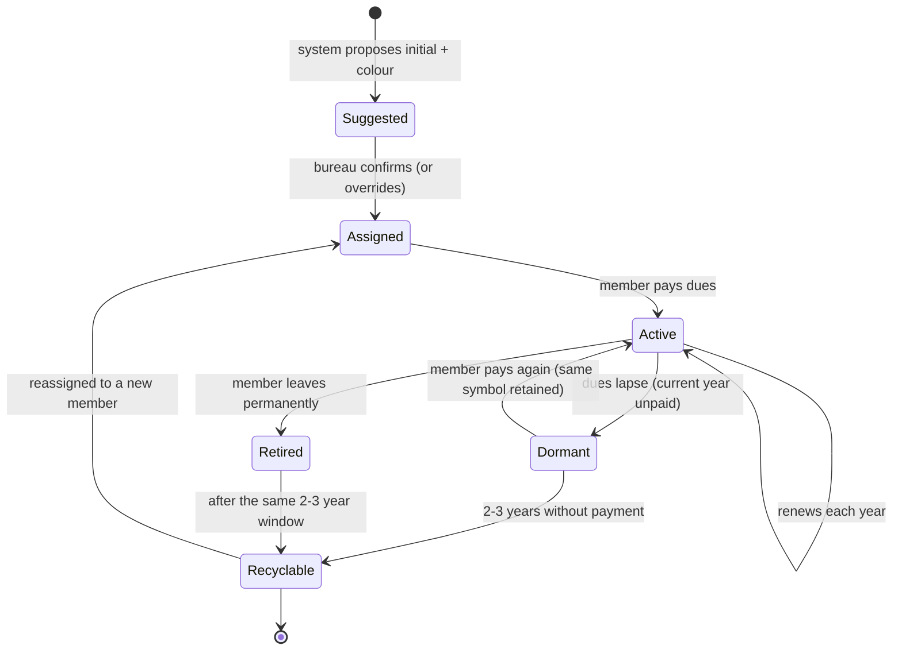

# roadmap-member-symbol.md — Member-Wide Unique Symbol (Design Note)

**Status:** Roadmap / not yet implemented. This is a note-keeping document
captured during the email-migration work. No code implements it yet.

## Origin

The instructor planning already assigns each instructor a stable, manually
curated **initial** and **colour**, stored on `member_details`:

- `instructor_initial` (varchar 3)
- `instructor_color` (hex, e.g. `#00695c`)

These are used in the availability grid (`resources/views/availability/index.blade.php`)
and must remain stable over time — they mirror the legacy Google Sheet planning
and are disambiguated by hand (Jerome Samson = J, Jerome Tongio = T, Pietro = O,
etc., per the project steering rules).

The idea in this note is to extend that same "unique symbol" concept from
instructors to **every active member**, so any active member can be represented
by a compact, stable, unique glyph across the app (planning, rosters, dive
group boards).

## Requirements (as discussed)

1. **Every active member** gets a unique symbol (initial + colour), not just
   instructors.
2. **Auto-suggested, bureau-overridable.** The system proposes a symbol (as
   `AliasAllocator` does for mail aliases), but the bureau confirms or overrides
   it. Curated instructor symbols must not be auto-changed.
3. **Uniqueness among active members.** Two active members may not share the
   same symbol at the same time.
4. **Recycle only after prolonged non-payment.** A symbol may be reassigned to a
   new member only after the previous holder has not paid dues for **2 to 3
   years**. Eligibility is derived from gaps in `member_details.cotisation_years`.
5. **Stability.** While a member remains active (or recently lapsed), their
   symbol never changes.

## Proposed Data Model (not built)

Two options, to be decided at implementation time:

- **Reuse `member_details`**: promote `instructor_initial` / `instructor_color`
  to member-wide `symbol_initial` / `symbol_color` columns, keeping the
  instructor columns as an alias or migrating them.
- **Dedicated `member_symbols` table** (`user_id`, `initial`, `color`, `active`,
  `assigned_at`, `released_at`): cleaner lifecycle tracking and history, at the
  cost of a join. Preferred if we want an audit trail of past holders for the
  recycle rule.

The recycle rule needs, per symbol, the last year the previous holder paid dues,
which is computable from `cotisation_years` or recorded as `released_at` when a
member's active status lapses.

## Symbol Lifecycle

## Allocation Sketch (not built)

Analogous to `App\Services\AliasAllocator`:

1. Candidate initials: first letter of first name; on collision, first two
   letters; then first + last initial; then a curated fallback set.
2. Candidate colours: a fixed palette, skipping colours already in use by active
   members, chosen for contrast against neighbours in the planning grid.
3. A symbol is "available" if no **active or dormant-but-not-yet-recyclable**
   member holds it. A symbol held only by a `Recyclable` former member is free.

## Explicit Non-Goals for Now

- No migration, table, service, UI, or tests are created by this note.
- Instructor symbols remain exactly as curated; any implementation must preserve
  them unchanged.

## Traceability

This note satisfies the "side idea" captured during the legacy mailer migration:
extend the instructor initial/colour concept to all active members with a
recycle-after-2-to-3-years-of-non-payment policy. It links back to the mail
migration only insofar as it reuses the same auto-suggest-then-bureau-confirm
pattern established by `AliasAllocator` (see `devdocs/email-cases.md` §7,
"Per-member unique alias").
