## theme-settings.md — Theme, Settings & Club Identity

## Overview

Centralized admin panel managing all configurable aspects: visual theme (6 presets + custom), club identity (name, IBAN, address), federation rules, medical rules, maintenance rules, membership fees, social media, and locales. All stored as key-value pairs in `theme_settings`.

## Data Model

### `theme_settings` Table

Simple key-value store: `key` (varchar 80, unique), `value` (text).

Used for: colors, club identity, feature toggles, layout config, license key, social credentials, locale settings, retention policies, and more.

## ThemeService

Generates CSS custom properties (`:root { --dc-primary: ... }`) from stored settings. Cached for 5 minutes.

### Color Variables Generated
`--dc-primary`, `--dc-secondary`, `--dc-accent`, `--dc-header-start`, `--dc-header-end`, `--dc-footer-bg`, `--dc-body-bg`, `--dc-body-color`

### UI Style Variables
`--dc-radius`, `--dc-radius-lg`, `--dc-shadow`, `--dc-shadow-hover`, `--dc-border-width`, `--dc-font-size`

### 6 Color Presets

| Preset | Primary | Secondary | Accent |
|--------|---------|-----------|--------|
| Ocean | #003366 | #0077be | #ffc107 |
| Coral | #c0392b | #e74c3c | #f39c12 |
| Lagoon | #00695c | #26a69a | #ffab40 |
| Abyss | #1a237e | #3949ab | #00e5ff |
| Tropical | #00838f | #4dd0e1 | #ff6f00 |
| Arctic | #37474f | #78909c | #80deea |

### 4 UI Styles

| Style | Radius | Borders | Font | Feel |
|-------|--------|---------|------|------|
| Rounded | 0.5rem | None | 1rem | Modern, friendly |
| Sharp | 0px | 1px | 1rem | Clean, precise |
| Classic | 4px | 1px | 1rem | Traditional admin |
| Compact | 3px | None | 0.875rem | Data-dense |

## Controller: `Admin\SettingsController`

Single mega-page managing multiple domains via tabs:

### Sub-CRUD Actions

| Domain | Methods |
|--------|---------|
| Federations | store, update, destroy |
| Member Statuses | store, update |
| Medical Rules | store, update, destroy |
| Maintenance Rules | store, update, destroy |
| Membership Fees | store (updateOrCreate), destroy |
| Theme | updateTheme (50 keys), applyPreset, uploadLogo |

### `updateTheme()` Allowed Keys (~50)

**Colors**: primary_color, secondary_color, accent_color, header_gradient_start, header_gradient_end, footer_bg, body_bg, body_color

**Logo/Branding**: logo_text, logo_emoji, logo_accent_text, logo_plain_text, club_full_name

**Club Identity**: club_iban, club_bic, club_email, club_address, club_phone, club_country, club_short_code, warehouse_address, warehouse_lat, warehouse_lon, training_locations

**Social Media**: social_facebook, social_instagram, social_youtube, social_tiktok, social_whatsapp, social_x, social_auto_publish, fb_group_is_closed, fb_group_id, fb_publish_enabled, ig_publish_enabled, ig_account_id

**UI**: ui_style, ui_show_icons, layout_width, card_style, header_bubbles, preset

**System**: license_key, default_locale, newsletter_article_base_url, enabled_locales (JSON array)

### Cache Invalidation
After updateTheme or applyPreset: `Cache::forget('theme_css')` and `Cache::forget('theme_settings')`. License key changes also flush `LicenseService::flushCache()`.

## ThemeSetting Model

| Method | Purpose |
|--------|---------|
| `ThemeSetting::get($key, $default)` | Retrieve a single setting |
| `ThemeSetting::set($key, $value)` | Upsert a setting |
| `ThemeSetting::all_settings()` | Return all as associative array |

## Dark Mode

Supported via `[data-bs-theme="dark"]` CSS selector (Bootstrap 5.3 color mode). ThemeService generates dark mode overrides for body bg, text color, footer, and shadows. Toggle is client-side (localStorage + class on `<html>`).

## Logo Upload

`POST /admin/settings/logo` — stores image in `theme/` on public disk, saves path to `theme_settings.logo_image`.


## Site Layouts

Admins can switch between three site-wide layout variants that control header style, navigation appearance, footer density, and overall visual hierarchy. The layout is applied as a CSS body class (`layout-{name}`) — no template changes, pure CSS override.

### 3 Layout Presets

| Layout | Body Class | Header | Nav | Cards | Footer | Feel |
|--------|-----------|--------|-----|-------|--------|------|
| Default | `layout-default` | Gradient + bubbles | Sticky white bar, border-bottom | Rounded, shadow | Dark bg, centered | Playful diving club |
| Professional | `layout-professional` | Solid primary, slim | Grey bar, underline indicators | 1px border, uppercase headers | Dark slim strip | Corporate / federation |
| Minimal | `layout-minimal` | White, borderless | Transparent, pill-shaped links | Borderless, floating shadow | Light grey, barely there | Modern SaaS |

### How It Works

```
ThemeService::layoutPresets()    → defines available options
ThemeService::activeLayout()     → returns validated current layout key
ThemeServiceProvider             → injects $theme into layout view
layout.blade.php                 → <body class="layout-{{ activeLayout() }}">
_layouts.scss                    → CSS overrides scoped to body.layout-{name}
```

### State Diagram

```mermaid
stateDiagram-v2
    [*] --> Default : initial (no DB entry)
    Default --> Professional : admin selects
    Default --> Minimal : admin selects
    Professional --> Default : admin selects
    Professional --> Minimal : admin selects
    Minimal --> Default : admin selects
    Minimal --> Professional : admin selects
```

### Component Interactions

```mermaid
flowchart LR
    A[Admin Settings UI] -->|POST site_layout| B[SettingsController]
    B -->|validate against layoutPresets| C[ThemeSetting::set]
    C -->|cache flush| D[Cache::forget]
    D --> E[Next page load]
    E --> F[ThemeServiceProvider]
    F -->|activeLayout| G[layout.blade.php]
    G -->|body class| H[_layouts.scss overrides]
```



### Adding a New Layout

1. Add entry to `ThemeService::layoutPresets()` with `label`, `desc`, `icon`
2. Add CSS block in `resources/scss/partials/_layouts.scss` as `body.layout-{key} { ... }`
3. Add dark mode override as `[data-bs-theme="dark"] body.layout-{key} { ... }`
4. Add mobile responsive rules within the layout block
5. Run `npm run build` — no migration needed, the key is stored as a string

### Validation

- `SettingsController::updateTheme()` rejects any `site_layout` value not in `layoutPresets()` keys
- `ThemeService::activeLayout()` falls back to `'default'` if DB contains an invalid value
- The body class is rendered via `activeLayout()` (never raw DB value) for XSS safety

### Dark Mode Compatibility

Each layout has a corresponding `[data-bs-theme="dark"] body.layout-{name}` block that adjusts backgrounds, borders, and text colors for the dark theme. The `data-bs-theme` attribute lives on `<html>`, the layout class on `<body>`.

### Admin UI Location

Settings → Appearance tab → "Site Layout" section (between Menu Icons and UI Style). Three card-style buttons with `aria-pressed` for screen reader support.
