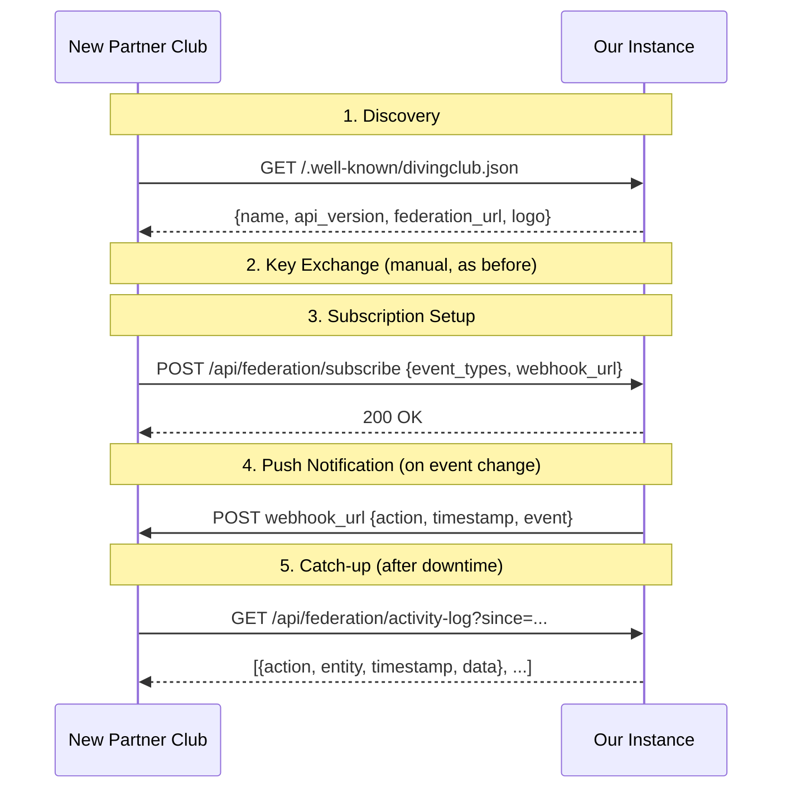

# Federation API Improvements Plan (Fediverse-Inspired)

**Status:** Planned (not started)
**Created:** 2026-06-29
**Motivation:** Borrow architectural patterns from ActivityPub/Mobilizon without adopting the public protocol. Keep the trusted bilateral model, improve resilience and usability.

---

## Context

The current inter-club partnership system is a closed bilateral REST API with manual key exchange. It works for 2-5 known partners but lacks:
- Zero-config discovery (admins must manually enter URLs)
- Push notifications (partners must poll for changes)
- Catch-up after downtime (no activity history)
- Selective subscriptions (all-or-nothing event visibility)
- Graceful handling of full slots (hard 409 rejection)

### Fediverse Lessons Applied

| Fediverse Concept | What We Borrow | What We Skip |
|---|---|---|
| WebFinger discovery | `/.well-known/divingclub.json` — machine-readable club identity | Open discovery without auth. We still require key exchange. |
| Inbox/Outbox push | Webhook notifications on event changes | Full S2S ActivityPub inbox. We use simple signed POSTs. |
| Activity history | Timestamped activity log with `?since=` cursor | JSON-LD, content negotiation, AS2 vocabulary |
| Follow semantics | Event type subscriptions per partner | Public follow/unfollow. Ours is admin-configured. |
| Mobilizon participant states | Waitlisted status with auto-promotion | Full ActivityPub Join/Accept/Reject flow |

### What We Explicitly Don't Do

- No public federation (ActivityPub S2S)
- No open discovery without key exchange
- No interop with Mastodon/Mobilizon instances
- No JSON-LD or ActivityStreams vocabulary
- No HTTP Signatures (we use HMAC-SHA256 with shared secrets)

---

## Architecture



---

## Task Breakdown

### Task 1: Discovery Endpoint

**Objective:** Public `/.well-known/divingclub.json` returning club metadata.

- Route in `routes/web.php`, no auth
- Returns: `name`, `logo_url`, `api_base_url`, `api_version` (integer, currently `1`), `federation_endpoint`, `contact_email`, `supported_event_types`
- Data from `ThemeSetting` + `config('app.url')`
- Cache-Control: max-age=3600

**Tests:**
- GET returns 200 with correct schema
- Works without auth
- Returns configured club name

---

### Task 2: Migration

**Objective:** Schema changes for webhooks, subscriptions, activity log, and waitlist support.

**`club_partnerships` additions:**
- `webhook_url` — nullable string
- `subscribed_event_types` — nullable JSON (array of event type strings, null = all)

**New table `federation_activity_log`:**
- `id` (bigint PK)
- `partnership_id` (nullable FK → club_partnerships, null = broadcast)
- `action` (string: `event_created`, `event_updated`, `event_cancelled`, `registration_status_changed`)
- `entity_type` (string)
- `entity_id` (unsigned bigint)
- `data` (JSON)
- `created_at` (timestamp, indexed)

**Model changes:**
- `ClubPartnership`: add to `$fillable`, cast `subscribed_event_types` to `array`

**No schema change for waitlist** — `external_registrations.status` is already a string column, `waitlisted` is just a new application-level value.

---

### Task 3: Event Type Subscriptions

**Objective:** Partners choose which event types trigger notifications.

- `POST /api/federation/subscribe` (authenticated): `{ "event_types": [...], "webhook_url": "..." }`
- Null/missing `event_types` = subscribe to all
- Admin UI: multi-select for event types + webhook URL on partnership edit form
- Add `PartnershipController::edit()` and `update()` methods

**Tests:**
- API sets fields correctly
- Null = all events
- Filtering logic matches event types

---

### Task 4: Webhook Push Notifications

**Objective:** Push signed notifications to partners when federated events change.

- `App\Jobs\NotifyFederationPartners` (queued): iterates matching partners, POSTs to webhook_url
- Payload: `{ "action": "...", "timestamp": "...", "event": {...} }`
- Headers: `X-Club-Key-Id`, `X-Club-Timestamp`, `X-Club-Signature` (HMAC-SHA256)
- Triggered from EventController/observer on: create, update, cancel of federated events
- Logs to `federation_activity_log`
- Retry 3× with backoff on failure

**Tests:**
- Creating federated event dispatches job
- Job filters by subscribed event types
- HMAC signature correct
- Non-federated events don't trigger

---

### Task 5: Activity Log & Catch-Up Endpoint

**Objective:** Timestamped log for partner sync after downtime.

- `GET /api/federation/activity-log?since={ISO8601}` (authenticated)
- Returns entries from `federation_activity_log` for the authenticated partner + broadcasts
- Ordered by `created_at`, max 100/page, cursor pagination via `?after_id=`
- Logged on: federated event changes, external registration status changes
- Service class: `FederationActivityLogger::log(action, entity, data, ?partnershipId)`

**Tests:**
- Returns correct entries filtered by `since`
- Pagination works
- Only relevant entries returned per partner
- 401 on unauthenticated request

---

### Task 6: Waitlisted Status

**Objective:** Graceful handling when external slots are full.

- `FederationApiController::register()`: when full → create with `status = 'waitlisted'`, return 201 with position
- Auto-promotion: when an approved/pending registration is cancelled, promote oldest waitlisted entry to `pending`
- Notify via webhook when promoted
- Log to activity log
- Admin UI: show waitlisted entries with position

**Tests:**
- Register when full → waitlisted
- Cancel approved → oldest waitlisted auto-promotes
- Position updates correctly
- Webhook fires on promotion

---

### Task 7: Integration & Admin UI

**Objective:** Wire together, update admin pages and documentation.

- Partnership index: show webhook_url, subscribed types as badges, delivery status
- Activity log page in admin
- Edit form with webhook + subscriptions
- "Test Webhook" button
- Update admin guide

**Tests:**
- Admin CRUD works with new fields
- Test webhook returns status
- Existing tests still pass

---

## API Summary (New Endpoints)

| Method | Endpoint | Auth | Purpose |
|--------|----------|------|---------|
| GET | `/.well-known/divingclub.json` | None | Club discovery |
| POST | `/api/federation/subscribe` | Key/Secret | Set subscriptions + webhook URL |
| GET | `/api/federation/activity-log` | Key/Secret | Catch-up feed |

## External Registration Statuses (Updated)

```
pending → approved → (done)
pending → rejected
pending → cancelled
waitlisted → pending (auto-promoted when slot opens)
waitlisted → cancelled
```

---

## Files to Create

- `docs/FEDERATION-IMPROVEMENTS-PLAN.md` (this file)
- `app/Jobs/NotifyFederationPartners.php`
- `app/Services/FederationActivityLogger.php`
- `database/migrations/xxxx_add_federation_improvements.php`

## Files to Modify

- `routes/web.php` (discovery endpoint)
- `routes/api.php` (subscribe + activity-log endpoints)
- `app/Http/Controllers/Api/FederationApiController.php` (subscribe, activity-log, waitlist logic)
- `app/Http/Controllers/Admin/PartnershipController.php` (edit/update, test webhook)
- `app/Models/ClubPartnership.php` (new fields, casts)
- `resources/views/admin/partnerships/` (edit form, activity log, subscription UI)
- `resources/views/admin/guide/partnerships.blade.php` (documentation update)

## Dependencies

- No new Composer packages required
- Uses existing queue infrastructure for webhook jobs
- Compatible with MySQL and PostgreSQL

## Estimated Effort

~3-4 days of implementation across all 7 tasks.
