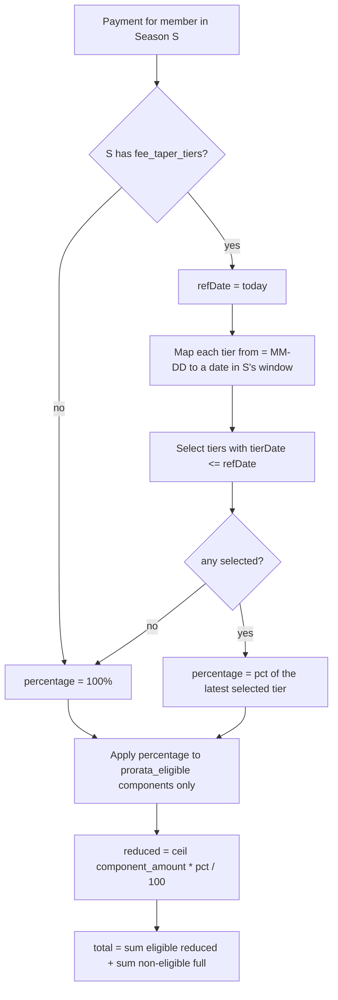

# Season-Relative Membership Fee Tapering — Design

## Requirements (source of truth)

| ID | Requirement (from bureau) |
|----|---------------------------|
| R1 | Only the **club-retained CEP membership component** tapers. Licence (FFESSM), insurance, federation, and any other pass-through components are never reduced. |
| R2 | The taper is **season-relative**: cutoffs are month-day anchors (e.g. "1 April") that apply within whichever season, not a hardcoded calendar year. |
| R3 | A **new season** starts automatically at **100%** (full rate). |
| R4 | Payment **before** a cutoff covers until the end of the season; payment **after** a cutoff is reduced (covers the remaining, shorter period). |
| R5 | The schedule is a **configurable list of cutoffs**, each with a **percentage**, editable by the bureau in the season config screen. Example: 1 April → 50%, 1 August → 100%. |
| R6 | The reference/tapering evaluation is driven by the **season** the payment applies to; the percentage is chosen from the cutoffs against the reference date (today at calculation time). |
| R7 | Reduced amounts are **rounded up to the higher euro** (`ceil`). |
| R8 | The taper must be reflected consistently in **both** the self-service cotisation calculator and the `PaymentExpected` / renewal breakdown seen by the treasurer. |

## Design decisions (traceable to requirements)

| Decision | Satisfies | Rationale |
|----------|-----------|-----------|
| D1. Store the schedule as JSON `fee_taper_tiers` on the `seasons` table. | R2, R3, R5, R6 | The `Season` already owns `start_date`/`end_date`; tapering is inherently season-scoped. New season ⇒ new (or empty) schedule ⇒ 100% by default (R3). |
| D2. Each tier is `{"from": "MM-DD", "pct": <int 0-100>}`, ordered; an implicit 100% applies from season start until the first tier's date. | R2, R3, R5 | Month-day anchors are season-relative (R2). Absence of a tier before a date means full rate (R3). |
| D3. Applicable percentage = the `pct` of the **last tier whose `from` month-day ≤ reference month-day within the season year**; if none, 100%. Wrap handled by ordering within the season window (start_date … end_date). | R4, R6 | Directly models "after 1 April = 50%, after 1 August = 100% again". |
| D4. Add a `prorata_eligible` boolean to `membership_fee_components`; only eligible components are multiplied by the percentage. The CEP membership base is eligible; licence/insurance/federation are not. | R1 | Explicit per-component opt-in prevents accidental tapering of pass-through money. |
| D5. Centralise the percentage lookup + application in `FeeCalculationService` (new methods `taperPercentage(Season, ?Carbon): int` and applying it in `calculate()`), and have the cotisation calculator use the same source. | R8 | Single source of truth; both screens agree. |
| D6. `ceil()` the reduced euro amount of each eligible component. | R7 | Round up to the higher euro. |
| D7. Admin editor for `fee_taper_tiers` on the season form/show screen; `prorata_eligible` toggle on the fee-components screen. | R5 | Bureau-editable, no code/config-file change needed. |

## Data model changes

```
seasons
  + fee_taper_tiers   JSON nullable   -- e.g. [{"from":"04-01","pct":50},{"from":"08-01","pct":100}]

membership_fee_components
  + prorata_eligible  BOOLEAN default false
```

No change to `membership_fees` (base amount stays; whether the *base* tapers is governed by marking the corresponding component eligible — see Open Point O1).

## Percentage resolution



## Component interaction

```mermaid
sequenceDiagram
    participant Admin as Bureau (Season config)
    participant Season as seasons.fee_taper_tiers
    participant Comp as membership_fee_components.prorata_eligible
    participant Svc as FeeCalculationService
    participant Calc as Cotisation calculator (self-service)
    participant Pay as PaymentExpected / renewal breakdown

    Admin->>Season: edit tiers [{04-01:50},{08-01:100}]
    Admin->>Comp: mark CEP membership eligible; licence/insurance not
    Calc->>Svc: taperPercentage(season, today)
    Svc-->>Calc: pct
    Calc-->>Calc: ceil(cep*pct/100) + licence + insurance
    Pay->>Svc: calculate(user, season, optionals)
    Svc->>Season: read tiers
    Svc->>Comp: read eligible flags
    Svc-->>Pay: amount_due (eligible tapered), components breakdown
```

## Open points (need confirmation before/at implementation)

- **O1.** The base membership fee (`MembershipFee.amount` per status) currently bundles the club-retained CEP portion. To taper "only the club portion", we either (a) treat the whole base as eligible when it represents the CEP membership, or (b) split the club portion into its own eligible component. The legacy `config/cotisation.php` already stores explicit `reduced` amounts per CEP type — migrating those to percentages will change some values (e.g. fonctionnaire 105→ reduced 55 today vs `ceil(105*0.5)=53`). Confirm acceptable, or keep per-type reduced overrides.
- **O2.** `config/cotisation.php` is the legacy source for the self-service calculator. Plan: migrate its `reduced_after` + per-type `reduced` into the season `fee_taper_tiers` + `prorata_eligible` model, then have the calculator read from the DB. Confirm we retire the config file.

## Test plan

- Percentage resolution: before first cutoff = 100; between cutoffs = tier pct; after last (wrap to 100) = 100; season with no tiers = 100.
- Application: eligible component reduced with `ceil`; non-eligible unchanged; total correct.
- Rounding: `ceil(105*0.5)=53`, `ceil(55*0.5)=28`.
- Both entry points (calculator + PaymentExpected) return identical amounts for the same inputs.
