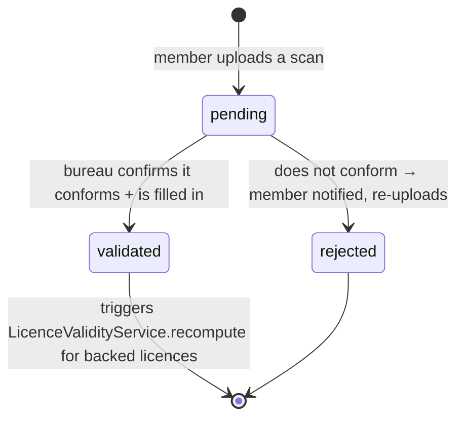
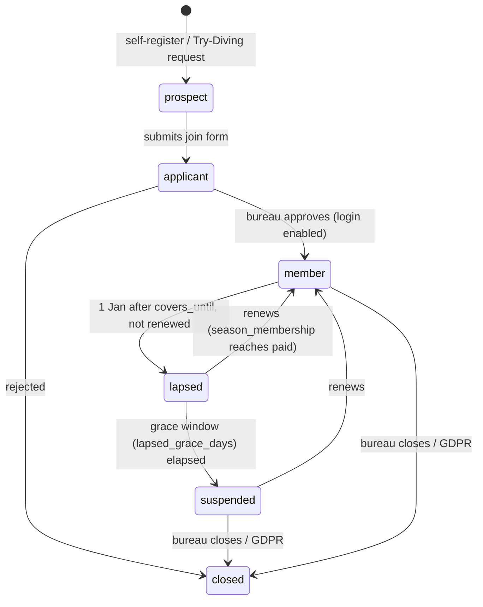

# Membership lifecycle — design proposal

Status: **draft for review (v2).** Nothing here is built. It captures the
bureau's description of how membership actually works, maps it onto the current
schema, and proposes the changes. §10 lists the decisions still open.

---

## 1. The lifecycle in the bureau's words

1. A person **joins** the club (submits the join form).
2. Someone from the **bureau approves** them → the profile goes **active** and
   they can log into the site.
3. **Every year:**
   - **Rate** depends on who they are:
     - EU-institution employee, or family of one, or an external instructor →
       *membre de droit* (reduced rate).
     - Retired → *membre assimilé*.
     - Child or spouse of a member → *membre associé*.
     - Otherwise → *membre externe* (adult rate); a **youth rate** applies below
       an age threshold.
   - They **pay the membership fee between September and December**. That
     payment covers **the rest of the current year plus the following year**.
   - If they are a **sympathisant**, it stops there — no licences.
   - If they are **"more" (active)**, they want federation **licences**.
4. **Licences** require **medical-certificate coverage**, and each federation
   has its own rules. The club orders the licences and records them on the
   profile. **Validity dates are computed from the member's age, the medical
   certificate date, and the federation's rules.**
5. **Any time during the year** a member can submit a **new medical certificate
   to extend validity**. The bureau checks the **scan** (conforms to
   requirements, properly filled in), **validates** it, and the licence validity
   is extended.
6. If, after some years, they **stop paying**: on **1 January of the first year
   they are no longer covered**, they become a **lapsed member**. Site access
   shows a **warning for 1–2 months maximum**, then is **blocked**.

---

## 2. Membership tiers (fee rate)

`member_statuses` is — and stays — the **fee-rate tier**, nothing else.

| Slug | FR label | Who | Notes |
|---|---|---|---|
| `membre_de_droit` | Membre de droit | EU-institution employee; **also** external instructors | reduced rate |
| `assimile` | Membre assimilé | retired (ex-fonctionnaire) | |
| `associe` | Membre associé | child or spouse of a member | age → youth rate |
| `externe` | Membre externe | external adult | full rate; age → youth rate |
| `sympathisant` | Sympathisant | supporter — fee only, **never takes licences** | lighter fee |
| `honoraire` | Honoraire | honorary — **no fee**, keeps access & licences | |
| `junior` / `enfant` | | under-18 sub-tiers (if kept — may be just the youth rate on `associe`/`externe`) | see §10.4 |

The **rate table** already exists: `membership_fees` keyed by
`(status_id, season_year)`, with the season fee-taper for mid-year joiners
(`Season::taperPercentage()`). The tier is the *input*; nothing new is needed to
price it. What's missing is a clean place to record **which tier applies for
which season** and **why** — that goes on `season_memberships` below.

Whether a member "takes licences" is **not** a tier — it's per season
(`sympathisant` never does; everyone else may). Model it as
`season_memberships.wants_licences` or infer it from "has ≥1 `member_licences`
row for the season".

---

## 3. Current state — the disconnect

"Is this person a covered member right now?" is answered by records that never
talk to each other:

| Record | Holds | Written by | Read by |
|---|---|---|---|
| `payment_expected` (`type = membership`) | the money: `status` pending/partial/paid, amounts, `paid_at`, `communication`, reconciliation refs | `FeeCalculationService::createPaymentExpected()`; → `paid` by `BankReconciliationService::confirmMatch()` | finance dashboard, annual report |
| `member_details.cotisation_years` | JSON year-string array | **only** the profile edit form, by hand | public "active members" count, `User::isActive()`, CSV export |
| `users.status_id` | the tier (see §2); only `former` is lifecycle-ish | members-screen dropdown | listings, mail eligibility, fee lookup |
| `member_licences` | `licence_number`, `federation_id`, `licence_request_pending`, `medical_cert_expiry`, `season` — **no licence `valid_from`/`valid_until`, no status** | licence admin screens | compliance checks |
| `documents` (medical) | scan, `expiry_date`, `is_verified` + `verified_by/at`, `is_current`, `superseded_by`, `is_compliant` | upload + bureau review | `MedicalComplianceService` |

Key gaps:
- `confirmMatch()` marks the payment `paid` and stops — nothing flows to
  `cotisation_years`, `status_id`, licences, or access.
- No **coverage window** — `cotisation_years` is a year list, but coverage is
  "rest of this year + all of next", i.e. a date range.
- No **licence validity** stored — only the backing cert's expiry.
- No **access-control state** — "lapsed", "in the warning window", "blocked"
  don't exist; `former` is a hand-set status.
- Medical review has no **rejected** state (`is_verified` is a bool).
- Rollover is computed two ways: `Season::currentDuesYear()` (data-driven off
  the season `start_date`) vs. hardcoded `now()->month >= 9` in
  `HomeController::memberStats()` and `User::isActive()`.

---

## 4. Proposed model

Three record types + one derived arc.

### 4a. `season_memberships` (new) — fee + coverage, one row per (user, season)

```
id
user_id            FK users
season_year        string             -- Season::currentDuesYear() convention (e.g. "2027")
member_status_id   FK member_statuses -- the tier FOR THIS SEASON (may differ year to year)
rate_basis         enum: droit | assimile | associe | externe | youth | sympathisant | honoraire
wants_licences     bool               -- false for sympathisant
state              enum: fee_due | paid | waived | lapsed | resigned
fee_payment_id     FK payment_expected  nullable
covers_from        date  nullable      -- payment date (or approval date for waived)
covers_until       date  nullable      -- 31 Dec of season_year
amount_due         decimal nullable
joined_on          date  nullable      -- first season only
lapsed_on          date  nullable
notes              text  nullable
timestamps
unique (user_id, season_year)
```

- A **September–December payment** for season `Y` → `state = paid`,
  `covers_from = paid_at` (in year `Y-1`), `covers_until = Y-12-31`. Coverage
  therefore spans the tail of `Y-1` and all of `Y`, exactly as described.
- **`member_details.cotisation_years` becomes derived**: the calendar years any
  `paid`/`waived` row's `[covers_from, covers_until]` touches. Keep it as a
  generated mirror column for one release, then drop it and its editor.
- Public "active members" and `User::isActive()` = "has a `paid`/`waived` row
  whose coverage window contains today" (via `Season::currentDuesYear()` — kill
  the hardcoded month check).

### 4b. `member_licences` (extended) — one row per (user, federation, season)

Add:
```
status         enum: requested | ordered | active | expired | cancelled
valid_from     date  nullable
valid_until    date  nullable          -- computed, see below
medical_doc_id FK documents nullable   -- the validated cert this validity rests on
```

`valid_until` = the **earliest** of:
- the federation's rule applied to the **validated medical certificate**
  (`documents.date_established` / `expiry_date`, `cert_type`) —
  `medical_compliance_rules` per federation,
- an **age cap** (federation rules differ for minors / seniors),
- the federation's **maximum licence term**.

Recomputed whenever a newer validated medical certificate arrives
(`LicenceValidityService::recompute($licence)`).

### 4c. Medical certificates — `documents` (medical), small additions

```
review_state   enum: pending | validated | rejected   -- replaces the is_verified bool
reviewed_by    (rename of verified_by)
reviewed_at    (rename of verified_at)
reject_reason  text nullable
```

Flow: `pending → validated | rejected`. On `validated`, recompute
`valid_until` for every `member_licences` row that names this doc (or every
active licence for the member if none named yet), and extend them.

### 4d. `users.lifecycle_stage` (new) — the arc + access control

```
prospect → applicant → member → lapsed → suspended → closed
```

| Stage | Meaning | Site access |
|---|---|---|
| `prospect` | self-registered or a linked `trial_requests` row; not approved | login blocked — "your request is pending" |
| `applicant` | join form submitted, awaiting bureau approval | same |
| `member` | approved **and** has coverage for today | full |
| `lapsed` | coverage ended (set on 1 Jan after `covers_until`); within the grace window | login allowed, **persistent renewal warning banner** |
| `suspended` | grace window elapsed | login blocked → redirected to a renewal / contact page |
| `closed` | bureau closed the file / GDPR erased | blocked |

- **Approval** (`applicant → member`) is the one-time act that "makes the
  profile active and lets them log in".
- **Renewal**: `lapsed`/`suspended` → `member` the moment a new
  `season_memberships` row reaches `paid`.
- `former` **disappears as an assignable status**; the mail/listing exclusion
  currently keyed on `MemberStatus::INACTIVE_SLUGS` moves onto
  `lifecycle_stage ∈ {lapsed, suspended, closed}` (with `lapsed` arguably still
  mailable — that's §10.2).
- The grace window is a setting: `lapsed_grace_days` (default ~60,
  "1–2 months max").

Enforced by one middleware on the authenticated route group; it reads
`lifecycle_stage` and either passes, flashes the banner, or redirects.

---

## 5. Rate / tier assignment

Deciding the tier is a bureau judgement, but it follows a table — worth making
it an assisted picker on approval and on each renewal:

```
is external instructor?                         → membre_de_droit
else EU-institution employee?                   → membre_de_droit
else retired (was fonctionnaire)?               → membre_assimilé
else child or spouse of a current member?       → membre_associé
else                                            → membre_externe
then: age < youth_age at season start?          → youth rate on that tier
opt-in "supporter, no licences"                 → sympathisant  (overrides above)
bureau-granted honorary                         → honoraire     (no fee)
```

`youth_age`, and whether `junior`/`enfant` stay as distinct tiers or collapse
into "youth rate", are §10.4.

---

## 6. State machines

### Per-season membership

```mermaid
stateDiagram-v2
    [*] --> fee_due: bureau adds member to the season / member renews\n(tier chosen, payment_expected generated)
    fee_due --> paid: bank reconciliation confirms the transfer\n(hook in confirmMatch) — or bureau marks cash/cheque
    fee_due --> waived: honoraire, or fee forgiven
    paid --> [*]: season closes, covered
    waived --> [*]
    fee_due --> lapsed: unpaid past the grace cutoff
    fee_due --> resigned: withdrew before paying
    paid --> resigned: quit mid-season (rare; usually just doesn't renew)
```



`covers_from` / `covers_until` are set on entry to `paid` / `waived`.
Non-renewal is not a transition here — it's the **absence** of next season's
row, detected by the lapse job (§7).

### Licence

```mermaid
stateDiagram-v2
    [*] --> requested: member (state=paid, wants_licences) asks for a licence
    requested --> ordered: club orders it from the federation
    ordered --> active: licence number recorded; valid_from/valid_until computed\nfrom the validated medical cert + federation rules
    active --> active: newer medical cert validated → valid_until extended
    active --> expired: valid_until passed
    expired --> active: new validated cert → re-validated
    requested --> cancelled: not pursued
```



### Medical certificate



### Lifecycle / access



---

## 7. Transitions & side effects

| Event | Change | Side effects |
|---|---|---|
| Join form submitted | `∅ → applicant` (lifecycle) | link `trial_requests` row if any |
| Bureau approves | `applicant → member` | login enabled; prompt to create the first `season_memberships` row |
| Add member to season / renew | `∅ → fee_due` (season) | pick tier → `member_status_id`, `rate_basis`; `FeeCalculationService::createPaymentExpected()` → `fee_payment_id` |
| Bank line matched & confirmed | `fee_due → paid` (season) | **new hook** in `BankReconciliationService::confirmMatch()`: if `payment_expected.type = membership` and now `paid`, set the linked season row `paid`, `covers_from = paid_at`, `covers_until = <season_year>-12-31`; if lifecycle is `lapsed`/`suspended` → `member`; refresh `cotisation_years` mirror |
| Cash / cheque | `fee_due → paid` | bureau click on the chip; `payment_expected` marked paid manually |
| Honoraire / waiver | `fee_due → waived` | `covers_*` set; `amount_due = 0` |
| Licence requested | `∅ → requested` (licence) | requires season `state = paid` and `wants_licences` |
| Club orders licence | `requested → ordered` | |
| Licence number recorded | `ordered → active` | `LicenceValidityService::recompute()` sets `valid_from`/`valid_until` |
| Medical cert uploaded | `∅ → pending` (cert) | supersede the previous `is_current` cert |
| Bureau validates cert | `pending → validated` | recompute + extend `valid_until` on backed licences |
| Bureau rejects cert | `pending → rejected` | notify member with `reject_reason` |
| Nightly, 1 Jan | `member → lapsed` | for users with no covering `season_memberships` row today; `lapsed_on = today` |
| Nightly | `lapsed → suspended` | once `today - lapsed_on > lapsed_grace_days` |
| Bureau closes file | `* → closed` | |

---

## 8. Members screen — the per-season chip

Replace the single **Statut** dropdown on `admin/members` with a chip for the
**current dues year**, showing `season_memberships.state` + coverage:

```
 ▢  —                 no 2027 row           click → create (fee_due, tier picker)
 ▢  € due             fee_due               click → mark paid (cash) / waive
 ▣  paid · to 31/12   paid                  (green) — hover: coverage + licence status
 ▢  lapsed            lapsed                (amber) — member is in the warning window
 ▢  suspended         suspended             (red)   — login blocked
```

- Bank reconciliation drives `fee_due → paid` on its own; the bureau only
  clicks for cash, waivers, and approvals.
- The **tier** picker is attached to the chip and writes
  `season_memberships.member_status_id` for that year — so a member can be
  `associe` as a student in 2026 and `externe` in 2027 without touching history.
- Second line / hover: licence chips per federation
  (`FFESSM ✓ to 2027-08 · FLASSA ⧗ cert pending`).
- Row hover: the season strip (`2024 paid · 2025 paid · 2026 lapsed · 2027 —`).

---

## 9. Migration path (each step shippable alone)

1. **`season_memberships`** + backfill from `cotisation_years` (one `paid` row
   per year, `covers_from = Jan 1`, `covers_until = Dec 31`, tier = current
   `status_id`).
2. **`users.lifecycle_stage`** + backfill (`former` → `lapsed`; `status_id`
   null & verified → `prospect`; else `member`).
3. **Repoint reads**: `HomeController::memberStats()` + `User::isActive()` →
   `season_memberships` via `Season::currentDuesYear()`. `cotisation_years`
   kept as a generated mirror. *(Fixes the reported bug — no UI change yet.)*
4. **Hook `confirmMatch()`** → advance the season row + lifecycle.
5. **Access middleware** on `lifecycle_stage` (banner for `lapsed`, block for
   `suspended`) + the nightly lapse job + `lapsed_grace_days` setting.
6. **Members-screen chip** (§8).
7. **Licence + medical additions** (4b/4c) + `LicenceValidityService`; wire the
   cert-review screen to extend licence validity.
8. **Link `trial_requests.user_id`**; retire `former`; drop `cotisation_years`
   and its editor.

Steps 1–3 alone close the "paid member not shown as active" gap.

---

## 10. Open questions for the bureau

1. **Blocked = ?** After the grace window, is `suspended` a hard login block,
   or login allowed but every page redirects to a "renew / contact us" wall
   until they pay?
2. **`lapsed` and mail.** During the 1–2 month warning window, should the
   member still receive club newsletters / event mail, or only renewal
   reminders?
3. **Grace length.** Fixed `lapsed_grace_days` (≈45–60), or a fixed date
   ("blocked from 1 March")?
4. **Youth.** One `youth_age` threshold applied as a rate on
   `associe`/`externe`, or keep distinct `junior` / `enfant` tiers? What age(s)?
5. **Retiree tier.** `assimile` = "retired ex-fonctionnaire" — does a retired
   *externe* also become `assimile`, or stay `externe`? Who flips it, and when?
6. **External instructors → `membre_de_droit`.** Is that automatic from the
   `instructor` role, or a manual bureau call?
7. **`paid` threshold.** With the fee taper and `payment_expected.provisional`,
   does `fee_due → paid` need `amount_paid ≥ amount_due`, `≥ the tapered
   amount`, or just "a payment was reconciled"?
8. **Multiple federations.** For someone with FFESSM + FLASSA licences, is the
   member "covered" if *any one* is valid, or must *all required* be valid?
9. **Licence validity rules.** Are the per-federation age/cert/term rules
   documented somewhere we can encode, or does the bureau compute `valid_until`
   by hand today?
10. **Honoraires.** Auto-create a `waived` `season_memberships` row each year,
    or leave them outside the per-season model (always "covered")?
11. **Partner-club / external divers** (`external_registrations`) — in scope for
    this model or a separate track?

---

## 11. What this deliberately avoids

- **No lifecycle values in `member_statuses`** — tier and lifecycle stay
  separate axes; conflating them is the current tangle.
- **No FSM library** — enum columns + an allowed-transitions map +
  `transitionTo()` guards are enough for these small machines.
- **No history rewrite on lapse / return** — every season and every licence is
  its own row; the arc and `cotisation_years` are derived.
- **No change to `status_sets`** — it already scopes which tiers a member may
  hold; untouched.
