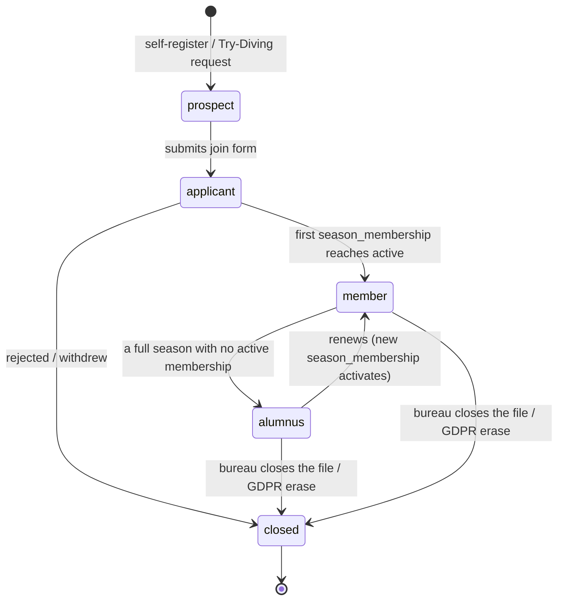

# Membership lifecycle — design proposal

Status: **draft for review.** Nothing here is built. It describes the problem,
a proposed model, and the open decisions, so the bureau can mark it up before
any migration.

---

## 1. Where "cotisation paid" lives today

"Is this person a paid-up member for the season?" is answered by **three
records that never talk to each other**:

| Record | What it holds | Written by | Read by |
|---|---|---|---|
| `payment_expected` (`type = membership`, `season_year`) | the **money** — `status` `pending`/`partial`/`paid`, `amount_due`, `amount_paid`, `paid_at`, `communication` (bank-transfer reference), `reconciled_by/at`, `bank_statement_ref` | `FeeCalculationService::createPaymentExpected()` (dues calculator, `PaymentController::generateFee` / `generateBulkFees`); moved to `paid` by `BankReconciliationService::confirmMatch()` when a statement line is matched | finance dashboard, annual report, GDPR export |
| `member_details.cotisation_years` | JSON array of year strings, e.g. `["2025","2026"]` | **only** the profile edit form (`ProfileController`, hand-ticked), or the retired legacy importers | the public "active members" count (`HomeController::memberStats()`), `User::isActive()`, member CSV export |
| `users.status_id` → `member_statuses` | the member **tier** (`fonctionnaire`, `associe`, `honoraire`, `junior`, …, `former`) — drives the fee multiplier and mail/listing eligibility | the members-screen "Statut" dropdown (`MemberController::updateStatus`) | listings, `MemberStatus::INACTIVE_SLUGS = ['former']`, fee calculation |

Consequences:

- **Reconciling a bank payment changes nothing a member or the website can
  see.** `confirmMatch()` sets `payment_expected.status = 'paid'` and stops
  there — it does not touch `cotisation_years`, `status_id`, or
  `member_licences`. Someone must then open the profile and tick the year by
  hand.
- **`member_statuses` does double duty**: it is the fee tier *and* the only
  lifecycle signal (the single `former` slug). There is no state for prospect,
  applicant, "paid but waiting for the federation licence", "lapsed this season
  but might renew", or "left for good".
- **`member_licences.licence_request_pending`** is a fourth, unconnected flag.
- **`trial_requests`** (the "Try Diving" funnel) has no link to `users` — only
  `confirmed_by` (the bureau handler). When a trialist joins, the connection is
  lost.
- The season-year rollover is computed **two different ways**:
  `Season::currentDuesYear()` reads the actual season `start_date` month
  (data-driven), while `HomeController::memberStats()` and `User::isActive()`
  hardcode `now()->month >= 9`. They agree today; they will not if a club sets a
  non-September season.

---

## 2. Proposed model

Two axes, kept separate:

- **Per-season membership** — a row per `(user, season_year)` carrying a small
  state machine. This is where "paid / licensed / active" lives.
- **Lifecycle stage** — one coarse value per user describing where they are in
  the join → member → lapse → return → leave arc. Independent of any season.

`member_statuses` stays exactly as it is: the **fee tier** vocabulary. It stops
being asked to mean "active" or "former".

### 2a. `season_memberships` (new table)

```
id
user_id            FK users
season_year        string   (matches membership_fees.season_year / Season::currentDuesYear())
member_status_id   FK member_statuses   -- the tier for THIS season; may differ year to year
state              enum: applied | fee_due | fee_paid | licence_pending | active | lapsed | resigned
fee_payment_id     FK payment_expected  nullable
joined_on          date     nullable    -- first season only
activated_on       date     nullable
lapsed_on          date     nullable
notes              text     nullable
timestamps
unique (user_id, season_year)
```

- `member_details.cotisation_years` becomes **derived**: the set of
  `season_year` where a row reached `active`. Keep it as a generated mirror
  column for one release so nothing downstream breaks, then drop it and the
  hand-editing UI.
- Public "active members" = `season_memberships` where
  `season_year = Season::currentDuesYear()` and `state = active`,
  `distinct user_id`.
- `User::isActive()` = "has an `active` row for the current dues year".

### 2b. `users.lifecycle_stage` (new column)

```
prospect  → applicant → member → alumnus → closed
```

| Stage | Meaning | Entered when |
|---|---|---|
| `prospect` | showed interest, not a member | self-registered (`status_id` null) or a `trial_requests` row is linked |
| `applicant` | submitted the join form, awaiting bureau approval | join form posted |
| `member` | has (or had) at least one `season_memberships` row that reached `active` | first activation |
| `alumnus` | was a member; last `active` season is before the current dues year; not explicitly closed | nightly job, or on the first day of a new season with no renewal |
| `closed` | left for good / GDPR-erasable | bureau action |

- **`former` disappears as an assignable status.** "Former member" becomes
  `lifecycle_stage = alumnus` (derived) — the mail/listing exclusion currently
  keyed on `INACTIVE_SLUGS` keys on the stage instead.
- **Returning** is natural: an `alumnus` gets a new `season_memberships` row →
  back to `member` when it activates. All prior seasons stay on record.
- `closed` is the only stage that blocks re-joining without a bureau override.

---

## 3. Per-season state machine

```mermaid
stateDiagram-v2
    [*] --> applied: bureau adds member to the season\n(or member renews)
    applied --> fee_due: bureau approves\n+ fee generated (payment_expected)
    fee_due --> fee_paid: bank reconciliation confirms payment\n(BankReconciliationService::confirmMatch)
    fee_paid --> licence_pending: federation licence requested\n(member_licences.licence_request_pending = true)
    licence_pending --> active: licence issued\n(licence_number set)
    fee_paid --> active: no licence required for this tier
    fee_due --> active: fee waived (honoraire) or paid in cash\n(bureau override)

    active --> lapsed: new season opens, not renewed\n(nightly)
    fee_due --> lapsed: unpaid past the grace cutoff
    applied --> resigned: withdrew before joining
    active --> resigned: quit mid-season
    lapsed --> [*]
    resigned --> [*]
```

Notes:

- **Honoraire / no-fee tiers** skip the money edges: `applied → active`
  directly on approval (or `fee_due → active` "fee waived").
- **Cash / cheque payments** need a manual `fee_due → fee_paid` on the chip —
  reconciliation only covers bank transfers.
- `lapsed` and `resigned` are terminal *for that season*; the user keeps
  whatever `lifecycle_stage` the arc gives them.

### Transition table (event → effect)

| Event | From → To | Side effects |
|---|---|---|
| Bureau adds user to season / user renews | `∅ → applied` | create `season_memberships` row; `lifecycle_stage` `prospect`/`alumnus` → `applicant` if not already `member` |
| Bureau approves + generates fee | `applied → fee_due` | `FeeCalculationService::createPaymentExpected()`; link `fee_payment_id` |
| Bank line matched & confirmed | `fee_due → fee_paid` | **new hook in `confirmMatch()`**: if the payment is `type=membership` and now `paid`, advance the linked season row |
| Licence requested | `fee_paid → licence_pending` | `member_licences.licence_request_pending = true` |
| Licence issued | `licence_pending → active` | set `licence_number`; `activated_on = today`; `lifecycle_stage → member`; refresh `cotisation_years` mirror |
| Tier needs no licence | `fee_paid → active` | as above minus the licence bits |
| Fee waived / cash | `fee_due → active` | `payment_expected.status = 'paid'`, `amount_paid = 0` or cash note |
| New season, not renewed | `active(prev) → lapsed` | nightly job; if user has no `active` row for the current year and last active < current → `lifecycle_stage → alumnus` |
| Unpaid past grace | `fee_due → lapsed` | uses the existing `dues_cutoff_grace_days` setting |
| Withdrew | `* → resigned` | bureau action + reason in `notes` |
| Bureau closes the file | (any) | `lifecycle_stage → closed` |

---

## 4. Lifecycle arc



`closed` is deliberately not `[*]` from `member` directly — leaving is
`member → alumnus` first; `closed` is an explicit, rarer act.

---

## 5. Members screen — the per-season chip

Replace the single **Statut** dropdown on `admin/members` with a chip for the
**current dues year** showing `season_memberships.state`:

```
 ▢  —              no 2027 record        → click: create it (applied / fee_due)
 ▢  € due          fee_due               → click: advance
 ▢  paid           fee_paid
 ▢  licence…       licence_pending       ← "waiting for licence(s) this season"
 ▣  active         active                (green)
 ▢  lapsed         lapsed                (faded)
```

- One click advances along the **allowed** transitions (a
  `SeasonMembership::transitionTo($state)` guard — a plain match on an
  allowed-transitions map, not an FSM package). Ambiguous forks (e.g.
  `fee_paid → licence_pending` vs `→ active`) open a 2-item popover.
- The **tier** select stays, but it now edits `season_memberships.member_status_id`
  for the current year — so a member can be `fonctionnaire` in 2026 and
  `associe` in 2027 without rewriting history.
- The chip is **read-mostly**: bank reconciliation drives `fee_due → fee_paid`
  on its own; the bureau only clicks it for cash payments, approvals, waivers,
  and licence steps.
- Hovering shows the season history (`2024 active · 2025 active · 2026 lapsed`).

---

## 6. Migration path (each step ships on its own)

1. **Add `season_memberships`.** Backfill: for every year in each
   `member_details.cotisation_years`, insert a row with `state = active`,
   `member_status_id = users.status_id`, `activated_on = null`.
2. **Add `users.lifecycle_stage`.** Backfill: `status_id = former` → `alumnus`;
   `status_id` null & email verified → `prospect`; else `member`.
3. **Repoint reads.** `HomeController::memberStats()` and `User::isActive()`
   query `season_memberships` and call `Season::currentDuesYear()` (kill the
   hardcoded `month >= 9`). `cotisation_years` kept as a generated mirror.
4. **Hook `BankReconciliationService::confirmMatch()`** → advance the linked
   season row `fee_due → fee_paid`.
5. **Members-screen chip** (this proposal's UI).
6. **Link `trial_requests.user_id`** (+ a "convert to applicant" button on the
   trial-requests screen).
7. **Nightly `lapse` job**; retire the `former` status; move the mail/listing
   exclusion onto `lifecycle_stage`.
8. Drop `cotisation_years` and its profile-form editor.

Steps 1–3 already fix the reported bug (paid members not showing as active)
without any UI change.

---

## 7. Open questions for the bureau

1. **Grace period.** `dues_cutoff_grace_days` exists as a setting — should
   `fee_due` auto-move to `lapsed` after it, or always require a bureau click?
2. **Provisional / taper.** `payment_expected.provisional` and the season fee
   taper mean "paid" can be a partial or reduced amount. Does `fee_paid`
   require `amount_paid >= amount_due`, or `>= the tapered amount`, or just
   "a payment was reconciled"?
3. **Licence-required per tier?** Is "needs a federation licence" a property of
   the `member_status` (tier), of the season, or decided case by case?
4. **Junior → adult, family groupings.** When a `junior` turns 18 mid-season,
   is that a tier change on next season only, or immediate?
5. **Multiple federations.** `member_licences` is per `(user, federation)`.
   Does `active` need *all* required licences, or *any one*?
6. **`alumnus` cutoff.** One missed season → `alumnus`? Or a grace of, say, 18
   months before the arc flips (keeps recent lapsers in normal listings)?
7. **Honorary members** never pay — should they get a `season_memberships` row
   auto-created each year in `active`, or sit outside the per-season model
   entirely?
8. **External / partner-club divers** (`external_registrations`) — in scope for
   this model, or a separate track?

---

## 8. What this deliberately avoids

- **No lifecycle values in `member_statuses`.** Tier and lifecycle are
  different axes; merging them is what caused the current tangle.
- **No FSM library.** An enum column plus an allowed-transitions map and a
  `transitionTo()` guard is enough for eight states.
- **No history rewrite on lapse/return.** Every season is its own row; the
  arc is derived from them.
- **No new "status set" concept.** `status_sets` already scopes which tiers a
  member may hold; it is untouched.
