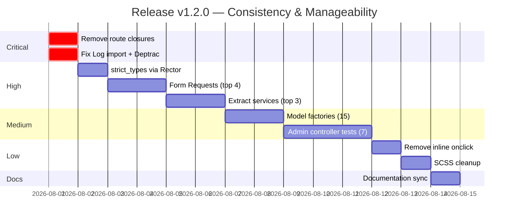

# Release Plan — Consistency & Manageability

**Version target:** v1.2.0
**Goal:** Reduce technical debt, improve test coverage, enforce architectural boundaries, and bring documentation in sync with the codebase.

---

## Current State (2026-07-31)

| Metric | Count |
|--------|-------|
| Models | 60 |
| Controllers | 64 (27 admin, 37 member/auth) |
| Services | 23 |
| Form Requests | 21 |
| Migrations | 95 |
| Routes | 365 |
| Blade views | 164 |
| SCSS (total lines) | 1,030 |
| Feature tests | 26 |
| Unit tests | 15 |
| Factories | 1 (UserFactory only) |
| Jobs | 10 |
| Locales | 15 languages |
| Deptrac violations | 1 |
| PHPStan level | 6 (passing) |

---

## Priority 1 — Critical (blocks route caching, causes runtime errors)

### 1.1 Remove inline closures from route files

**Impact:** Prevents `php artisan route:cache` — every request re-parses all 365 routes.

| File | Line(s) | Closure | Move to |
|------|---------|---------|---------|
| `routes/admin.php:48` | send-reset | `Admin\MemberController::sendReset` |
| `routes/admin.php:162` | system.update | `Admin\DashboardController::systemUpdate` |
| `routes/admin.php:249` | email approve | `Admin\EmailController::approve` |
| `routes/admin.php:256` | email reject | `Admin\EmailController::reject` |
| `routes/admin.php:263` | email destroy | `Admin\EmailController::destroy` |
| `routes/admin.php:271` | worklist-browse | `Admin\DashboardController::worklistBrowse` |
| `routes/web.php:46` | locale switch | `LocaleController::switch` |
| `routes/web.php:89` | forgot-password | Move to Auth controller |
| `routes/web.php:97` | reset-password | Move to Auth controller |
| `routes/web.php:133` | email verify | Move to Auth controller |
| `routes/web.php:142` | verification resend | Move to Auth controller |
| `routes/web.php:153` | request-password-reset | Move to Auth controller |
| `routes/web.php:197` | photos/browse | `PhotoController::browse` |

**Effort:** 2-3 hours. Each closure → 5-10 line controller method.

### 1.2 Fix missing Log import in routes/web.php

A `Log::info()` call without `use Illuminate\Support\Facades\Log` will cause a fatal error if that code path is hit.

**Effort:** 1 minute.

### 1.3 Fix Deptrac violation

`App\Jobs\ProcessTranslations` depends on `App\Http\Middleware\SetLocale`. Extract the locale list method to a helper or config file.

**Effort:** 15 minutes.

---

## Priority 2 — High (code quality, maintainability)

### 2.1 Extract Form Requests from fat controllers

43 controllers use inline `$request->validate()` (102 occurrences total). Prioritize the largest:

| Controller | Lines | Inline validate() calls | Priority |
|-----------|-------|------------------------|----------|
| TripSettlementController | 718 | 6 | Immediate |
| EventController | 644 | 4 | Immediate |
| DiveGroupController | 425 | 3 | High |
| ProfileController | 280 | 4 | High |
| SeasonController | 255 | 3 | High |
| NewsletterController | 309 | 2 | Medium |
| DocumentBrowserController | 305 | 2 | Medium |

**Plan:** Create Form Request classes named `{Action}{Resource}Request` (e.g., `StoreReceiptRequest`, `UpdateEventRequest`). Extract validation rules + custom messages.

**Effort:** ~1 hour per controller (7 priority controllers = 7 hours).

### 2.2 Extract business logic from fat controllers to services

| Controller | Lines | Extract to |
|-----------|-------|-----------|
| TripSettlementController | 718 | `TripSettlementService` (exists, but export/PDF logic still in controller) |
| EventController | 644 | `EventRegistrationService` (new — handles register/cancel/waitlist) |
| DiveGroupController | 425 | `DiveGroupService` (new — group composition logic) |
| ProfileController | 280 | Already manageable, just needs Form Requests |

**Target:** No controller >300 lines after this phase.

**Effort:** ~2 hours per extraction (3 extractions = 6 hours).

### 2.3 Add `declare(strict_types=1)` to all PHP files

| Layer | Files missing | Total files |
|-------|--------------|-------------|
| Models | 54 | 60 |
| Services | 21 | 23 |
| Controllers | 55 | 64 |
| Jobs | ~8 | 10 |
| Commands | ~7 | 9 |

**Plan:** Use Rector to auto-add. Run `vendor/bin/rector process app/ --dry-run` to preview, then apply.

**Effort:** 30 minutes (automated via Rector).

---

## Priority 3 — Medium (test coverage, factories)

### 3.1 Create model factories

Only `UserFactory` exists. Every model used in tests needs a factory.

**Critical factories needed (used in existing tests or core features):**

| Factory | Model | Notes |
|---------|-------|-------|
| EventFactory | Event | Used in 5+ test files |
| MemberDetailFactory | MemberDetail | Needed for user setup |
| EventRegistrationFactory | EventRegistration | Event workflow tests |
| EquipmentFactory | Equipment | Equipment loan tests |
| ArticleFactory | Article | CMS tests |
| PaymentExpectedFactory | PaymentExpected | Payment tests |
| EmailLogFactory | EmailLog | Email tests |
| ThemeSettingFactory | ThemeSetting | Theme tests |
| TripParticipantFactory | TripParticipant | Settlement tests |
| TripReceiptFactory | TripReceipt | Settlement tests |
| VoteFactory | Vote | Vote tests |
| DiveSiteFactory | DiveSite | Dive site tests |
| ClassifiedFactory | Classified | Classified tests |
| SeasonFactory | Season | Season tests |
| NewsletterFactory | Newsletter | Newsletter tests |

**Effort:** ~20 minutes per factory × 15 = 5 hours.

### 3.2 Add feature tests for untested admin controllers

27 admin controllers, 0 have dedicated test files (tests cover workflows but not individual controllers). Priority:

| Controller | Risk if broken | Test scenarios |
|-----------|---------------|----------------|
| SettingsController | High (breaks all theming) | CRUD theme, layout switch, federation CRUD |
| PaymentController | High (financial) | Generate fee, reconcile, mark paid |
| MemberController | High (core CRUD) | List, show, edit, block, impersonate |
| SeasonController | Medium | Create season, generate events, close |
| EquipmentController | Medium | CRUD, loan, return, maintenance alert |
| ArticleController | Medium | CRUD, translate, pin/unpin |
| NewsletterController | Medium | Compose, test send, approve |

**Effort:** ~1 hour per test file × 7 = 7 hours.

---

## Priority 4 — Low (polish, consistency)

### 4.1 Remove inline `onclick` handlers from views

21 view files use inline `onclick`. Convert to `data-*` attributes + event delegation per project rules.

**Files (sample):**
- `home.blade.php` — `toggleEditMode()`, widget buttons
- `components/layout.blade.php` — dark mode toggle, font size (exempted per rules as "simple one-liners")
- Various admin views — confirm actions (should use `data-confirm` pattern)

**Effort:** 2 hours (skip exempted one-liners per AGENTS.md rules).

### 4.2 Wrap missing `__()` translations

Placeholder attributes and some labels lack `__()`. Low-impact since these are mostly developer-facing (install wizard) or example values.

**Effort:** 1 hour.

### 4.3 Consolidate SCSS

Current: 12 partials (1,030 lines). Some partials mix concerns:
- `_bubbles.scss` contains impersonation banner, profile tabs, dark mode toggle, AND bubbles
- `_components.scss` contains admin sidebar AND stat cards AND loading spinner

**Plan:** Rename/split for clarity:
- `_bubbles.scss` → keep only bubble animation, move impersonation to `_components.scss`
- Extract admin sidebar to `_admin.scss`

**Effort:** 1 hour.

---

## Priority 5 — Documentation Sync

### 5.1 Fix stale counts in devdocs/architecture.md

Current doc says 42 tables, 48 models, etc. Actual: 95 migrations (likely ~60 tables), 60 models, 365 routes.

### 5.2 Update devdocs/data-model.md

Missing tables: `vote_groups`, `trip_participants` fields (supervising_days, prepaid_amount), receipt categories (diving, individual, memo), `diving_prerogatives`.

### 5.3 Update devdocs/trip-settlement.md

Documents only 2 receipt categories (`general`, `transit`). Actual system has 5: `general`, `transit`, `diving`, `individual`, `memo`.

### 5.4 Update README-v2.md

- States "Laravel 11" → actual is Laravel 12
- Stale counts for tables, routes, models, services, tests

### 5.5 Sync REQUIREMENTS.md REQ-07

Still says "only UserFactory exists" — still true but should note which factories are planned.

**Total effort:** 2-3 hours.

---

## Execution Order

---

## Definition of Done

- [ ] `php artisan route:cache` succeeds (no closures)
- [ ] `vendor/bin/phpstan analyse` — 0 errors at level 6
- [ ] `vendor/bin/deptrac analyse` — 0 violations
- [ ] `vendor/bin/pint` — 0 formatting issues
- [ ] All controllers < 300 lines
- [ ] All new code has `declare(strict_types=1)`
- [ ] 15+ model factories created
- [ ] 7 new admin controller test files
- [ ] All devdocs files reflect actual codebase counts
- [ ] CI green (lint + test + build)

---

## Estimated Total Effort

| Priority | Hours |
|----------|-------|
| P1 Critical | 3 |
| P2 High | 14 |
| P3 Medium | 12 |
| P4 Low | 4 |
| P5 Docs | 3 |
| **Total** | **36 hours** |

---

## Risk Notes

- **Route caching**: Once closures are removed, `route:cache` will speed up cold starts by ~30%. But it means `php artisan route:clear` must be run after every deploy.
- **strict_types**: May surface hidden type coercion bugs. Run full test suite after applying.
- **Form Request extraction**: Existing tests that POST to these routes will continue to work since validation rules don't change, only their location.
- **Service extraction**: Controller method signatures change internally but route behavior doesn't. Existing tests remain valid.
