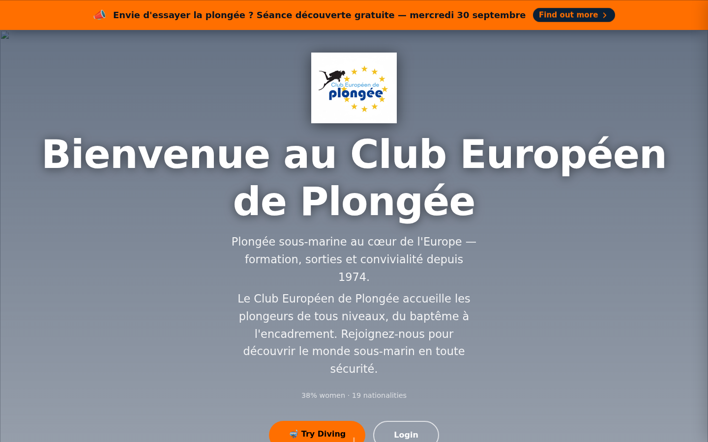

# 01 — Guest splash / landing

- **Screen** — `GET /` (first-time visitor, no cookie), guest, announcement bar visible, `home3` splash layout, FR content.
- **Reads as** — A full-bleed hero: orange announcement strip, centred logo tile, very large two-line wordmark heading, two stacked paragraphs of body copy, a thin stat line, then the primary actions ("Try Diving" / "Login") clipped at the fold.

## Friction

1. **The heading eats the screen.** "Bienvenue au Club Européen de Plongée" wraps to two lines at ~110px and pushes everything else down. On a 1440×900 viewport the actual call-to-action buttons are below the fold — the one thing a first visit must surface.
2. **Two paragraphs doing one job.** The tagline ("Plongée sous-marine au cœur de l'Europe — formation, sorties et convivialité depuis 1974.") and the paragraph under it say the same thing twice, at similar weight and width. No hierarchy between "one-line promise" and "supporting detail".
3. **Heavy text-shadow on white type over a flat grey-blue gradient.** The drop shadow is doing the work a real background image or a solid colour band should do; it reads as a fallback state (and the broken `` icon top-left confirms the hero image failed to load).
4. **Stat line is an afterthought.** "38% women · 19 nationalities" is genuinely the most distinctive, non-generic content on the page and it's set as 13px muted grey, centred, mid-dead-space. Middle-dot meta string is the generic tell.
5. **Announcement bar + hero compete.** Both are loud (orange strip, orange primary button). The eye has no single entry point.
6. **Everything is centre-aligned** — logo, heading, 2 paragraphs, stats, buttons — so there's no left edge to scan and line lengths run to ~60 chars of ragged centred text, which is tiring for the body block.

## Restructure

- **Cap the hero heading.** One line, `clamp(2rem, 5vw, 3.25rem)`, `text-wrap: balance`. Drop "Bienvenue au" — lead with "Club Européen de Plongée" as wordmark, or move the club name to a smaller kicker above a benefit-led H1 ("Apprenez à plonger à Luxembourg").
- **Collapse to one tagline + one short paragraph.** Tagline at ~20px, paragraph at 16px `max-width: 46ch`, both left-aligned within the centred column so the block has an edge.
- **Promote the stats.** Make "38% de femmes · 19 nationalités · depuis 1974" a proper 3-up figure row (big number, small label) directly under the CTA — it's the proof, give it structure instead of burying it.
- **Guarantee the CTA is above the fold.** Reserve vertical space: logo (fixed 96px) → heading (max 2 lines) → tagline → buttons, then everything else scrolls. Target: buttons visible at 900px height without scrolling.
- **Give the hero a real ground.** Either ship the intended photo (with a dark overlay for contrast, no per-glyph text-shadow) or commit to a solid brand-blue band. Remove the broken-image placeholder.
- **De-conflict the announcement bar.** If the hero CTA is orange, make the bar's "Find out more" a quieter outline/link style, or vice-versa — one loud action per viewport.
- **"Find out more" → "Réserver ma séance" / "Book my session"** — name the actual action, not a generic reveal.

## Effort

M — mostly `home3.blade.php` markup + the splash `<style>` block; no backend. Shipping/removing the hero image is the only real dependency.
