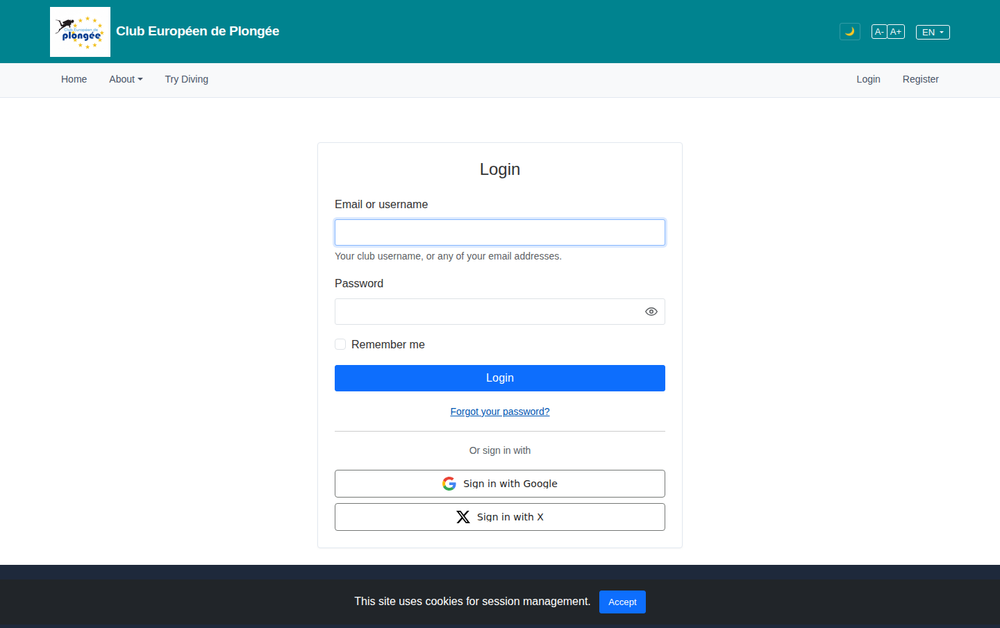

# 02 — Login

- **Screen** — `GET /login`, guest, default state.
- **Reads as** — A narrow centred card floating high on a large empty page: email, password, "Remember me", a full-width "Log in" button, then "Forgot your password?" isolated between two horizontal rules, then two stacked official social buttons (Google, Microsoft).

## Friction

1. **Vertical rhythm is off.** ~30% of the viewport above the card is empty, the card itself is tight, and the page has no footer anchor in view. The form floats.
2. **"Forgot your password?" is fenced by two `
`s.** Two full-width rules around a single short link makes a trivial utility link look like a major section boundary. It also visually detaches the social buttons from the form they belong to.
3. **Three separators competing.** `
` above the forgot link, `
` below it, plus the card border — the eye sees four horizontal bands in a form that has two inputs.
4. **Social buttons stacked full-width** read as equal in weight to the primary "Log in" button. A returning member's primary path is email+password; OAuth is the alternative.
5. **No "don't have an account? Register" link visible** on the login card even though Register sits in the top nav — the two auth pages should cross-link.
6. **"Log in" vs nav "Login"** — minor, but pick one spelling of the verb and keep it everywhere.

## Restructure

- **Tighten the vertical centring.** Cap the wrapper at `min-height: 100dvh` with the card centred but nudged up only slightly (e.g. `padding-top: 8vh`), and keep the footer reachable.
- **Kill both `
`s.** Put "Forgot your password?" as a small right-aligned link on the same row as the "Remember me" checkbox (checkbox left, link right) — standard, compact, no rules needed.
- **One divider, labelled.** Between the primary form and the social buttons use a single "or continue with" divider (centred text on a hairline), not a bare rule.
- **Downweight social buttons.** Keep them full-width for tap targets but visually secondary (they already have the white/grey treatment — make sure the primary "Log in" is the only filled brand-colour button on the page).
- **Add the cross-link.** Under the button: "New here? Create an account" → `/register`.
- **Group the card contents** with consistent 1rem field spacing; the button should sit ~1.25rem below the last field, not flush.

## Effort

S — single Blade view (`auth/login.blade.php`) + minor spacing CSS.
