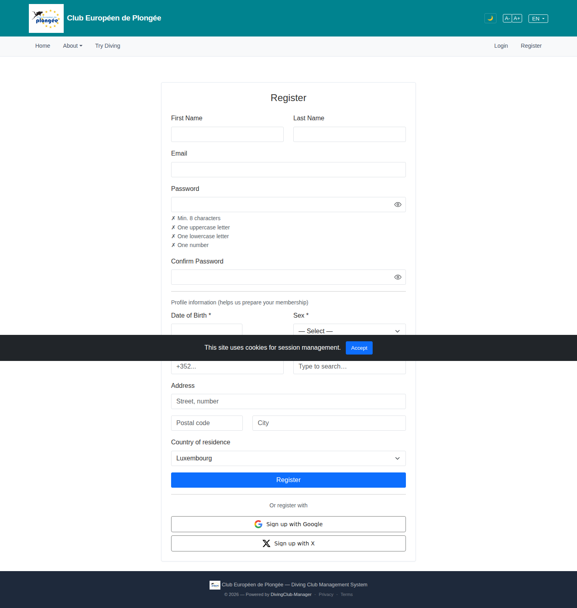

# 03 — Register

- **Screen** — `GET /register`, guest, default (untouched) state.
- **Reads as** — One long single-column form: account fields, a live password-rules checklist rendered with ✗ marks, "Profile information" as small grey text, then name / DoB / two different country controls / a multi-line address block, then submit. Everything is the same width and weight top to bottom.

## Friction

1. **✗ marks on an untouched form read as errors.** Five red-looking "✗ at least 8 characters / ✗ one uppercase…" lines before the user has typed anything says "you have five problems". Should be neutral until the field is touched, then tick green as satisfied.
2. **No sections, one column, ~12 fields.** Account (username/email/password), Identity (name/DoB), Location (nationality/residence/address) are three distinct groups presented as one undifferentiated scroll. High perceived length.
3. **Two different country controls on the same form.** "Nationality" uses the `x-country-select` typeahead ("Type to search…"); "Country of residence" is a plain 4-option `<select>`. Same data type, two affordances, two visual styles — confusing and looks unfinished.
4. **"Profile information" heading is micro-text.** The one real section divider on the page is set smaller than the field labels, so it doesn't function as a divider.
5. **Address as free stack of inputs.** Street / postal / city / country are four full-width inputs with no grouping box or sub-heading; postal code and city especially should share a row.
6. **Full-width everything.** DoB, postal code, country — short fields stretched to 100% width give false affordance (looks like it wants a long value) and add height.
7. **Password rules take vertical space equal to a fieldset** even when the user picks a password manager value and never reads them.

## Restructure

- **Three labelled fieldsets** with real headings (same size as body, semibold, with a hairline under): "Your account" · "About you" · "Where you live". Perceived length drops even if field count doesn't.
- **Password checklist: neutral → validated.** Grey dot before touch; on `input`, satisfied rules go green ✓ and unmet rules stay grey (not red) until submit. Consider collapsing to a single strength line with the full list in a tooltip/`aria-describedby`.
- **One country control.** Use `x-country-select` for both Nationality and Country of residence. Delete the 4-option `<select>`.
- **Row up short fields.** `First name | Last name` on one row; `Postal code | City` on one row; DoB at `max-width: 12rem`; country at `max-width: 20rem`.
- **Address as a sub-group** under "Where you live": Street (full), then Postal + City row, then Country. A light inset or just the shared heading is enough — no heavy border.
- **Move DoB next to name** (it's identity, not location) so the "About you" block is name + DoB only.
- **Submit button**: label it "Create account" to match the cross-link added on the login page, with the T&C/privacy line directly above it, not lost mid-form.

## Effort

M — `auth/register.blade.php` restructure + swap one country control + small JS tweak to the password-rules component's initial/again state. No schema change.
