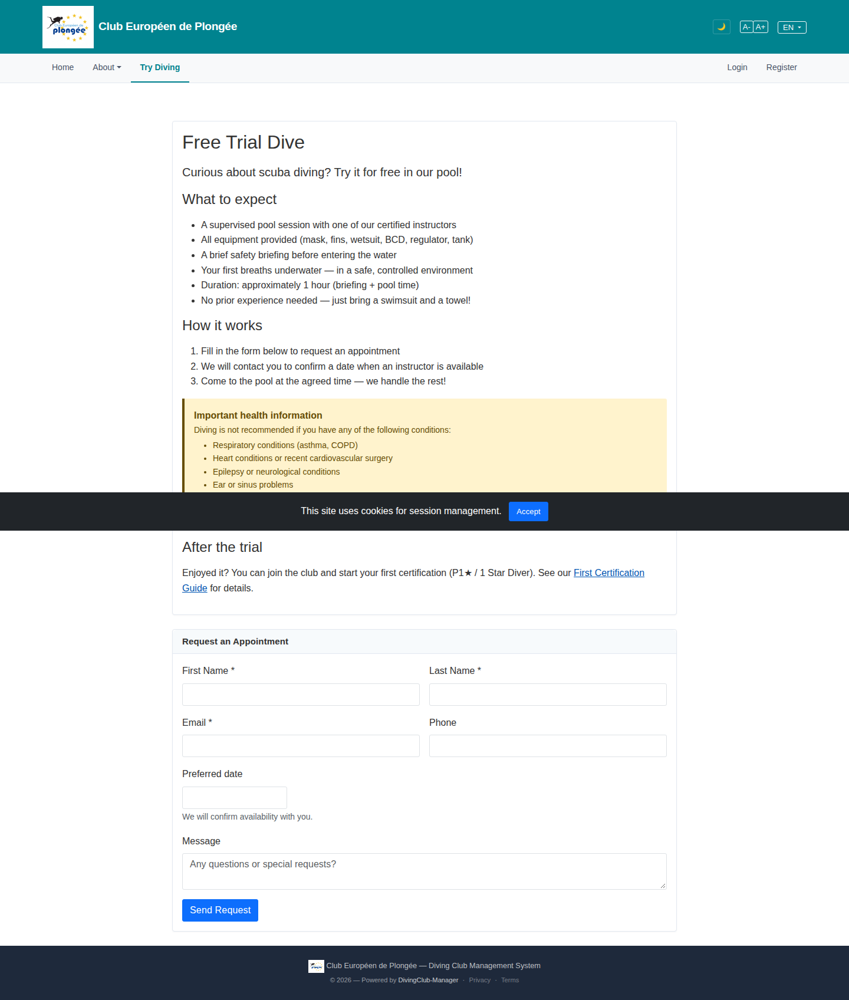

# 04 — Try Diving (free trial request)

- **Screen** — `GET /trial` (route `trial.*`), guest, default state. Cookie banner overlapping content mid-page.
- **Reads as** — A long marketing article ("Free Trial Dive" → "What to expect" → "How it works" → yellow health-warning callout → "After the trial") inside one card, then a **separate** "Request an Appointment" card with the actual form (name/email/phone/preferred date/message).

## Friction

1. **The form is ~1100px down the page.** Four prose sections and a callout come first. A visitor who arrived intending to book has to read or scroll past all of it. No anchor link, no "Request a session" button at the top.
2. **Two stacked cards with different header treatments.** The article card has no header bar; the form card has a grey "Request an Appointment" header bar. They look like they're from two different templates.
3. **The health-warning callout is the visual peak of the page** — full yellow fill, bold heading, bulleted conditions — and it's sandwiched between "How it works" and "After the trial". It's important, but as styled it outshouts the booking CTA. It's also where the cookie banner happens to overlap in this capture.
4. **"Preferred date" is a bare text input** with helper text "We will confirm availability with you." No datepicker affordance visible — for a date field on a public form that invites free-text garbage ("next week", "asap").
5. **First/Last and Email/Phone are paired rows — good** — but "Preferred date" then sits alone at ~180px width on its own row, and "Message" is full width, so the form's rhythm breaks after row 2.
6. **"After the trial" section** (join / first certification) is post-conversion content shown pre-conversion; it competes with the booking action.
7. **Cookie banner is a fixed mid-screen black bar**, not docked to the bottom — it covers content rather than sitting out of the way.

## Restructure

- **Lead with a compact intro + the form, push detail below.** Order: short 2-line intro → "Request a session" form → then "What to expect" / "How it works" / "After the trial" as supporting reading. Or keep the article but add a sticky "Book a session ↓" button and an `#request` anchor.
- **One card, or none.** Either wrap the whole page in a single card with internal section rules, or drop cards entirely and use headings + hairlines. Don't mix.
- **Downgrade the health callout** to a bordered-left note (thin amber left border, no full fill) with a "Read before booking" heading, placed immediately above the form where it's actually relevant — not mid-article.
- **"Preferred date" → real date input.** `<input type="date">` at minimum, or the project month/date picker component, with `min=today`. Constrain width to ~12rem and pair it on a row with Phone.
- **Regroup the form**: `First name | Last name` · `Email | Phone` · `Preferred date | (empty or time-of-day select)` · `Message` (full). Keep field widths proportional to expected content.
- **Move "After the trial"** to a single closing line with a link, below the form.
- **Dock the cookie banner** to the viewport bottom (`position: fixed; bottom: 0`) so it never overlaps form fields.

## Effort

M — `trial` view reorder + swap date control + cookie-banner positioning (global partial, affects all guest pages — see cross-cutting notes).
