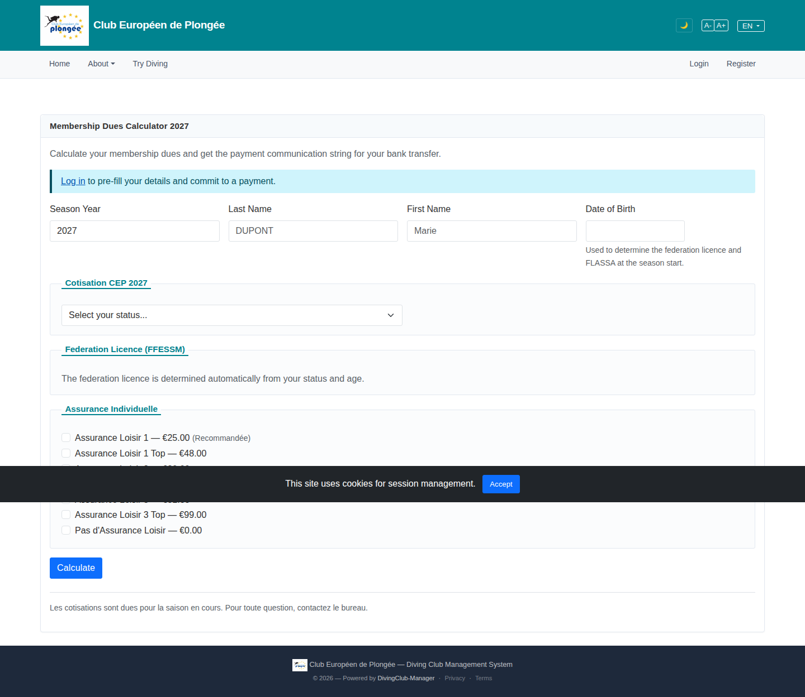

# 05 — Membership Dues Calculator

- **Screen** — `GET /dues` (public fee calculator), guest, default state.
- **Reads as** — Page title, a blue "Log in to pre-fill" info banner, a row of identity fields (Season Year / Last / First / Date of birth), then three bordered blocks stacked — "Cotisation", "Federation Licence", "Assurance Individuelle" — each with teal section headers, the last containing a long list of insurance-option checkboxes.

## Friction

1. **Teal section headers fight the page.** The header band colour is heavy and appears three times; combined with the three full borders the page reads as three separate mini-forms rather than one calculator with three inputs.
2. **The identity row mixes concerns.** "Season Year" is a calculation parameter; Last/First/DoB are personalisation (they only affect age-based rates). They're on one row at equal weight, so it's unclear which fields are required to get a number.
3. **Language mix.** "Cotisation" and "Assurance Individuelle" (FR) sit beside "Federation Licence" and "Season Year" (EN) on the same English page — the fee-domain terms aren't translated.
4. **The insurance checkbox list is long and flat.** Many options, no grouping (by tier? by price?), no indication of which is typical/recommended, each row full width.
5. **Blocks look collapsible but aren't.** Bordered box + coloured header = accordion affordance; if they don't collapse, that's a false signal. If the result is long, the user can't focus on one section.
6. **"Log in to pre-fill" banner** is full-width and blue — same visual weight as an error/warning. For an optional convenience it's too loud, and it sits between the title and the first field, adding a step before the form starts.
7. **No visible result/total.** A "calculator" screenshot with no output area shown means the total is far below the fold; the thing the user came for isn't anchored.

## Restructure

- **Demote section headers** from filled teal bands to plain semibold text + a hairline. Drop the per-section full border; use whitespace to separate. One calculator, three parts.
- **Split the identity row.** Put "Season" (and maybe "member type") as the top-level calculation controls. Put "First / Last / Date of birth" behind an "Optional — for age-based rates" disclosure, or clearly label them optional. Make it obvious that Season alone yields a number.
- **Translate the fee terms**: "Cotisation" → "Membership fee", "Assurance Individuelle" → "Individual insurance", keep "Federation licence". Consistency with the page language.
- **Group the insurance options.** By coverage tier or price band, with a sub-heading per group, and mark the common choice ("Standard — most members"). Consider a radio group if the options are mutually exclusive, rather than checkboxes.
- **Pin the total.** A sticky summary card (right column on desktop, sticky bottom bar on mobile) showing the running total as inputs change, with the breakdown. That's the payload — keep it in view.
- **Shrink the pre-fill banner** to a single inline line with a link ("Logged-in members: your details pre-fill this form — log in"), placed under the Season control, not above the whole form.
- **Two-column on desktop**: inputs left (~60%), live total + breakdown right (~40%, sticky). Collapses to single column with sticky total bar on mobile.

## Effort

L — `dues` view is a real form with server-side calc; regrouping inputs, adding a sticky live-total panel, and translating fee terms is a coordinated change. Header/border restyle alone is S and worth doing first.
