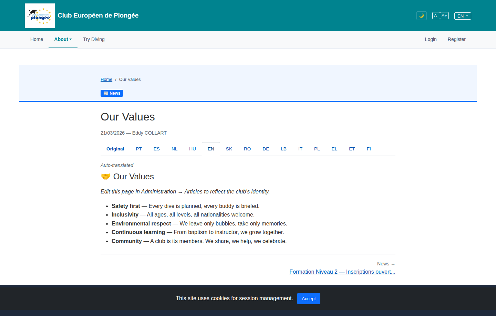

# 06 — Public article ("Our Values")

- **Screen** — `GET /news/{slug}` / About → article, guest, "EN" language tab selected (auto-translated).
- **Reads as** — Breadcrumb, a small blue "News" category pill, H1 "Our Values", a date + author line, then a **15-tab language switcher** spanning the full width, an "Auto-translated" italic note, the article body (emoji heading + intro + 5 bullet points), a rule, and a "News →" / next-article link.

## Friction

1. **The 15-tab language bar is the loudest element on the page.** "Original PT ES NL HU EN SK RO DE LB IT PL EL ET FI" — a full-width strip of 15 link-tabs directly under the title dominates the article. For a reader who just wants to read, it's noise; the current language is already set in the top-nav language picker.
2. **Two language controls.** The top-right nav has an "EN ▾" picker; the article has its own 15-tab row. They can disagree and it's unclear which wins.
3. **Category pill is orphaned.** The blue "News" pill sits alone in the pale breadcrumb band, vertically between the breadcrumb and the H1, attached to neither.
4. **Editor instruction leaks to the public.** "Edit this page in Administration → Articles to reflect the club's identity." is placeholder/CMS guidance rendering on the live guest page.
5. **"Auto-translated" note + emoji H2 that repeats the H1.** The body starts with "🤝 Our Values" — the same text as the page H1 one line above it. Redundant.
6. **No content width cap visible.** Bullets run wide; body text line length looks well over 80 chars on this viewport.
7. **The date/author line** ("21/03/2026 — Eddy COLLART") uses an em-dash meta join and sits at the same indent as the title with no separation.

## Restructure

- **Collapse the language switcher.** Replace the 15-tab strip with a single "Translations ▾" dropdown (or rely entirely on the existing top-nav language picker and drop the per-article control). If kept, move it to the end of the article ("Read this in another language") or a small control top-right of the article header.
- **Attach the category pill to the title.** Put "News" as a kicker immediately above the H1, same left edge, tight spacing — breadcrumb / kicker / H1 / byline as one stacked header block.
- **Suppress CMS instructions for guests.** The "Edit this page in Administration…" line should render only for users with `manage articles`, or be stripped from the public render.
- **Drop the body's repeated H2.** If the article body leads with its own title, hide the page H1 or the body H1 — not both. Kill the decorative emoji or keep it only in one place.
- **Cap body width** at `~68ch` (`max-width: 40rem` for the prose column), left-aligned, with the byline in muted small caps or just muted 13px directly under the H1 with a hairline.
- **"Auto-translated"** → a small unobtrusive badge next to the (collapsed) language control, not a standalone italic line in the content flow.
- **Bottom nav**: "News →" and the next-article title are right-aligned and cramped; make a proper "Next: Formation Niveau 2 — Inscriptions ouvertes" row with a matching "← All news" on the left.

## Effort

M — article template (`articles/show` public view): language-switcher component swap is the bulk; hiding CMS text is a small conditional; width cap + header regroup are CSS.
