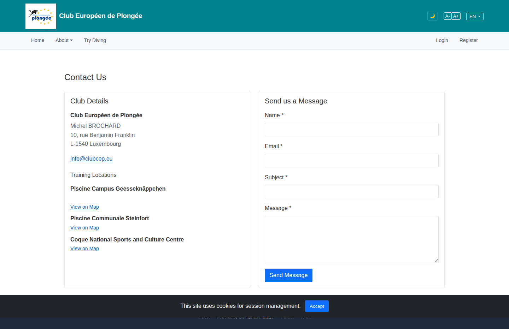

# 07 — Contact Us

- **Screen** — `GET /contact`, guest, default state.
- **Reads as** — H1 "Contact Us", then two side-by-side cards: left "Club Details" (contact name, address, email, then three training locations each with a bold name + "View on Map" link), right "Send us a Message" form (Name / Email / Subject / Message / Send Message).

## Friction

1. **Left card has three typographic levels doing similar things.** "Club Européen de Plongée" (bold), "Michel BROCHARD" (muted), address lines (muted), then "Training Locations" (plain, same size as a field label), then three venue names all bold at the same weight as the club name. Hard to tell the club's own address from the pool addresses.
2. **"View on Map" ×3 with no map.** Three identical links, no inline map, no address shown for the pools (only names). Each link is an unlabelled trip to Google Maps. The venue block is a list of names + repeated link, low information.
3. **Vertical imbalance.** The left card's content stops at ~720px; the right card's textarea makes it taller. Left card then has a large empty bottom — the two-column layout leaves dead space rather than balancing.
4. **No grouping inside "Club Details".** Postal address, email, and training locations are three different things stacked with only blank lines between; a reader scanning for "where do I email" has to parse the whole block.
5. **Form is fine but unanchored.** Four full-width fields + button, no card header rule beyond the card border, "Name/Email" could pair on a row to shorten it and align the form height closer to the details card.
6. **Cookie banner again floating mid-lower-screen**, overlapping the footer.
7. **Footer barely visible / clipped** under the cookie bar — the page has no breathing room at the bottom.

## Restructure

- **Left card as a definition list.** Three labelled rows: **Address** (club postal address + contact name), **Email** (`info@clubcep.eu`, mailto), **Training pools** (each: venue name, one-line address, "Map" link). Labels in muted small caps on the left, values right — scannable.
- **Show the pool addresses**, not just names. If a small static map thumbnail per venue is feasible, that replaces three bare links with actual orientation; otherwise at least street + city per pool.
- **Balance the columns.** Either make the details card `align-self: start` and let it be shorter (fine), or move "Training pools" into a full-width band *below* both cards as a 3-up location grid — that uses the horizontal space and stops the left card looking half-empty.
- **Pair Name + Email** on one row in the form to reduce its height and bring the two cards closer in size.
- **Consistent card headers.** Both cards get the same header treatment (title + hairline) or neither.
- **Dock the cookie banner** to `bottom: 0` (global fix — see 04 and cross-cutting notes) so the footer is reachable.
- **Add bottom padding** to the page so the footer isn't flush against the last card.

## Effort

S–M — `contact.blade.php` is static; converting the details block to a `<dl>` and optionally moving training pools to a full-width grid is layout-only. Map thumbnails would push it to M.
