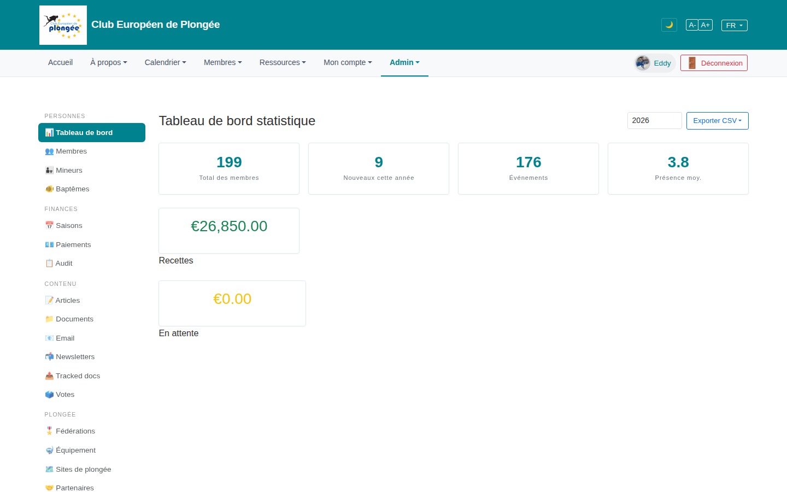

# 08 — Admin dashboard (statistics)

- **Screen** — `GET /admin/dashboard`, bureau_master (eddy), FR, default year 2026.
- **Reads as** — Left admin sidebar (5 groups, ~24 links), then a title "Tableau de bord statistique" with a year field + "Exporter CSV" top-right, a row of four stat cards (199 members / 9 new / 176 events / 3.8 avg attendance), then two more cards on their own rows (€26,850 Recettes, €0.00 En attente) that are much wider than the top four and left-aligned.

## Friction

1. **The stat grid breaks after row 1.** Four equal cards, then "Recettes" and "En attente" each on their own line at ~2× the width of the top cards. Six KPIs, two different card sizes, inconsistent columns. Reads as "the layout ran out of plan".
2. **Money cards are the biggest thing on the page but sit lowest.** Revenue is arguably the headline for a bureau; it's a huge empty card with a small label underneath, mid-page, unaligned with everything else.
3. **Labels below numbers, some inside the card, some outside.** "Recettes" and "En attente" captions sit *outside* and below their card border; the top four have captions *inside*. Pick one.
4. **Vast empty space** below the fold — six cards then nothing. No charts, no recent activity, no "needs attention" list. A dashboard that's 90% whitespace.
5. **Year selector is an unlabelled bare input** next to "Exporter CSV"; not obvious it scopes the whole page.
6. **"Exporter CSV" dropdown** is the most prominent button (filled blue) — exporting is not the primary dashboard action.
7. **Sidebar + top "Admin" mega-menu are two full navigations** for the same destinations, both on screen.

## Restructure

- **One consistent grid.** Six KPIs in a `repeat(auto-fit, minmax(180px, 1fr))` grid, all the same card size. Group them: "Members" (total, new) · "Activity" (events, avg attendance) · "Finance" (collected, outstanding), with a thin label above each pair or a subtle divider.
- **Lead with what needs action.** Under the KPI row, a compact "Needs attention" panel: outstanding payments count + total, unverified members, events missing an instructor, expiring medicals. That's what a bureau opens a dashboard for.
- **Captions consistent** — all inside the card, number large, label small-caps muted directly under.
- **Label the year control** ("Saison / Année") and move it to a clear filter bar; demote "Exporter CSV" to an outline button.
- **Fill the space** with one useful trend: monthly attendance or revenue-by-month sparkline/bar. One chart, not a wall of them.
- **Collapse the sidebar groups by default** (see cross-cutting note on the admin sidebar) or accept the mega-menu as the primary nav and make the sidebar a slimmer contextual list.

## Effort

M — dashboard Blade is a card grid; regularising it + adding a "needs attention" panel is contained. One chart is M. Sidebar rework is separate (L, cross-cutting).
