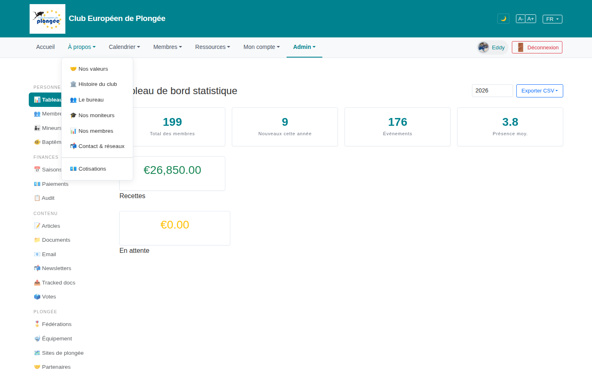

# 09 — "À propos" nav dropdown (public menu)

> Capture note: the harness opened the **"À propos"** (About) dropdown, not the
> Admin mega-menu. Reviewed as-is; the Admin mega-menu is re-captured as `09b`.

- **Screen** — top nav "À propos ▾" open, logged-in bureau_master, FR.
- **Reads as** — A plain dropdown: Nos valeurs / Histoire du club / Le bureau / Nos moniteurs / Nos membres / Contact & réseaux, then a divider, then **Cotisations** on its own below the rule.

## Friction

1. **"Cotisations" is fenced off below a divider** with no heading explaining why it's separate. A divider in a 7-item menu implies two categories; only one item is on the far side, so it reads as "misc / leftover" rather than a deliberate group.
2. **Mixed item types, no grouping.** "Nos valeurs / Histoire / Le bureau / Nos moniteurs / Nos membres" are *about the club*; "Contact & réseaux" is *how to reach us*; "Cotisations" is *fees / joining*. Three intents, one flat list + one lone divider.
3. **Icons are decorative and inconsistent** (handshake, bank, people, shirt, bar-chart, megaphone, book) — they don't encode a category, so they add visual noise to a short text menu.
4. **Dropdown width is set by the longest label** ("Contact & réseaux") leaving ragged right edge.

## Restructure

- **Drop the divider or make it mean something.** If "Cotisations" belongs with joining, add a small "Rejoindre" section header above it and move "Essai plongée" / "S'inscrire" beside it. Otherwise fold it into the list in alphabetical/logical order with no rule.
- **Order by intent**: club story (valeurs, histoire) → people (bureau, moniteurs, membres) → practical (contact, cotisations). Optional light section labels if the menu grows.
- **Remove the per-item emoji** or replace with a single consistent style; a 7-item text menu doesn't need them.
- **Fix the menu min-width** so labels don't leave a ragged column.

## Effort

S — nav partial (`layout.blade.php` public menu); reorder + drop/relabel one divider.
