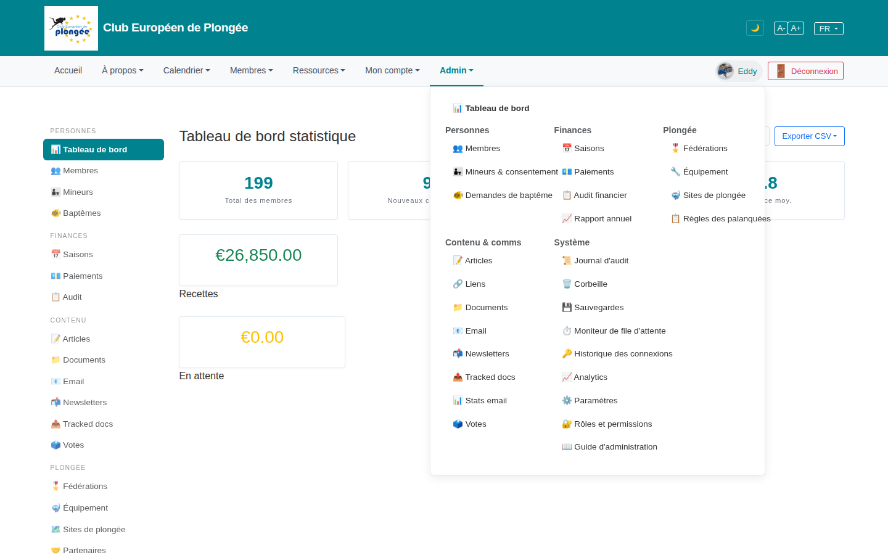

# 09b — Admin mega-menu (open)

- **Screen** — top nav "Admin ▾" open, bureau_master, FR. Left admin sidebar also visible behind it.
- **Reads as** — A wide panel: "Tableau de bord" hanging alone at the top, then a 3-column band (Personnes / Finances / Plongée), then a 2-column band (Contenu & comms / Système). ~27 links total, each with an emoji. Behind it, the left sidebar shows the *same* structure (PERSONNES / FINANCES / CONTENU / PLONGÉE / SYSTÈME) with the same links.

## Friction

1. **Two full copies of the admin navigation on screen at once.** The mega-menu and the left sidebar are the same 5 groups, same ~24 destinations. Whichever the user learns, the other is redundant chrome taking horizontal space (sidebar) or covering the page (mega-menu).
2. **The 3-then-2 column layout is uneven.** Top row: Personnes (5), Finances (5), Plongée (4). Bottom row: Contenu & comms (8) and Système (11) — much taller. The panel is short on the right in its top half and long on the left in its bottom half. The earlier "swap 3rd/4th" change helped but the real issue is 5 groups don't fit a clean grid.
3. **"Tableau de bord" floats above the columns** with no group — an orphan.
4. **27 emoji, no system.** 📊👥🎫🏅💶🗓️💳📋📈📝🔗📁📧📮🔥📊🗳️🏆🔧🗺️📕🧾🗑️💾⏱️🔑📈⚙️🔒📖 — decorative, inconsistent (two different bar-chart emoji for "Tableau de bord" and "Analytics" and "Stats email"), and at small size they're noise, not wayfinding.
5. **Grouping is arguable.** "Analytics" and "Historique des connexions" under Système, "Stats email" under Contenu — three analytics-ish things in two groups. "Sites de plongée" and "Règles des palanquées" under Plongée next to "Fédérations".
6. **Names inconsistent with the sidebar.** Menu says "Mineurs & consentement", "Audit financier", "Rapport annuel", "Moniteur de file d'attente", "Rôles et permissions"; sidebar says "Mineurs", "Audit", "Rôles". Same targets, different labels.

## Restructure

- **Pick one.** Either the mega-menu is the admin nav (then the left sidebar becomes a slim *contextual* list — e.g. the sub-pages of the current section only), or the sidebar is primary (then "Admin" in the top nav is a single link to the dashboard, no mega-panel). Running both doubles the maintenance and the cognitive load.
- **If the mega-menu stays: 4 columns, equal-ish.** Merge to four groups — **Personnes**, **Finances**, **Contenu**, **Système & config** (fold Plongée's 4 items into Contenu or Système, or give it its own column and drop to a 5-col grid with balanced counts). Put "Tableau de bord" as the first item of Personnes or as a standalone link in the panel header.
- **Drop the emoji** or commit to one consistent 16px icon set where the glyph actually distinguishes the item.
- **One canonical label per destination**, shared by menu and sidebar.
- **Co-locate the three "insight" pages** (Analytics, Stats email, Historique des connexions) under one "Statistiques" heading.

## Effort

M — the menu and sidebar are both Blade partials (`layout.blade.php`, `admin-sidebar.blade.php`) already sharing a mental model; consolidating to one nav + 4 balanced groups + label parity is a focused refactor. Deciding menu-vs-sidebar is a product call first.
