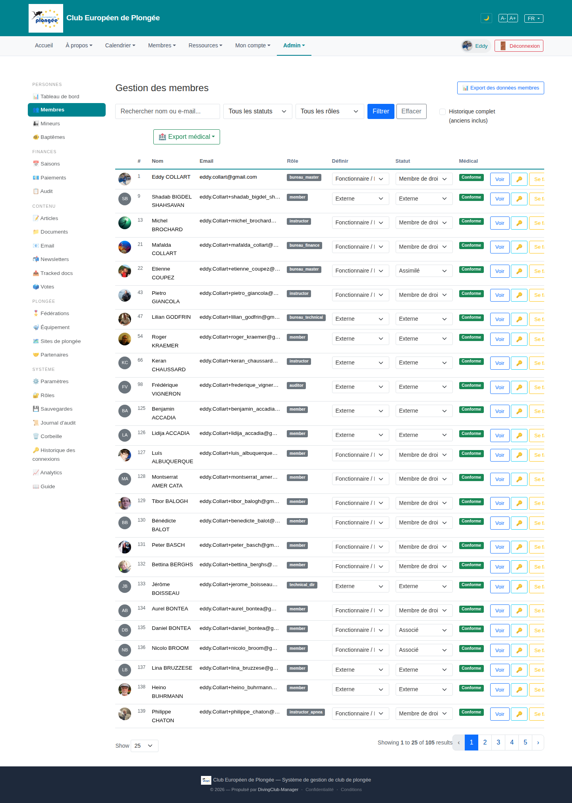

# 10 — Members management (list)

- **Screen** — `GET /admin/members`, bureau_master, FR, 25/page, 105 results.
- **Reads as** — Filter bar (search / status select / role select / Filtrer / Effacer / "Historique complet" checkbox), a second-row "Export médical" split button, then a wide table: avatar · # · Nom · Email · Rôle (grey pill) · **Définir** (editable select) · **Statut** (editable select) · Médical (green "Conforme" badge) · three action buttons (Voir / 🔑 / "Se f…" clipped).

## Friction

1. **Two editable `<select>`s per row, inline, 25 rows.** "Définir" (role) and "Statut" columns are live dropdowns on every row — 50 selects on screen. Heavy visually, easy to mis-click, and it's unclear whether a change auto-saves. This is the single biggest density problem on the page.
2. **The last action column is clipped** ("Se f…" = "Se faire passer pour" / impersonate). Actions overflow the viewport → horizontal scroll on a core admin screen (violates the project's own table conventions).
3. **Rôle shown twice.** A grey "bureau_master" pill *and* the "Définir" select next to it both represent role. One should be display, the other edit — not both inline.
4. **Email column shows raw `eddy.Collart+michel_brochard…` truncated.** For staging test data that's expected, but the column is wide and low-value at a glance; could be secondary text under the name.
5. **No sortable headers visible.** `AGENTS.md` requires `<x-sortable-th>` on all data tables; Nom/#/Statut/Médical should be click-to-sort. (Need to confirm — headers look plain here.)
6. **"Conforme" badge in its own column** repeated 25× in identical green — carries almost no information when everyone is compliant. Only the exceptions matter.
7. **Filter bar wrapping.** "Historique complet (anciens inclus)" checkbox wraps to two lines and sits oddly to the right of the buttons.
8. **Three different actions as three different visual styles** (outline button, key icon, text link) with no labels/tooltips grouping them.

## Restructure

- **Make the row read-only by default; edit in a drawer/modal.** Row shows: avatar + name (email as small muted line under) · role (pill) · status (pill) · medical (icon only, and only when *not* compliant) · a single "⋯" actions menu (View / Impersonate / Reset password). Inline `<select>`s move into an "Edit member" side panel. Kills ~50 controls and the horizontal scroll at once.
- **If inline edit must stay**, collapse role+status into one "Membership" cell with both selects stacked and a clear autosave indicator ("Saved ✓"), and drop the duplicate role pill.
- **Medical column → exceptions only.** Blank when "Conforme"; amber "Expire soon" / red "Non conforme" chip otherwise. Add a filter chip "Medical: needs attention".
- **Sortable headers** on #, Nom, Rôle, Statut, Médical, and a default sort (Nom asc).
- **Tidy the filter bar**: search (grow) · Statut · Rôle · [Filtrer] [Effacer] on one row; move "Historique complet" and both export buttons into a single "⋯ More" / toolbar so the primary row is clean.
- **Pin the actions column** or move actions to the left of the horizontal overflow so they're always reachable.

## Effort

L — behavioural change (inline edit → drawer) touches controller save endpoints and JS. Medium if limited to: exceptions-only medical column + sortable headers + filter-bar tidy + actions menu. Do those first.
