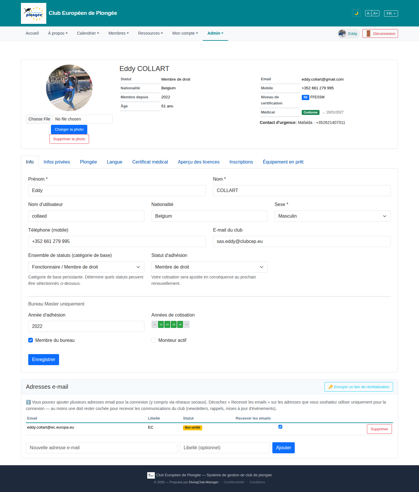

# 11 — Member profile / edit (admin view)

- **Screen** — `GET /admin/members/{id}/profile`, bureau_master viewing Eddy, FR, tab "Info". (Own profile `/profile` renders the same layout — see 31.)
- **Reads as** — A summary card (avatar + photo upload controls / name / Statut·Nationalité·Membre depuis·Âge as a mini table / Email·Mobile·Niveau·Médical on the right / emergency contact line), then an 8-tab strip (Info / Infos privées / Plongée / Langue / Certificat médical / Aperçu des licences / Inscriptions / Équipement en prêt), then the "Info" form: name row, username/nationality/sexe row, phone/club-email row, "Ensemble de statuts" + "Statut d'adhésion" row with two help paragraphs, a hairline, a **"Bureau Master uniquement"** block (année d'adhésion / années de cotisation chips / two checkboxes), Enregistrer. Then a separate "Adresses e-mail" card.

## Friction

1. **Photo upload controls sit in the summary card, always visible.** "Choose File / Charger la photo / Supprimer la photo" — three controls for a once-a-year action, occupying the prime top-left position and unbalancing the otherwise clean summary card.
2. **The summary card mixes read-only facts with an action widget.** Everything else in the card is display (statut, âge, médical…); the file input is the only interactive thing and it's the biggest element.
3. **"Info" tab crams three concern-levels together:** basic identity (name, sexe, phone), membership classification (ensemble de statuts, statut d'adhésion — with two paragraphs of explanation), and a privileged "Bureau Master uniquement" sub-section (adhésion year, cotisation years, bureau/moniteur flags). Three audiences, one scroll.
4. **"Bureau Master uniquement" is just a grey text label** above the block — not a visually distinct privileged zone. Easy to miss that these fields are special / high-consequence.
5. **"Années de cotisation" as tiny 2-digit chips** (22 23 24 25 26 27) — hard to read, unclear if toggling them is safe, no year context (2022? 2026?).
6. **Two help paragraphs stacked** under the status selects add ~4 lines of grey text mid-form.
7. **8 tabs, no grouping.** "Certificat médical", "Aperçu des licences", "Plongée" are all diving-qualification-ish; "Info" + "Infos privées" + "Langue" are personal; "Inscriptions" + "Équipement en prêt" are activity history. Flat 8-wide strip.
8. **"E-mail du club" field** (`sas.eddy@clubcep.eu`) sits in the basic info row with no explanation of what a "club email" is or when it's used — and there's a whole separate "Adresses e-mail" card below doing email management.
9. **Field widths**: "Sexe" is a full-third-width select for a 2–3 option value; "Nationalité" is a plain text input here but a searchable control on the public register form (see 03) — inconsistent.

## Restructure

- **Move photo upload out of the summary card.** Put a small "Modifier la photo" link/pencil on hover over the avatar, opening a little popover with the file input. The summary card becomes purely at-a-glance.
- **Split the "Info" tab into clear sections with real headings:** "Identité" (name, sexe, DoB, nationalité, phone) · "Adhésion" (ensemble de statuts, statut, année) · then a visually distinct **"Réservé au bureau"** panel (tinted background, lock icon, its own heading) for the cotisation years + bureau/moniteur flags.
- **Cotisation years as a labelled control**: a row of full-year toggle buttons ("2024 2025 2026 2027") with the active season highlighted, or a multi-select — not cramped 2-digit chips.
- **Collapse the two help paragraphs** into one line each, or move them to `?` tooltips on the field labels.
- **Group the 8 tabs** into 3: "Profil" (Info, Infos privées, Langue) · "Plongée" (Plongée, Certificat médical, Aperçu des licences) · "Activité" (Inscriptions, Équipement en prêt). Either nest, or use a segmented control + sub-tabs.
- **Clarify "E-mail du club"** with helper text, or merge its management into the "Adresses e-mail" card so there's one place for email.
- **Standardise the nationality control** with the register form (use `x-country-select` everywhere).
- **Constrain field widths** to expected content (Sexe ~10rem, phone ~16rem).

## Effort

M–L — profile is a multi-tab Blade with per-tab POST endpoints. Section headings + privileged-panel styling + cotisation-years control + photo-popover are each S–M and independent. Tab regrouping is M and the highest-value structural change.
