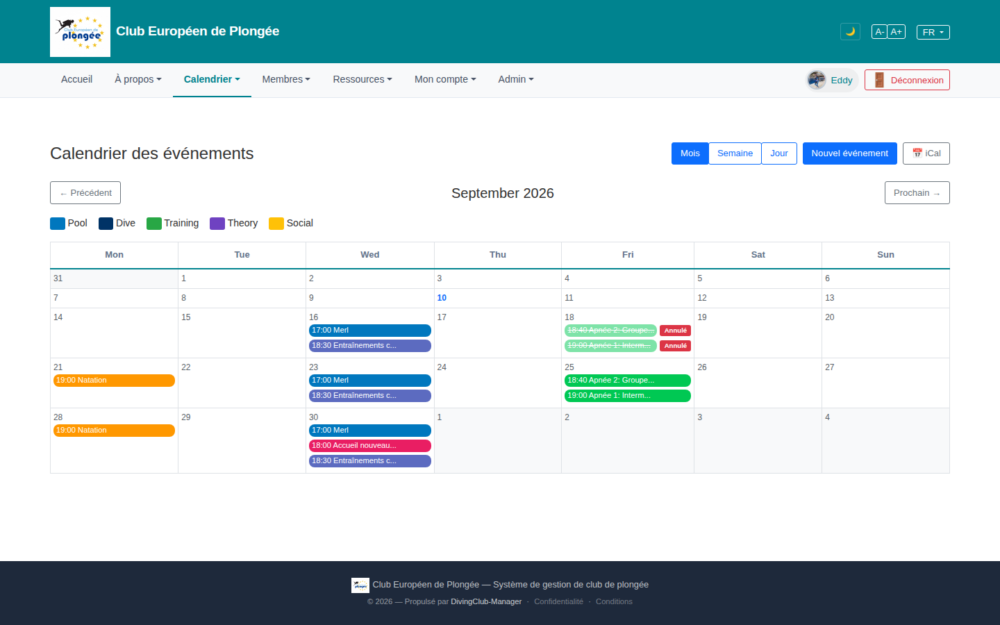

# 12 — Event calendar (month view)

- **Screen** — `GET /events` (route `events.index`), bureau_master, FR, month view, September 2026.
- **Reads as** — Title "Calendrier des événements", a view switcher (Mois / Semaine / Jour) + "Nouvel événement" + "iCal" top-right, a month pager (← Précédent / September 2026 / Prochain →), a 5-chip colour legend (Pool / Dive / Training / Theory / Social), then a 7-column month grid. Event chips carry "17:00 Merl", "18:30 Entraînements c…", cancelled ones show strikethrough + a red "Annulé" badge outside the chip.

## Friction

1. **Month label is in English ("September 2026") inside an otherwise-French page** — and the pager around it is French ("Précédent" / "Prochain"). The calendar grid weekday headers are English too (Mon–Sun) while everything else is FR.
2. **The "Annulé" badge sits *outside* the event chip**, to its right, overflowing into the next day's column visually. A cancelled event should read as one unit — strikethrough chip *with* the badge inside it.
3. **Chips truncate mid-word** ("Entraînements c…", "18:40 Apnée 2: Groupe…") with no tooltip shown — you can't tell two "Entraînements collectifs" apart, or see the location, without clicking.
4. **Legend is 5 colours but the calendar uses more** — the availability page (14) listed 15 activity types. Either the calendar collapses many types into 5 buckets (then the chip colours don't match the 15-type reality) or the legend is incomplete.
5. **Lots of empty grid.** Weeks 1–2 and most weekdays are blank; the grid is a fixed 6×7 with tall rows regardless of content, so a sparse month is a big scroll.
6. **View switcher + "Nouvel événement" + "iCal" share the top-right corner** at similar visual weight; "Nouvel événement" (the primary create action) doesn't stand out.
7. **No "today" emphasis beyond a blue date number** (the 10th) — easy to lose the current day in the grid.
8. **No week-number column** here, but the availability calendar (14) has one — the two calendars aren't consistent with each other.

## Restructure

- **Localise the month title and weekday headers.** `->translatedFormat('F Y')` / localized day names, matching the page locale.
- **Bring the "Annulé" state inside the chip:** muted/hatched fill, strikethrough title, a small "Annulé" tag on the same line — contained within the cell.
- **Add hover tooltips / a click-popover** with full title, time, location, instructor, registration count — so truncation is safe.
- **Reconcile the legend with the real type set.** Either show all types (in a collapsible "Types ▾") or clearly state the 5 are grouped buckets and colour chips by bucket consistently.
- **Let empty weeks collapse** or cap row height for weeks with ≤1 event; give the grid a sensible max-height so a normal month fits near one screen.
- **Promote "Nouvel événement"** to a filled primary button; group "Mois/Semaine/Jour" as a segmented control and "iCal" as a quiet outline/icon button.
- **Stronger "today"**: tint the whole cell, not just the number.
- **Align with the availability calendar** (14): same weekday localisation, same week-number treatment (either both show "Sem" or neither), same chip style.

## Effort

M — calendar is a custom Blade/JS grid. Localisation + cancelled-chip fix + tooltips + button hierarchy are S–M each. Collapsing empty weeks is M. Legend/type reconciliation may need a product decision.
