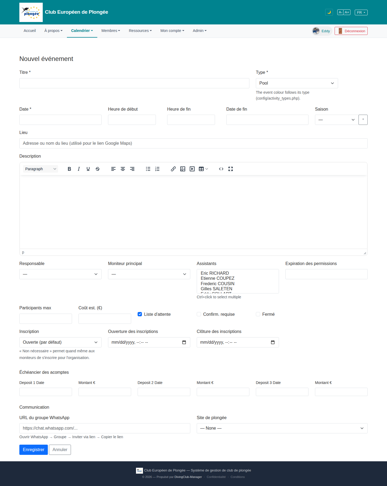

# 13 — New event form

- **Screen** — `GET /events/create` (route `events.create`), bureau_master, FR, empty form.
- **Reads as** — One long single-column form, ~35 fields, no sections: Titre/Type · Date/Heure début/Heure fin/Date de fin/Saison[+] · Lieu · a full rich-text editor for Description · Responsable/Moniteur principal/Assistants (multi-select listbox)/Expiration des permissions · Participants max/Coût est./3 checkboxes · Inscription/Ouverture/Clôture · "Échéancier des acomptes" (3× Date+Montant) · "Communication" (WhatsApp URL / Site de plongée) · Enregistrer/Annuler.

## Friction

1. **~35 controls, zero grouping.** Scheduling, staffing, registration rules, deposit schedule, and comms links are all one undifferentiated column. This is the densest form in the app. A user creating a simple pool session must scroll past deposit-schedule and permission-expiry fields that don't apply.
2. **The rich-text editor is enormous** — a full TinyMCE-style toolbar and a ~300px body — for a field that's usually one or two sentences. It dominates the top third of the form and separates "Date" from "Responsable" by a screenful.
3. **Native date/datetime inputs show `mm/dd/yyyy, --:-- --`** — US format placeholder in a FR UI, and inconsistent with the plain "Date" text input at the top (which has no visible format hint at all). Three different date-entry styles on one form.
4. **"Assistants" is a raw multi-select listbox** with "Ctrl+click to select multiple" helper text — poor affordance, no search, shows 4.5 names. For a club with 200 members this doesn't scale.
5. **Developer text leaked into the UI:** "The event colour follows its type (config/activity_types.php)." — a config file path shown to the bureau.
6. **"Échéancier des acomptes"** = 6 fields (Deposit 1/2/3 Date + Montant) always rendered, even for free events. Labels are English ("Deposit 1 Date", "Montant €") in a FR form.
7. **Three checkboxes mid-form** ("Liste d'attente" pre-checked, "Confirm. requise", "Fermé") float between "Coût est." and "Inscription" with no grouping — their relationship to the registration settings just below isn't visually expressed.
8. **"Saison" has a bare `+` button** next to it with no label — create-a-season inline? Unclear.
9. **"Expiration des permissions"** is an unexplained date field next to staffing — needs context.
10. **Everything full-width.** "Heure de début", "Participants max", "Coût est." are short values in wide inputs.

## Restructure

- **Break into collapsible sections**, most with sensible defaults so a basic event is ~6 fields:
  1. **Essentiel** — Titre, Type, Date, Heure début/fin, Lieu.
  2. **Description** (collapsed by default; a plain textarea that upgrades to rich-text on demand, or a much shorter editor).
  3. **Encadrement** — Responsable, Moniteur principal, Assistants.
  4. **Inscriptions** — Inscription mode, Ouverture/Clôture, Participants max, the 3 checkboxes (grouped here), Coût est.
  5. **Acomptes** (collapsed unless Coût > 0) — the deposit schedule.
  6. **Liens** (collapsed) — WhatsApp, Site de plongée.
- **Shrink the description editor** to ~120px with a "développer" toggle; drop the full toolbar to bold/italic/link/list + "plus".
- **One date control style.** Use the project date/time picker component everywhere on this form, FR-formatted, with `min` = today for registration dates.
- **Replace the Assistants listbox** with a searchable multi-select / token input (same control as recipients pickers elsewhere).
- **Remove the config-path helper text**; if the colour rule needs explaining, say "La couleur suit le type d'activité."
- **Row up short fields**: Heure début | Heure fin; Participants max | Coût est.
- **Label the Saison `+`** ("Nouvelle saison") or move season creation out of this form.
- **Translate** "Deposit N Date", "Montant €".
- **Add a helper** to "Expiration des permissions" ("Les moniteurs assistants perdent l'accès après cette date").

## Effort

L — this is the app's biggest form and the restructure touches the Blade heavily plus the Assistants control and the date pickers. But sectioning + collapsing rarely-used blocks is the single highest-impact density win in the whole review. Editor-shrink and helper-text removal are S and can ship immediately.
