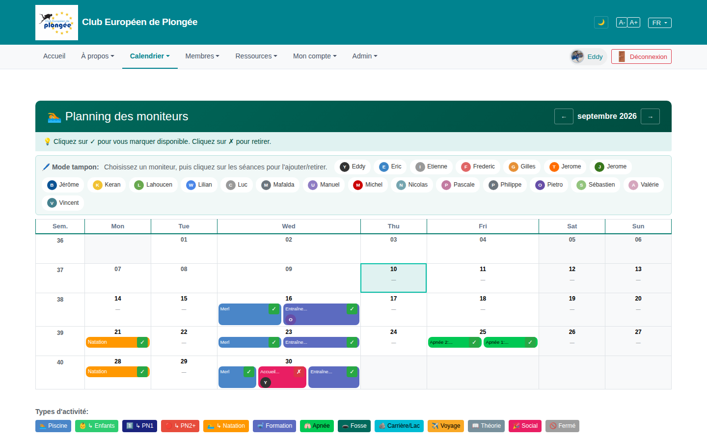

# 14 — Instructor planning / availability

- **Screen** — `GET /availability` (route `availability.index`), bureau_master, FR, month grid September 2026, "buffer mode" instructor picker visible. (Light mode — the dark-mode contrast fix landed earlier; this review is structural.)
- **Reads as** — Dark teal title bar with month pager, a full-width blue hint line, a bordered "Mode tampon" panel holding ~22 instructor chips wrapped over 3 rows, then a 8-column month calendar (Sem + Mon–Sun) where days carry coloured event chips with ✓/✗, then a legend row of 15 activity-type colour chips at the bottom.

## Friction

1. **The instructor chip cloud is huge.** 22 name chips in a bordered box, three rows deep, all equal weight, pushing the actual calendar down ~360px. In "buffer mode" you pick one — so this is a picker rendered as a wall.
2. **Three stacked banners before content.** Title bar (teal) + hint line (blue) + "Mode tampon" instructions (inside the panel) — three different background colours, three messages, all before the grid.
3. **Colour is overloaded.** Event chips are coloured by activity type (15 types → 15 colours in the legend), plus ✓ green / ✗ pink states, plus the teal header, plus the "today" cyan cell outline. No single colour dimension is readable at a glance.
4. **The 15-chip legend at the bottom** is far from the grid it explains; by the time you scroll to it you've lost the cell you were looking at.
5. **Empty days show a lone "—"** in large type — visually noisy for a month that's mostly empty; the dashes draw the eye more than the actual sessions.
6. **"Sem" (week number) column** is as wide as a weekday column for a 2-digit number.
7. **Day cells are tall and fixed** even when empty, so the grid is much taller than its content warrants.

## Restructure

- **Collapse the instructor picker.** In buffer mode, replace the chip wall with a single searchable "Choisir un moniteur ▾" combobox (or a compact 2-row scrollable list with a search field). Show the *selected* instructor as one prominent chip with a "change" affordance. Recovers ~300px.
- **Merge the banners.** One slim toolbar: [◀ septembre 2026 ▶]   ·   mode toggle (Normal / Tampon)   ·   contextual one-line hint that changes with the mode. Drop the separate teal bar + blue strip.
- **Pick one primary colour dimension.** Colour cells/chips by **availability state** (covered / partial / uncovered), and show activity type as a small text label or icon inside the chip. Move the type legend to a collapsible "?" popover next to the toolbar.
- **Quiet the empty cells.** No "—"; empty days are just empty with the date number muted. Reserve visual weight for days that have sessions.
- **Shrink "Sem"** to a narrow gutter (~2.5rem), de-emphasised.
- **Let cell height shrink** to content; cap the grid so a full month fits near one viewport.

## Effort

M–L — the calendar is a custom Blade/JS grid. Picker-collapse + banner-merge + empty-cell cleanup are M and high-impact. Re-basing colour onto availability state is L (touches the chip rendering + legend).
