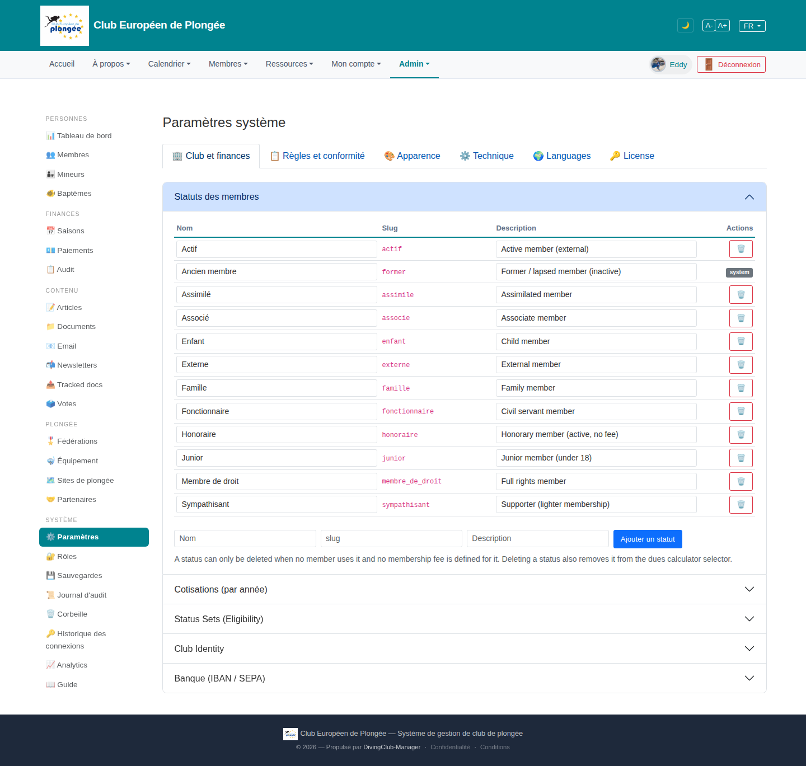

# 15 — System settings (Club & finance tab)

- **Screen** — `GET /admin/settings`, bureau_master, FR, tab "Club et finances", accordion "Statuts des membres" open (others collapsed: Cotisations, Status Sets, Club Identity, Banque).
- **Reads as** — 6 top tabs (Club et finances / Règles et conformité / Apparence / Technique / Languages / License), then a light-blue accordion header "Statuts des membres", an editable table of 12 status rows (Nom / Slug / Description / Actions=trash), an "add row" line, a help sentence, then 4 collapsed accordion bars.

## Friction

1. **Two levels of navigation for one screen: 6 tabs + 5 accordions.** To reach "Banque (IBAN/SEPA)" you pick a tab then open the 5th accordion. Nested disclosure — easy to lose your place, hard to know what's where.
2. **The open accordion header is a saturated blue band** heavier than the page title; the 4 closed ones are plain grey. The open section shouts, the rest whisper.
3. **12 editable rows all rendered as open inputs.** Every Nom/Slug/Description is a live text field — 36 inputs — with no visual difference between a system row ("Ancien membre", marked with a grey "system" chip where the trash would be) and an editable one. The "system" chip is easy to miss.
4. **Slug column is editable.** Slugs are identifiers other tables key on; presenting them as free text fields invites breakage. Should be read-only (or derived) once a status is in use.
5. **Trash icon per row, red, ×12** — a column of delete buttons is visually aggressive for a settings list where deletion is rare and conditional (the help text explains it's often blocked).
6. **Help text sits below the table** ("A status can only be deleted when…") — it explains the disabled/blocked trash buttons that are *above* it.
7. **Add-row uses placeholder-only labels** ("Nom" / "slug" / "Description" as placeholders) so once you type, the field's purpose disappears.
8. **Language mix**: "Status Sets (Eligibility)", "Club Identity", "Banque (IBAN / SEPA)" — EN headings in a FR UI.

## Restructure

- **Flatten one level.** Either: tabs only, with each former accordion becoming its own sub-tab or a plain `<h2>` section on a scrollable page; or accordions only, no tabs. Nested tab-in-accordion is the core problem.
- **Render status rows read-only with an "Edit" affordance.** Row shows Nom / Slug (muted, monospace) / Description as text; pencil to edit inline or in a modal. System rows visually distinct (muted background, no edit/delete, a small "system" tag at the *start* of the row).
- **Slug read-only after creation.** Show it, don't let it be edited when `usage_count > 0`.
- **Move the help text above the table** and disable (not hide) trash buttons that can't act, with a tooltip saying why.
- **One "＋ Ajouter un statut" button** that reveals a small form with real labels, instead of a permanent ghost row.
- **Demote the open-accordion header** to match the others; use a thin left accent or bold text for "open", not a full colour fill.
- **Translate the section headings.**

## Effort

M — settings views are already partials per section; de-nesting the tab/accordion structure is the main lift. Read-only rows + slug lock + help-text move are S each.
