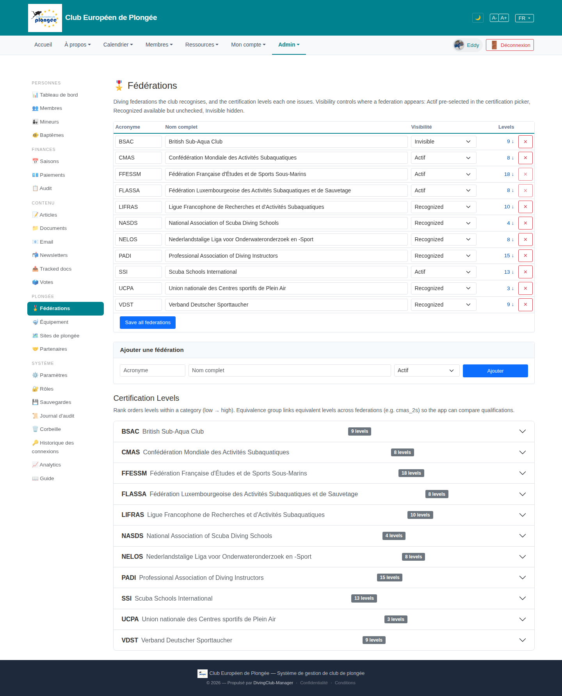

# 16 — Federations

- **Screen** — `GET /admin/federations` (route `federations.index`, gated by `manage federations`), bureau_master, FR.
- **Reads as** — Title + explanatory paragraph, an editable table of 11 federations (Acronyme / Nom complet / Visibilité select / Levels count-link + ↓ / red × delete), a "Save all federations" button, an "Ajouter une fédération" panel, then a second `<h2>` "Certification Levels" with its own intro paragraph and an 11-row accordion (one per federation, "N levels" badge, chevron).

## Friction

1. **The same 11 federations are listed twice on one page** — once as the editable table, once as the accordion below. To edit BSAC's levels you scroll past the table, find BSAC again in the accordion, expand. The two lists can drift visually (order, naming).
2. **Two intro paragraphs**, one under each `<h2>`, both ~2 lines of light grey — a lot of prose before any control. The "Visibilité" explanation (Actif/Recognized/Invisible) is buried in paragraph 1.
3. **"Levels" column shows `9 ↓`** — a number that's also a link, plus a down-arrow whose meaning (jump to accordion? sort?) isn't clear.
4. **Editable "Nom complet" fields, full width, 11 rows** — federation names essentially never change; presenting them as always-open inputs adds weight for no benefit.
5. **Red × on every row** — same aggressive delete column noted on settings; deletion here is also conditional (blocked while licences/levels exist).
6. **"Save all federations"** implies the whole table is a dirty form at all times; no per-row save, no indication of what changed.
7. **Visibilité values untranslated** ("Actif / Recognized / Invisible" mixed FR/EN) and their effect is only in the intro prose, not near the control.

## Restructure

- **Merge the two lists.** One row per federation that *expands in place* to reveal its certification levels (the accordion content moves into the table row's detail panel). Delete the separate "Certification Levels" section entirely. One list, drill down in place.
- **Row: read-only by default.** Acronyme (bold) · Nom complet (text) · Visibilité (pill) · "N niveaux" (link that expands the row) · ⋯ menu (Edit / Delete-if-allowed). Edit opens inline or modal.
- **Replace both intro paragraphs** with: a one-line page description, and a small "?" popover on the "Visibilité" column header carrying the Actif/Recognized/Invisible definitions.
- **Drop the `↓` glyph**; the count itself is the expand control.
- **Per-row save** (or an explicit "unsaved changes" bar) instead of a permanent "Save all".
- **Translate** the visibility options.

## Effort

M — controller already returns levels eager-loaded; collapsing the accordion into an expandable table row is a view refactor of `federations/index.blade.php` + `_levels.blade.php`. Removes a whole section rather than adding one.
