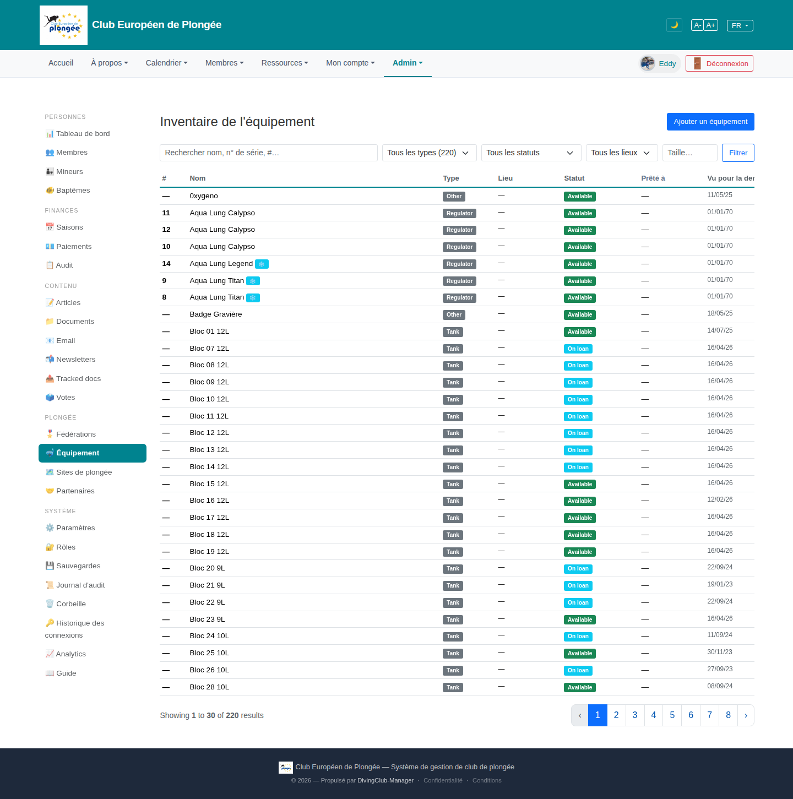

# 17 — Equipment inventory

- **Screen** — `GET /admin/equipment` (route `equipment.index`, gated by `manage equipment`), bureau_master, FR, 30/page of 220.
- **Reads as** — Title + "Ajouter un équipement", a filter bar (search / type select "Tous les types (220)" / status select / location select / "Taille…" input / Filtrer), then a table: # · Nom · Type (grey pill) · Lieu · Statut (green "Available" / cyan "On loan") · Prêté à · "Vu pour la dernière fois" (date, clipped at right edge).

## Friction

1. **Last column clipped** ("Vu pour la der…") — table exceeds viewport, horizontal scroll on a primary list.
2. **The list is dominated by near-identical rows** — "Bloc 07 12L / Bloc 08 12L / Bloc 09 12L …" 20+ tanks in sequence, each a full row. Tanks are fungible; showing 200 of them one per line is the wrong granularity for an overview.
3. **`#` column is mostly "—".** Only regulators have an id; tanks show a dash. A column that's 80% empty.
4. **`Lieu` and `Prêté à` are almost entirely "—"** too — three columns (#, Lieu, Prêté à) carrying dashes for most rows. High grid, low information.
5. **Dates as `01/01/70`** for regulators (epoch = never seen) render as real-looking dates — reads as a data bug even if it's "unknown". Should be "—" or "jamais".
6. **Status colours**: green "Available" vs cyan "On loan" are close in hue/brightness; at a glance the column looks uniformly greenish.
7. **Filter bar**: "Taille…" is a bare input with no label among four selects; "Tous les types (220)" putting the total count inside the option label is unusual.
8. **No grouping or summary.** 220 items, no "X available / Y on loan / Z in maintenance" counts, no grouping by type.

## Restructure

- **Add a summary strip** above the table: counts by status (Available / On loan / Maintenance / Retired) and by type, as clickable filter chips.
- **Group or roll up fungible items.** Show "Tanks 12L — 24 items (18 available, 6 on loan)" as one expandable row; expand to the individual list only when needed. Same for weights, masks, etc. Regulators/BCDs (serial-tracked) stay one-per-row.
- **Drop or merge low-signal columns.** Combine "Lieu" + "Prêté à" into one "Where" column (a location *or* a borrower, never both). Move `#`/serial into the name cell as a muted sub-line.
- **Fix the epoch dates** → "jamais vu" / "—".
- **Widen status colour separation** (e.g. grey "disponible", amber "prêté", red "maintenance") and pull the last-seen date into the visible area once columns are trimmed.
- **Label "Taille…"** and align the filter controls on one row.

## Effort

M–L — roll-up/grouping is a controller + view change (needs a "group fungible" concept). Column trim + summary chips + date fix + colour tweak are M and independently shippable.
