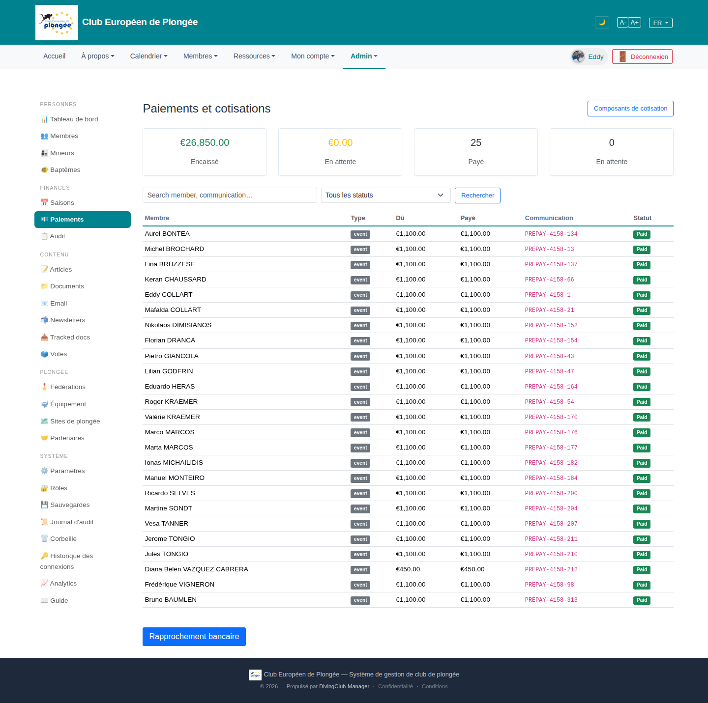

# 18 — Payments & dues

- **Screen** — `GET /admin/payments` (route `payments.index`), bureau_master, FR.
- **Reads as** — Title + "Composants de cotisation" button, four KPI cards (€26,850 Encaissé / €0.00 En attente / 25 Payé / 0 En attente), a search + status filter, a table (Membre / Type "event" pill / Dû / Payé / Communication link / Statut "Paid" green), then a "Rapprochement bancaire" button alone at the bottom.

## Friction

1. **"En attente" appears twice in the KPI row** — once as €0.00 (amount) and once as 0 (count). Two of four cards have the same label. The row reads: money-in, nothing-pending, count-paid, nothing-pending.
2. **Every row is identical.** Same "event" type, same €1,100.00 dû = payé, same green "Paid". 25 rows conveying one fact: everyone paid. The exceptions (Diana €450, anyone unpaid) are what the bureau needs and they're not surfaced.
3. **"Dû" and "Payé" columns are the same number on every row** — when they match, showing both is redundant; the interesting case is when they *differ*.
4. **Communication codes** ("PREPAY-4158-134") are pink monospace links filling a wide column — high visual weight for a reference string.
5. **Two primary actions detached from the content**: "Composants de cotisation" top-right, "Rapprochement bancaire" bottom-left, both filled blue, nothing between them relating them to the table.
6. **No date column** — when was each payment received? Can't sort by recency.
7. **KPI cards** use the same big-number-small-label pattern as the dashboard but the numbers here (25, 0) are counts of the *current filtered page*? unclear scope.

## Restructure

- **Fix the KPI row**: Encaissé (€) · Attendu (€) · **Reste à encaisser** (€, the actionable one) · Membres en retard (count). Four distinct facts.
- **Default the table to "needs attention"** — unpaid / partial / overpaid first, or a prominent filter chip set ("Impayés · Partiels · Payés · Tous") defaulting to "Impayés". A fully-paid club should show a near-empty actionable list, not 25 green rows.
- **Collapse Dû/Payé** into one "Montant" column, with a "solde" only shown (amber/red) when non-zero.
- **Add a "Reçu le" date column**, sortable, default sort desc.
- **Demote Communication** to a muted sub-line under the member name, or a column at `max-width` with copy-on-click.
- **Group the two actions** into a small toolbar under the title: "Composants de cotisation" and "Rapprochement bancaire" as outline buttons side by side.
- **Sortable headers** (Membre, Montant, Reçu le, Statut).

## Effort

M — controller supplies the rows; adding a received-date column + status-based default filter + merging amount columns is contained. KPI relabel is S.
