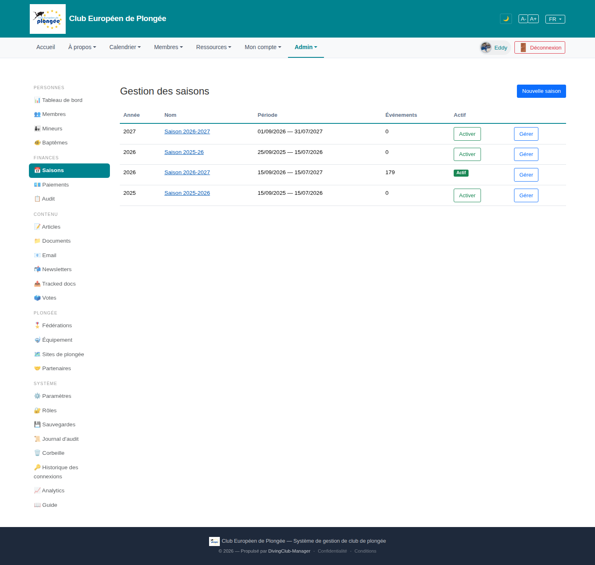

# 19 — Seasons management

- **Screen** — `GET /admin/seasons` (route `seasons.index`), bureau_master, FR.
- **Reads as** — Title + "Nouvelle saison", a 4-row table: Année / Nom (link) / Période / Événements / Actif (either a green "Actif" tag or an "Activer" button) / "Gérer" button. Then a large empty page.

## Friction

1. **Overlapping, near-duplicate season names.** "Saison 2026-2027" appears **twice** (year 2027 with 0 events, and year 2026 with 179 events and Actif). Plus "Saison 2025-26", "Saison 2025-2026", "Saison 2026-2027". A reader cannot tell which is real / current / a mistake. This is a data-hygiene problem the UI does nothing to mitigate.
2. **"Année" column disagrees with the name.** Row "Saison 2025-26" is filed under Année 2026; "Saison 2026-2027" under 2026. The single-year column for a two-year season is inherently confusing and here it's inconsistent.
3. **"Actif" column mixes a status and an action.** Three rows show an "Activer" button, one shows a green "Actif" tag. Fine pattern, but the button and the tag sit in the same column at the same position so the column reads as ragged.
4. **"Événements" = 0 for three of four seasons.** Only the active one has data. The three empty seasons look like abandoned drafts — nothing distinguishes "future season, not started" from "leftover junk".
5. **Two actions per row** ("Activer" and "Gérer") both as outline buttons, similar width — no primary/secondary distinction.
6. **No dates of creation / no "current" indicator beyond the tag**, no sort, no way to archive/delete an obviously-bad row from this screen.

## Restructure

- **Show the full span, not a single year.** Column "Saison" = the name; column "Période" already gives `01/09/2026 — 31/07/2027`. Drop the ambiguous "Année" column (or make it the span "2026–27").
- **One clear "current" treatment.** A left border accent + "Saison en cours" label on the active row; other rows plain. Move the "Activer" action into the row's ⋯ menu so the status column only ever shows status.
- **Distinguish future / past / draft.** Badge each row: "En cours" · "À venir" · "Terminée" · "Brouillon (0 événement)". Sort: current first, then upcoming, then past.
- **Surface the duplicates.** If two seasons overlap in date range, show an inline warning ("chevauche Saison 2026-2027") so the bureau can clean up. Add "Supprimer" (guarded: only when 0 events, 0 payments) to the ⋯ menu.
- **Primary vs secondary actions**: "Gérer" as the row's main affordance (or make the name link do it); everything else in ⋯.
- **Fill the empty page** with a short explainer of what activating a season does (fees, calendar scoping), since it's a high-consequence toggle.

## Effort

S–M — view-only changes (drop a column, badge rows, move an action to a menu, add an overlap warning). The underlying duplicate-season data needs a separate cleanup pass.
