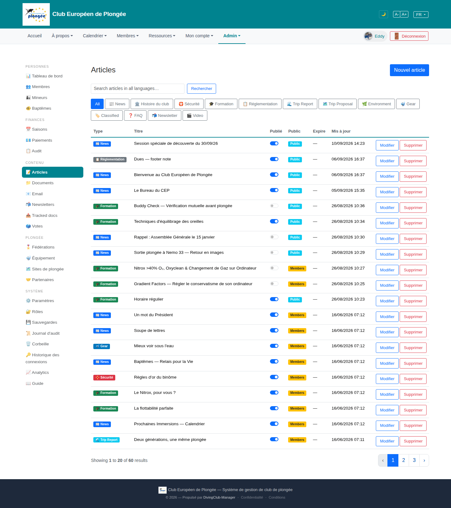

# 20 — Articles list

- **Screen** — `GET /admin/articles`, bureau_master, FR, "All" filter, 20/page of 60.
- **Reads as** — Title + "Nouvel article", a search box, then **two rows of 13 type-filter buttons** (All / News / Histoire du club / Sécurité / Formation / Réglementation / Trip Report / Trip Proposal / Environment / Gear / Classified / FAQ / Newsletter / Video), then a table: Type (coloured pill w/ emoji) · Titre · Publié (toggle) · Public (pill Public/Members) · Expire · Mis à jour · Modifier / Supprimer.

## Friction

1. **13 filter buttons over two rows** is a lot of chrome above the list — and several ("Classified", "Newsletter", "Video", "FAQ") likely have very few or zero articles. The filter bar is taller than 4 table rows.
2. **Type shown as a coloured emoji pill in every row** — 20 pills, ~8 colours, plus the emoji. With the type filter right above, the per-row pill is somewhat redundant and adds colour noise.
3. **Two boolean columns, two representations.** "Publié" is a toggle switch; "Public" is a text pill (Public / Members). Both are on/off states — inconsistent controls. And an inline toggle that saves on click gives no feedback here.
4. **"Expire" column is "—" on every visible row** — a whole column carrying no information on this page.
5. **"Mis à jour" timestamps** to the minute ("16/06/2026 07:12" ×8 identical) — minute precision isn't useful in a list; and 8 rows share the exact same time (a seed artefact) which looks like a bug.
6. **No sortable headers** (`AGENTS.md` requires them) — can't sort by updated date, title, or type.
7. **"Modifier / Supprimer" as two separate buttons per row** — 40 buttons; "Supprimer" (destructive) is one careless click away with no row-level confirmation shown.
8. **No language indicator.** Articles are multi-language (the public view had 15 tabs) but the list doesn't show which translations exist / are stale.

## Restructure

- **Collapse the type filter** to a single "Type ▾" dropdown, or show only the ~6 types that have articles as chips + a "Plus ▾" for the rest. Keep "All" as the default chip.
- **Drop the per-row Type pill's colour+emoji** to a small text label, or keep the pill but only when the "All" filter is active.
- **One control for each boolean.** Make "Publié" and "Public" both toggles (or both pills), grouped under a "Visibilité" mini-column: e.g. "Brouillon / Publié" + "Public / Membres". Add a saved-state tick on toggle.
- **Hide the "Expire" column** unless at least one row has a value (or fold expiry into the Titre cell as a small "expire 12/06" note).
- **Relative "Mis à jour"** ("il y a 3 mois", full date on hover); sortable.
- **Sortable headers** on Titre, Type, Mis à jour, and a default sort (Mis à jour desc).
- **Collapse row actions** to one "⋯" menu (Modifier / Dupliquer / Supprimer), with Supprimer confirming.
- **Add a translations indicator** — "FR ·+3" or a small globe with a count, so editors see coverage at a glance.

## Effort

M — controller already filters by type; swapping the chip bar for a dropdown + sortable headers + actions menu + relative dates is contained. Translation-coverage badge needs a small query addition.
