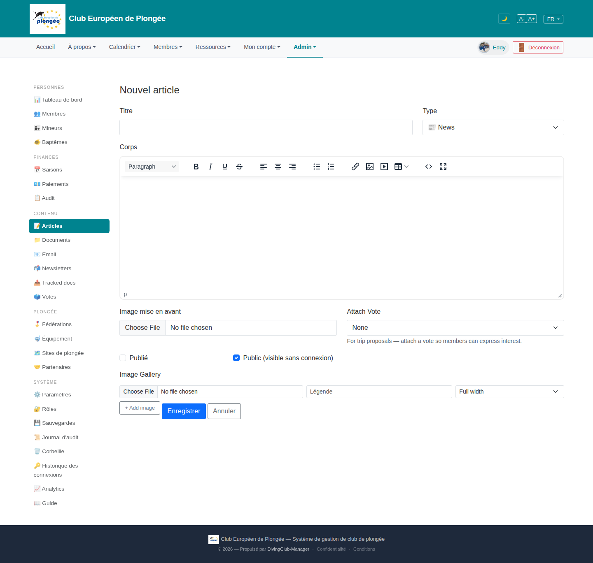

# 21 — New / edit article

- **Screen** — `GET /admin/articles/create`, bureau_master, FR, empty.
- **Reads as** — "Nouvel article", Titre / Type row, a large rich-text "Corps" editor, then "Image mise en avant" (file input) + "Attach Vote" (select) row, two checkboxes ("Publié" unchecked, "Public (visible sans connexion)" checked), then "Image Gallery" (file input + Légende + "Full width" select + "+ Add image"), Enregistrer / Annuler.

## Friction

1. **Language is invisible on the create form.** Articles are multi-language (15 tabs on the public side, "Search articles in all languages" on the list). This form gives no indication of *which* language you're authoring, or how translations get created. A core concept of the content model is absent from its main entry point.
2. **Mixed FR/EN labels:** "Corps" / "Image mise en avant" / "Publié" (FR) next to "Attach Vote" / "Image Gallery" / "Full width" / "For trip proposals — attach a vote…" (EN).
3. **"Attach Vote" is always shown**, but its own helper says it's "For trip proposals" — it's only relevant for one of 13 types. Noise for every other article.
4. **Two publish-state checkboxes with a subtle relationship.** "Publié" (is it live) and "Public" (visible without login) — "Public" is pre-checked while "Publié" isn't, so the default is "not published but would be world-visible if it were". The dependency isn't expressed.
5. **"Image mise en avant" and "Image Gallery"** are two separate image mechanisms with different UIs stacked together — a single file input vs a repeatable row with caption + width. Unclear when to use which.
6. **Native file inputs** ("Choose File / No file chosen") — unstyled, no preview, no drag-drop, inconsistent with the Document Library's nice drop-zone (22).
7. **No sections.** Content (titre, corps), media (2 image blocks), and publishing (type, vote, 2 checkboxes) are interleaved: Type is at the top, its related "Attach Vote" is below the editor, the checkboxes are between the two image blocks.
8. **The editor has no size guidance / preview** — same oversized editor concern as the event form (13).

## Restructure

- **Make language explicit.** Header: "Nouvel article — Français (langue source)". After save, show the translation tabs with an "auto-translate" action, matching the public view's model. If translations are auto-generated, say so here.
- **Three sections:**
  1. **Contenu** — Titre, Corps, Image mise en avant (with preview).
  2. **Galerie** (collapsible) — the repeatable image rows.
  3. **Publication** — Type, then *conditionally* "Attacher un vote" only when Type = Trip Proposal; then a single clear visibility control.
- **Replace the two checkboxes** with one segmented control: "Brouillon / Publié (membres) / Publié (public)". One decision, three states, no hidden dependency.
- **Unify the image inputs** with the Library's drop-zone component; show thumbnails.
- **Translate** all labels to match the UI locale.
- **Trim the editor** to a sensible default height with expand, like the event form recommendation.

## Effort

M — Blade + a conditional on Type for the vote field + swapping checkboxes for a segmented control + reusing the Library upload component. Making language/translation flow explicit may be L if the translation UX doesn't exist yet on this screen.
