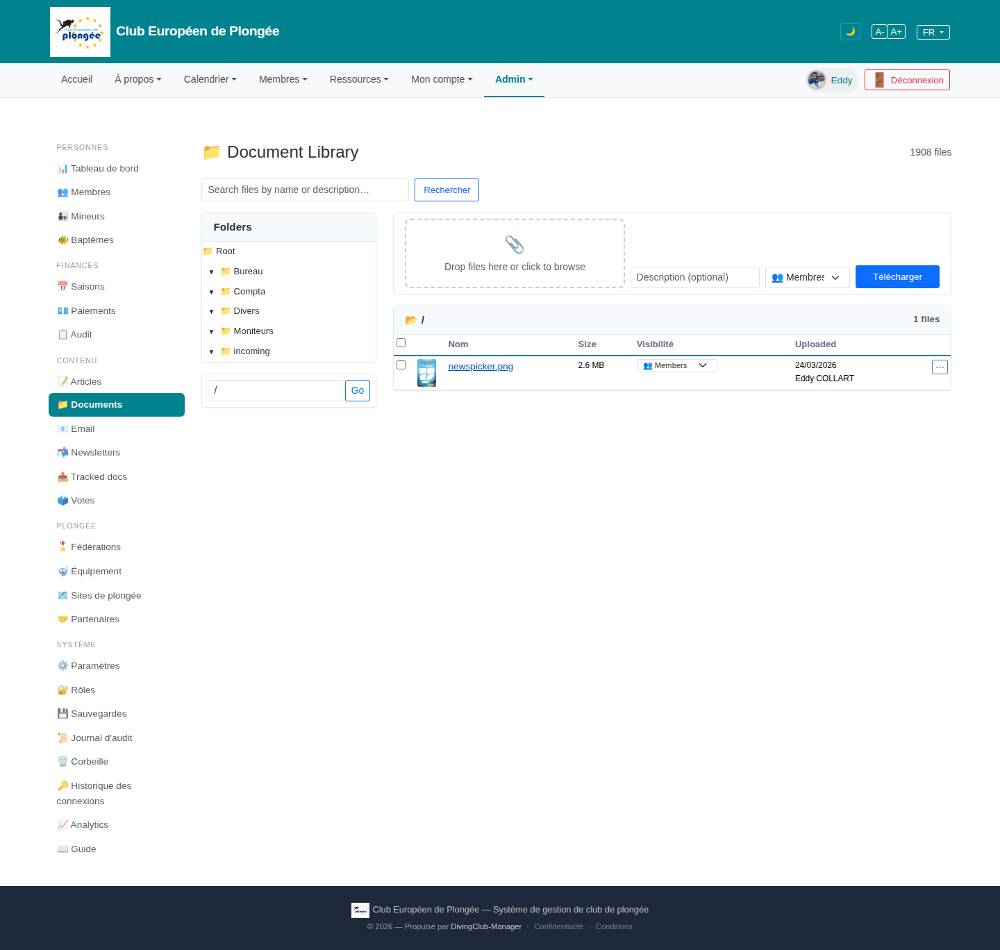

# 22 — Document Library

- **Screen** — `GET /admin/library` (route `library.index`), bureau_master, FR-ish, folder `/` (Root), 1 file shown, "1908 files" total.
- **Reads as** — Title "Document Library" + "1908 files" top-right, a search box, then a left "Folders" tree (Root → Bureau / Compta / Divers / Moniteurs / incoming) with a path input + "Go", and a right pane: a dashed drop-zone + "Description (optional)" + visibility select + "Télécharger" (= Upload), then a file table (checkbox · Nom w/ thumb · Size · Visibilité select · Uploaded w/ name · ⋯).

## Friction

1. **"1908 files" but the current view shows 1.** The root folder has one file; the count is the whole library. It reads as "1908 files, and here is 1 of them" — no sense of how they're distributed, no "recent" or "all files" view.
2. **English title and column headers** ("Document Library", "Folders", "Size", "Uploaded", "Drop files here or click to browse") in an otherwise FR admin. "Visibilité" and "Description (optional)" are FR — mixed.
3. **The upload panel is always expanded**, taking a third of the right pane above the file list, even when you're just browsing. Drop-zone + description + visibility + button = a permanent form.
4. **Folder tree has no counts.** "Bureau / Compta / Divers / Moniteurs / incoming" — no file counts, no indication where the 1908 files actually are. "Divers" and "incoming" are catch-alls that probably hold most of it.
5. **Two ways to navigate folders** — click the tree, or type a path into the input + "Go". The path input is a power-user affordance sitting under the tree with equal prominence.
6. **Per-row "Visibilité" is an inline select** — same inline-editable-select density issue as the members table (10); with many files this is a wall of dropdowns.
7. **"Télécharger" means Upload here** but "Télécharger" is also the natural word for Download (and the row ⋯ menu presumably has a real download). Ambiguous label.
8. **No file-type / date filters, no sort headers** — for a 1908-file library, search-by-name is the only tool.

## Restructure

- **Default to a useful view.** "Récents" (last 30 uploaded) or "Tous les fichiers" (paginated, sortable) when no folder is selected, so the page isn't empty-looking with a big global count.
- **Collapse the upload panel** into a "＋ Téléverser" button that opens the drop-zone/description/visibility as a panel or modal. Browsing is the common case.
- **Add file counts to the folder tree** ("Divers (1204)", "incoming (312)") so users know where things are.
- **Pick one folder-navigation model** — the tree — and demote the path input to an advanced option (or remove it; breadcrumbs on the file pane cover "where am I").
- **Row visibility read-only** with an edit affordance (pencil / ⋯ menu → "Changer la visibilité"), not an always-live select per row.
- **Rename the upload button** "Téléverser" (or "Ajouter un fichier"); reserve "Télécharger" for download.
- **Add sortable headers** (Nom, Size, Uploaded) + a type filter (PDF / image / autre) + a date filter.
- **Translate** the title and headers.

## Effort

M — the library view is a folder tree + table + upload form. Collapsing upload, adding a default "recent" view, folder counts, sortable headers, and label fixes are each S–M and independent.
