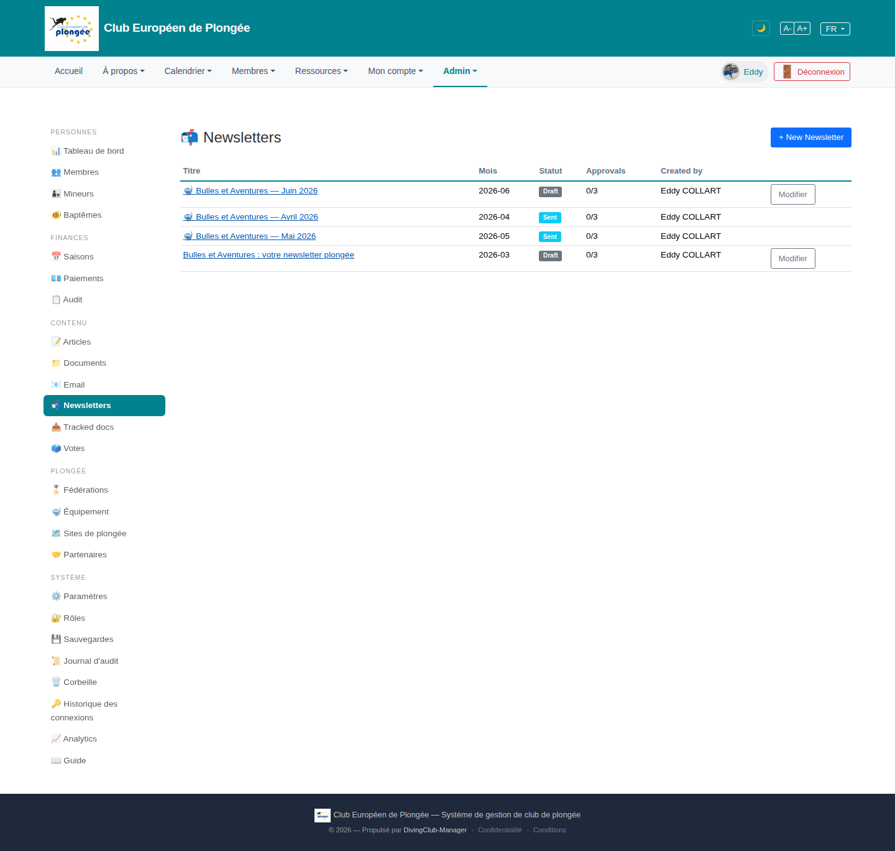

# 23 — Newsletters list

- **Screen** — `GET /admin/newsletters`, bureau_master, FR, 4 rows.
- **Reads as** — Title "Newsletters" + "+ New Newsletter", a table: Titre (link, some with a mail emoji) · Mois (2026-06) · Statut (Draft / Sent pill) · Approvals (0/3) · Created by · "Modifier" button (only on Draft rows). Then a large empty page.

## Friction

1. **"Approvals 0/3" on every row, including "Sent" ones.** A newsletter that's already been sent still shows "0/3" approvals — so either the approval step is skipped in practice, or the column is stale/meaningless. Either way it's a column of identical "0/3" carrying no signal.
2. **Rows are not sorted meaningfully.** Order shown: Juin (Draft) / Avril (Sent) / Mai (Sent) / Mars (Draft) — not by month, not by status, not by date. Looks random.
3. **"Modifier" only appears on Draft rows**, leaving a ragged empty action column on Sent rows with no alternative action (View? Duplicate? See send stats?).
4. **English button + heading** ("+ New Newsletter", and "Created by" / "Approvals" columns) in a FR admin. The `list` title itself is untranslated ("Newsletters" is arguably fine, but "Titre/Mois/Statut" FR vs "Approvals/Created by" EN is inconsistent).
5. **"Mois" as `2026-06`** — ISO year-month, not localised ("Juin 2026").
6. **The mail emoji prefix on some titles** (not all) has no obvious meaning — sent vs draft is already the Statut column's job.
7. **No send metrics.** For "Sent" newsletters there's no open rate / recipient count / send date — the thing you'd want after sending.
8. **Huge empty page** for 4 rows — no summary ("prochaine: Juin, en brouillon"), no schedule view.

## Restructure

- **Fix or drop the Approvals column.** If approval is required before send, show it only for Draft/In-review rows and make "Sent" rows show the send date + recipient count instead. If approval isn't actually used, remove the column.
- **Sort by month desc** (or status: Drafts first, then Sent by month desc). Add sortable headers.
- **Every row gets an action.** Draft → "Modifier"; Sent → "Voir" (rendered + stats). One "⋯" menu covering Modifier / Aperçu / Dupliquer / Statistiques.
- **Localise** "Mois" → "Juin 2026"; translate "+ Nouvelle newsletter", "Créé par", "Statut d'approbation".
- **Add a send-summary** to Sent rows: date envoyée · N destinataires · (open rate if tracked).
- **Drop the inconsistent emoji prefix**; let Statut carry state.
- **Fill the page** with a small "Prochaine édition" card (next month's draft + its approval progress) so the screen has a focus.

## Effort

S–M — small table; sorting + per-row actions + localisation + deciding the Approvals column's fate are quick. Send-metrics depend on whether newsletter opens are tracked.
