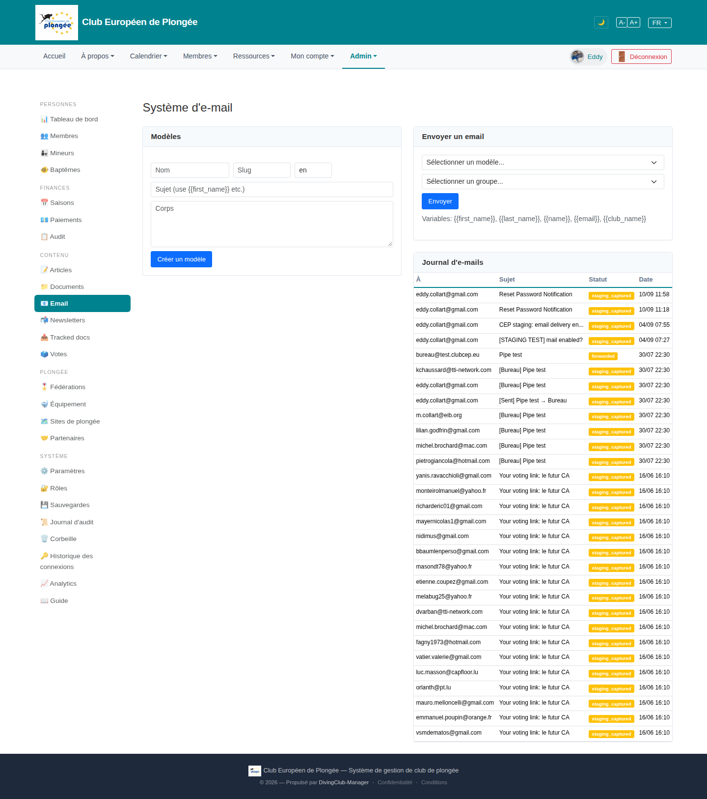

# 24 — Email system

- **Screen** — `GET /admin/email`, bureau_master, FR.
- **Reads as** — Title "Système d'e-mail", a two-column layout: **left** "Modèles" card (Nom / Slug / lang inputs, Sujet, Corps textarea, "Créer un modèle") ; **right** "Envoyer un email" card (template select / group select / Envoyer / variables hint), and below it a tall "Journal d'e-mails" table (À / Sujet / Statut / Date) with ~30 rows, mostly "staging_captured" yellow pills.

## Friction

1. **The "Modèles" card is a create form with no list of existing templates.** You can create a template and pick one in the send dropdown, but there's no way to see, edit, or delete the templates you have. The left column is a lonely create form.
2. **Left/right column heights are wildly unequal.** "Modèles" ends at ~530px; the right column runs 1500px+ because the email log is stacked under the tiny "Envoyer" card. The log — the biggest content on the page — is squeezed into the right half.
3. **"Journal d'e-mails" should be full-width.** It's a 4-column table with long subjects being truncated ("CEP staging: email delivery en…") because it only gets half the viewport.
4. **Every log row is "staging_captured"** (one "forwarded") — on staging that's expected, but the Statut column is then 30 identical yellow pills. No filter by status, no filter by date/recipient.
5. **Template form fields are placeholder-labelled** ("Nom", "Slug", "en", "Sujet (use {{first_name}} etc.)", "Corps") — once filled, the purpose vanishes; and "en" as a bare 3-char input for language is cryptic.
6. **"Envoyer un email" with just template + group** — no preview of the rendered email, no recipient count for the chosen group, no confirmation step before a real send.
7. **Three email surfaces in the app** — this page, Newsletters (23), and Tracked docs (29) — each with its own send UI. A bureau user has to learn which "send email" screen does what.
8. **Log timestamps** "10/09 11:58" — no year, and the column is narrow.

## Restructure

- **Left column = template manager.** A list of existing templates (Nom · langue · Sujet · Modifié · actions) with "＋ Nouveau modèle" opening the editor. Edit/duplicate/delete per row. The create form is a panel, not the whole column.
- **Make the email log full-width**, below both cards. Add filters: statut, période, destinataire (search). Sortable headers. Show the year.
- **"Envoyer" card**: after picking a group, show "→ 142 destinataires"; add an "Aperçu" that renders the template with sample data; require a confirm on send.
- **Real labels** on the template form; language as a proper select ("Français / English / …"), not a raw code input.
- **Cross-link the three send surfaces**: a short line on each ("Pour la newsletter mensuelle, voir Newsletters. Pour un envoi suivi, voir Documents suivis.") so users land in the right place.

## Effort

M — needs a template-list query + view (the model exists, it's just not listed). Log full-width + filters is S–M. Preview/confirm on send is M.
