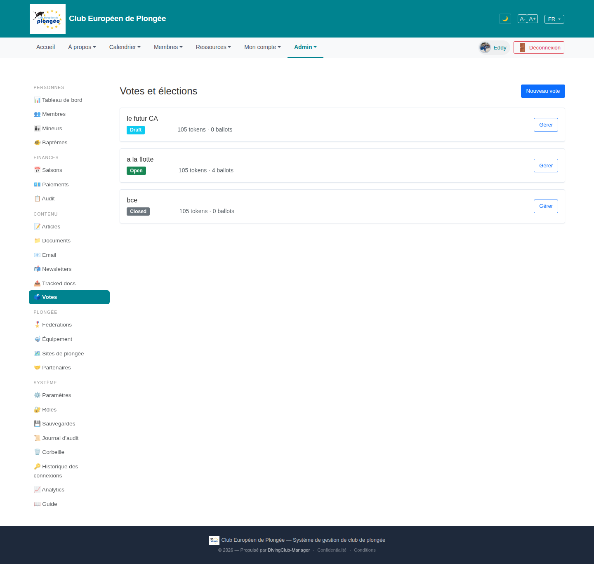

# 25 — Votes & elections list

- **Screen** — `GET /admin/votes`, bureau_master, FR, 3 rows.
- **Reads as** — Title "Votes et élections" + "Nouveau vote", then three bordered cards, each: title ("le futur CA" / "a la flotte" / "bce"), a status pill (Draft cyan / Open green / Closed grey), "105 tokens · 0 ballots" (one shows "4 ballots"), and a "Gérer" button on the right. Large empty page below.

## Friction

1. **Card layout wastes vertical space for very little content.** Each card is ~100px tall to show title + one pill + one stat line. Three cards = a lot of scroll for 3 items; a table row would carry the same info in ~40px.
2. **"105 tokens · 0 ballots" is opaque.** "tokens" = eligible voters? issued voting links? "ballots" = votes cast? A bureau member reading this can't tell turnout (is 0/105 "nobody voted" or "not open yet"?). The Draft and Closed votes both show "0 ballots" — for Closed that's a real (bad) turnout; for Draft it's just "not started".
3. **Status → meaning of the stats changes**, but nothing signals that. "0 ballots" under Draft is fine; "0 ballots" under Closed ("bce") means the election closed with zero participation — that should be flagged, not shown identically.
4. **Test-data titles** ("a la flotte", "bce") lowercase, no dates — no "opens 12/01", "closed 15/01", no "élection du CA 2026" context. Can't tell when anything happened or will.
5. **Only action is "Gérer"** — no quick "voir les résultats" for a closed vote, no "ouvrir maintenant" for a draft.
6. **No sort / no grouping** — Draft, Open, Closed in creation order. An Open vote (the one needing attention) is in the middle.

## Restructure

- **Table, not cards.** Titre · Statut · Période (ouvre → ferme) · Participation (`n / 105`, with a bar) · action. Three rows fit above the fold with room for a summary.
- **Order by urgency**: Open first (with days-left), then Draft (with scheduled open date), then Closed (most recent).
- **Make participation legible**: "42 / 105 (40 %)" with a small progress bar; for Draft show "—" not "0"; for Closed with 0, an amber "aucune participation" note.
- **Define the terms** once, near the header or as a `?`: "jetons = membres éligibles · bulletins = votes exprimés".
- **Per-row actions by state**: Draft → "Modifier" / "Ouvrir" ; Open → "Gérer" / "Clore" ; Closed → "Résultats".
- **Add dates** to each row and a "prochaine échéance" line at the top.

## Effort

S–M — converting 3 cards to a table + state-aware participation display + ordering. The token/ballot data already exists; it just needs labelling and a bar.
