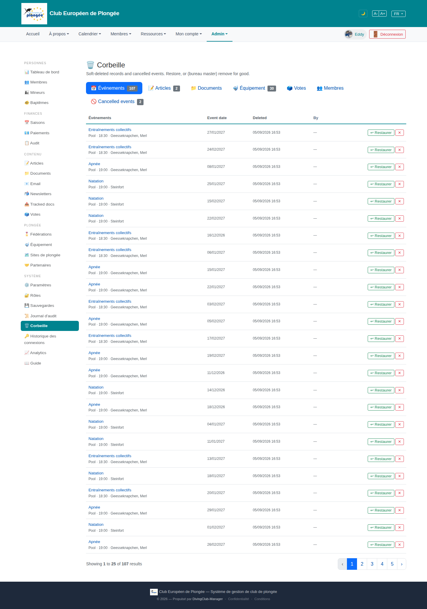

# 26 — Recycle bin (Corbeille)

- **Screen** — `GET /admin/trash`, bureau_master, FR, tab "Événements" (107), 25/page. Other tabs: Articles (2) / Documents / Équipement (30) / Votes / Membres / "Cancelled events" (2).
- **Reads as** — Title + one-line explainer, a row of 7 kind-tabs with counts, then a table: Événements (title link + "Pool · 18:30 · Geesseknapchen, Merl" sub-line) · Event date · Deleted (05/09/2026 16:53, all identical) · By (all "—") · "↩ Restaurer" / red "×".

## Friction

1. **107 soft-deleted events, all deleted at the same timestamp, all "By —".** This is a bulk deletion (a legacy-sync purge?) that dumped 100+ rows into the bin with no attribution. The bin can't tell you *why* these are here or *who* did it — the two things that matter when deciding to restore or purge.
2. **"Cancelled events" is a separate tab from "Événements"** with its own count (2). Two event-ish buckets in one bin; a user has to know that "cancelled" ≠ "deleted" and check both. (This is the feature added earlier — the tab exists, but sitting 7th after "Membres" it's easy to miss.)
3. **The kind-tabs are unordered by importance.** Événements (107) / Articles (2) / Documents (0?) / Équipement (30) / Votes / Membres / Cancelled events (2). Empty and near-empty tabs sit between the big ones.
4. **"Deleted" column is 25 identical timestamps** — no information; and "By" is 25 dashes.
5. **Every row has a red "×" (hard delete)** right next to "Restaurer". On a 107-row list of bulk-deleted items, an accidental "×" permanently destroys an event. No select-all + bulk-restore, no confirm shown.
6. **Sub-line format** "Pool · 18:30 · Geesseknapchen, Merl" repeats "Pool" and the venue for dozens of near-identical recurring training sessions — hard to distinguish rows.
7. **No date-range or search** within the bin — to find one deleted event among 107 you page through.

## Restructure

- **Merge "Cancelled events" into the Événements view** as a filter/segment ("Supprimés · Annulés · Tous"), not a separate 7th tab. One place for "events that aren't on the calendar".
- **Group bulk deletions.** If 100+ rows share a timestamp + null actor, show them as one collapsible batch: "107 événements supprimés le 05/09/2026 (import) — [Tout restaurer] [Tout supprimer définitivement] [Voir la liste]". Individual rows on expand.
- **Order tabs by count** (or hide zero-count kinds) and give each a consistent "kind (n)" label.
- **Drop the "By" column when it's all null**; keep "Deleted" but collapse identical values into the batch header.
- **Guard hard delete**: move "×" into a "⋯" menu or require a typed confirm; add checkbox multi-select with "Restaurer la sélection".
- **Add search + date filter** inside the bin.
- **Tighten the sub-line** to what disambiguates (date + time; drop the repeated "Pool" and venue, or show venue only).

## Effort

M — the batch-grouping is the main new logic (group by deleted_at + deleted_by). Merging the cancelled tab into a filter, reordering tabs, guarding hard-delete, and adding multi-select restore are S–M each.
