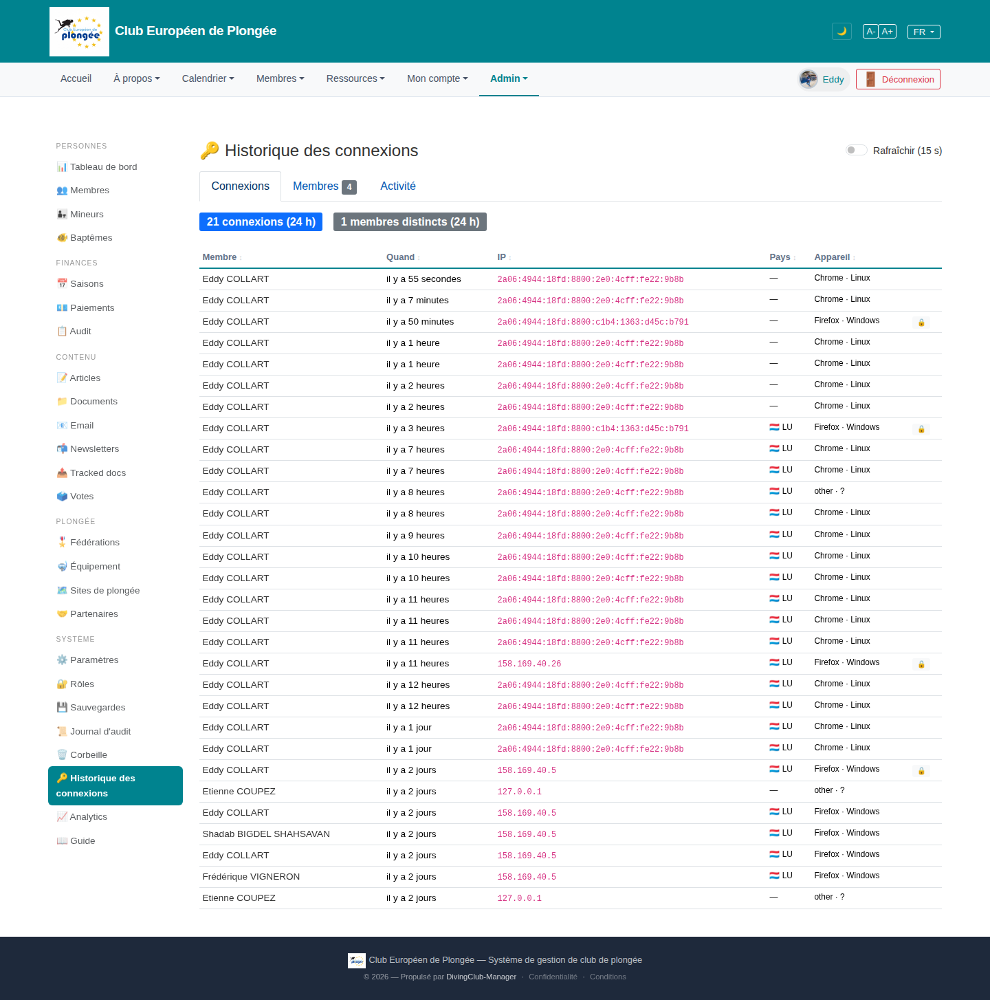

# 27 — Login history

- **Screen** — `GET /admin/logins` (route `logins.index`, bureau_master only), FR, tab "Connexions". Other tabs: Membres (4) / Activité.
- **Reads as** — Title + "Rafraîchir (15 s)" toggle, 3 tabs, two summary pills ("21 connexions (24 h)", "1 membres distincts (24 h)"), then a table: Membre · Quand (relative) · IP (pink monospace) · Pays (flag + code, or "—") · Appareil ("Chrome · Linux", some rows with a padlock).

## Friction

1. **The list is ~25 rows of "Eddy COLLART" logging in from the same IPv6.** One admin testing on staging fills the whole page; the "1 membres distincts (24 h)" pill confirms it. On prod this may be more varied, but the screen has no way to collapse repeated sessions from the same person/IP/device.
2. **"Pays" is "—" for the most recent rows then "🇱🇺 LU" for older ones.** The geolocation backfill (the feature added earlier) hasn't resolved the newest logins yet — so the column looks half-broken. A "résolution en cours…" state would read better than a bare dash.
3. **IPv6 addresses in full** (`2a06:4944:18fd:8800:2e0:4cff:fe22:9b8b`) repeated 20×, pink monospace, wide column — high visual weight for a value that's identical on most rows.
4. **The padlock icon** on some rows (Firefox · Windows) is unexplained — 2FA? trusted device? admin session? No legend.
5. **"other · ?" as a device** (Etienne COUPEZ, `127.0.0.1`) — localhost logins from seeding/impersonation shown alongside real ones with no distinction.
6. **Two summary pills only cover "24 h"** — no 7-day / 30-day, no "failed logins" count (arguably the most security-relevant number on a login-history page).
7. **"Quand" is relative only** ("il y a 11 heures") — no absolute timestamp on hover for correlating with an incident.
8. **"Rafraîchir (15 s)"** auto-refresh toggle top-right — useful, but it's the most prominent control and unlabelled as to what it does until you parse it.

## Restructure

- **Collapse consecutive same-actor/IP/device sessions** into one row: "Eddy COLLART · Chrome · Linux · 2a06:…:9b8b — 14 connexions (il y a 55 s → il y a 12 h)", expandable. The list becomes readable at a glance.
- **Geo column states**: flag+country when resolved, "…" (spinner/muted) when queued, "IP privée" for `127.0.0.1`/RFC1918. Never a bare "—".
- **Truncate the IP** (`2a06:…:9b8b`) with full value on hover/click-to-copy; widen once collapsed.
- **Add a legend** for the padlock (and any other row icons), or a header tooltip.
- **Flag local/impersonation logins** distinctly ("session locale", "usurpation") so they don't dilute the real login record.
- **Summary row**: connexions (24 h / 7 j / 30 j) · membres distincts · **échecs de connexion (24 h)** · comptes verrouillés.
- **Absolute timestamp on hover** for "Quand".

## Effort

M — session-collapsing is the main logic (group by user + ip + user_agent + adjacency). Geo-state display, IP truncation, icon legend, and the failed-login summary are S each.
