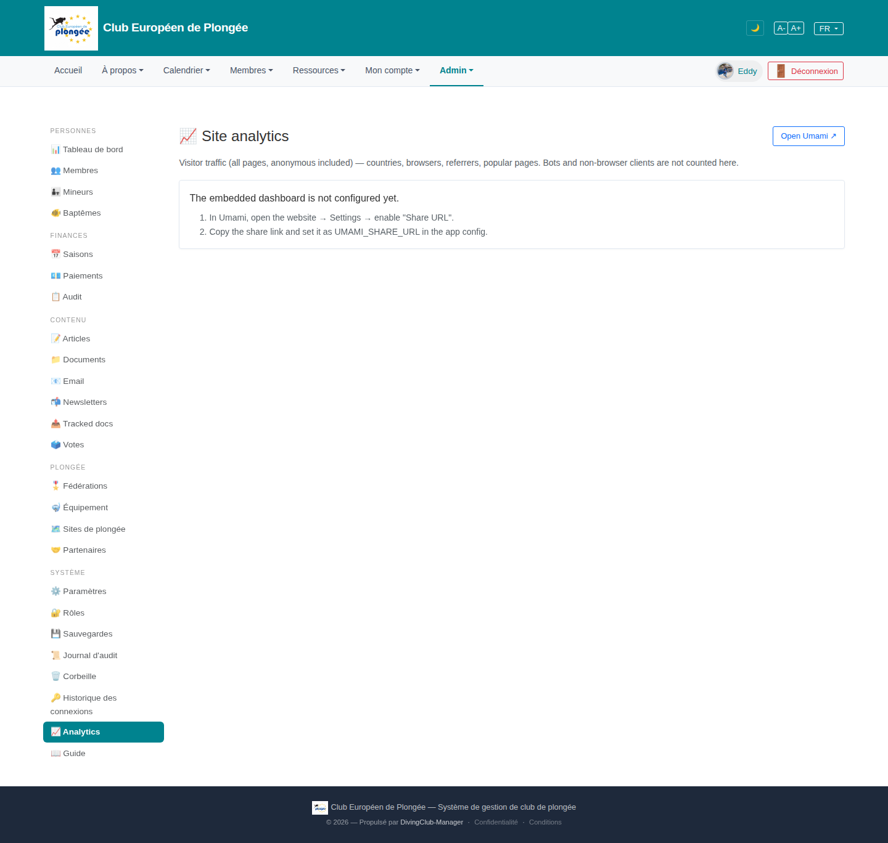

# 28 — Site analytics (Umami embed)

- **Screen** — `GET /admin/analytics` (route `analytics.index`, gated by `view analytics`), bureau_master, staging. `UMAMI_SHARE_URL` not set → setup-hint state.
- **Reads as** — Title "Site analytics" + "Open Umami ↗", one line of description, then a bordered card: "The embedded dashboard is not configured yet." + a 2-step numbered list ("In Umami, open the website → Settings → enable 'Share URL'." / "Copy the share link and set it as UMAMI_SHARE_URL in the app config."). Rest of page empty.

## Friction

1. **Setup instructions reference an env var and a config edit** ("set it as `UMAMI_SHARE_URL` in the app config") — that's a developer/ops action, shown to a bureau user who can't do it and shouldn't need to see it. The bureau's takeaway from this screen is "broken, and I don't understand the fix".
2. **Entirely English** on a FR admin — title, description, and the hint.
3. **When configured**, this page is just an `<iframe>` of the Umami share dashboard (per the build notes) — so the DCMS chrome (title, "Open Umami" button) wraps a full external UI. In the working state there's likely a double set of controls (Umami's own date-range picker inside the frame, nothing from DCMS around it).
4. **"Open Umami ↗" and the embed are redundant** once the embed works — and right now "Open Umami" is the only working thing, but it's styled as a secondary outline button top-right.
5. **No fallback content.** Even without the share URL, DCMS *has* useful first-party numbers it could show (the landing pixel count, login-history-derived visits) — the page could degrade to something rather than a config error.

## Restructure

- **Split the audience.** For non-technical viewers, the un-configured state should say: "Les statistiques de visite ne sont pas encore activées. Contactez l'administrateur technique." — no env var names. Put the `UMAMI_SHARE_URL` instructions behind a "Détails techniques" disclosure, or only render them for a super-admin.
- **Translate** the whole page.
- **In the configured state**, give the iframe a full-width, tall container (min-height ~80vh), a one-line "Données fournies par Umami · fuseau UTC" caption, and keep "Ouvrir dans Umami ↗" as a small link, not a button competing with the title.
- **Degrade gracefully**: if the embed isn't available, show whatever first-party metrics DCMS already has (landing pixel hits, unique logins/day from login history) as a minimal built-in panel, so the page always has content.
- **Date-range**: rely on Umami's in-frame picker; don't add a second one.

## Effort

S–M — the view is tiny. Translation + splitting the message by audience + a taller iframe container are S. A first-party fallback panel is M and optional.
