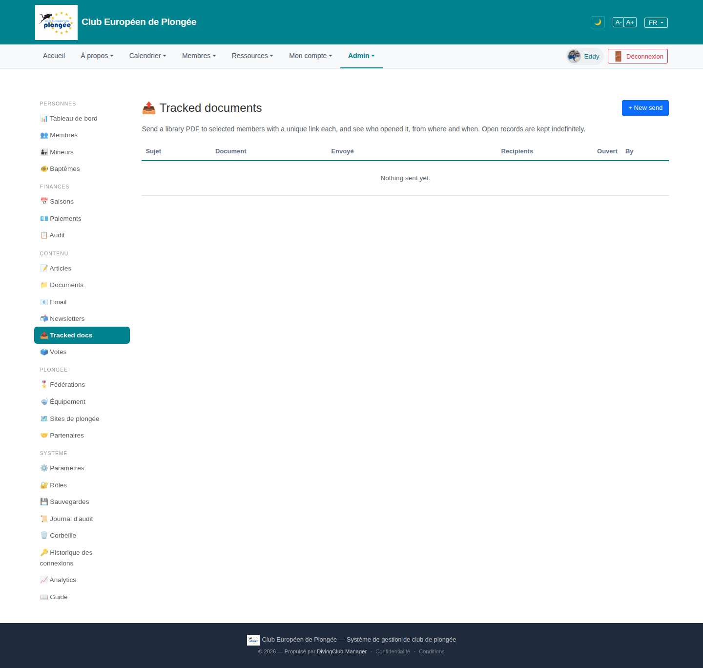

# 29 — Tracked documents (list)

- **Screen** — `GET /admin/document-dispatch` (bureau_master only), FR, empty state. *(Staging-only feature.)*
- **Reads as** — Title "📤 Tracked documents" + "+ New send", one explanatory line, a table header (Sujet / Document / Envoyé / Recipients / Ouvert / By), and "Nothing sent yet." Rest empty.

## Friction

1. **Bilingual within one screen.** Title/description English ("Tracked documents", "Send a library PDF to selected members…"), column headers mostly English ("Document", "Recipients", "By") with "Sujet" and "Envoyé" in French. The empty-state text is English.
2. **Empty state is a bare "Nothing sent yet."** centered in the table — no guidance, no primary CTA in the empty region (the only "+ New send" is the small top-right button). A first-time bureau_master doesn't learn what this does beyond the one-line blurb.
3. **Column set is send-centric, not outcome-centric.** "Recipients" and "Ouvert" are separate columns; the interesting number is the *ratio* (opened / sent) over time. "By" and "Envoyé" (date) are metadata that could share a cell.
4. **Icon is a decorative 📤** in the title (consistent with the rest of the admin's emoji-in-headings pattern, which the mega-menu review flags as noise).
5. **Name mismatch with the sidebar/menu.** Sidebar calls it "Tracked docs", mega-menu "Tracked docs", page title "Tracked documents", route `document-dispatch`. Four names for one feature.

## Restructure

- **Translate everything** to match the admin locale: "Documents suivis", "Envoyer un document de la bibliothèque à une sélection de membres, avec un lien unique par personne, et suivre qui l'a ouvert, depuis où et quand. Les ouvertures sont conservées indéfiniment."
- **Real empty state**: a short "Comment ça marche" (3 steps: choisir un PDF → choisir les destinataires → envoyer) + a prominent "Créer un envoi" button in the empty region.
- **Outcome-first columns**: Sujet · Document · Date · **Ouvertures** (`12 / 40` with a small bar) · Par. Merge date+author if space is tight.
- **One canonical name** — pick "Documents suivis" and use it in the sidebar, mega-menu, title, and breadcrumb.
- **Drop or standardise the title emoji** with the rest of the admin.

## Effort

S — view-only: translation, an empty-state block, a merged/ratio column, name alignment.
