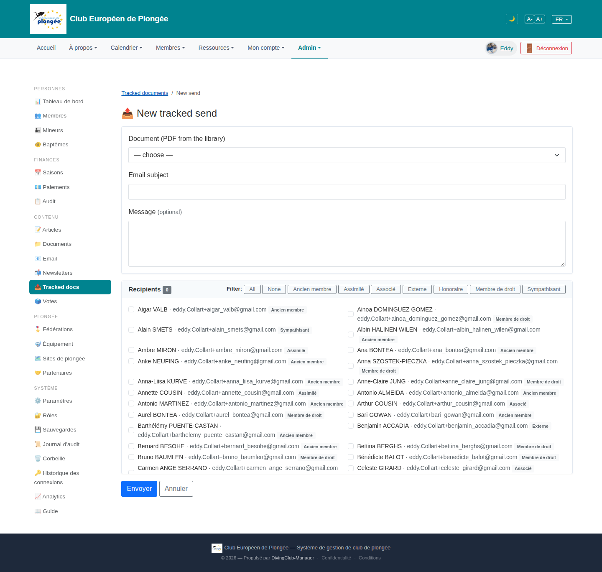

# 30 — New tracked send

- **Screen** — `GET /admin/document-dispatch/create` (bureau_master only), FR, empty. *(Staging-only feature.)*
- **Reads as** — Breadcrumb, "📤 New tracked send", a card with Document select / Email subject / Message textarea, then a "Recipients 0" card: a filter row (All / None / Ancien membre / Assimilé / Associé / Externe / Honoraire / Membre de droit / Sympathisant) + a two-column checkbox list of ~200 members with a status tag each. Envoyer / Annuler.

## Friction

1. **Bilingual, same as the index.** "New tracked send", "Document (PDF from the library)", "Email subject", "Message (optional)", "Recipients", "All / None" — English; page is served in FR.
2. **The recipient list is the whole club (~200) as raw checkboxes**, two columns, un-paginated, no search box. The status filter chips help, but there's no free-text "find a name". Selecting 5 specific people means scrolling and scanning 200 rows.
3. **"Recipients 0" counter is in the card header** but far from the Envoyer button — when you've scrolled to the bottom to submit, you can't see how many you selected.
4. **Status filter chips are additive-only.** Clicking "Externe" then "Associé" — does it union, or replace? (Per the code it unions by *checking*, never unchecking — so chips only ever add, and "None" is the only subtract.) Not obvious; no active-state styling on the chips.
5. **No confirmation / preview.** "Envoyer" sends real tracked emails to everyone checked with no "You are about to email N people" step and no preview of the rendered message.
6. **Long member rows wrap.** "Barthélémy PUENTE-CASTAN · eddy.Collart+barthelemy_puente_castan@gmail.com  Ancien membre" wraps to two lines, breaking the two-column rhythm.
7. **The email address is shown for every member** — needed for disambiguation, but on staging they're all `eddy.Collart+…@gmail.com` so it's pure noise here; on prod it's long. Could be secondary/hover.
8. **Document select gives no preview** — you pick a PDF by filename with no way to confirm it's the right one.

## Restructure

- **Translate** all labels/buttons ("Nouvel envoi suivi", "Document (PDF de la bibliothèque)", "Objet de l'e-mail", "Message (facultatif)", "Destinataires", "Tous / Aucun").
- **Add a search field** above the recipient list ("Filtrer par nom…"), and paginate or virtualise the list (or cap height with sticky search).
- **Sticky selection summary + submit.** A small bar that follows the viewport: "12 destinataires sélectionnés — [Continuer]". "Continuer" opens a confirm step.
- **Confirm + preview step**: show recipient count, the chosen document name (with a "voir" link), and the rendered email (subject + message + the button) before the actual send.
- **Make filter chips toggle with visible active state**, and say what they do ("ajoute au choix").
- **Demote the email address** to a muted sub-line or hover title; lead with the name + status tag.
- **Group the form** with light section headings: "1. Document & message" / "2. Destinataires" — mirrors the two cards already there, just labelled.

## Effort

M — translation + search/pagination on the recipient list + a sticky summary + a confirm/preview step. The confirm step is the most valuable (prevents mis-sends) and is M on its own.
