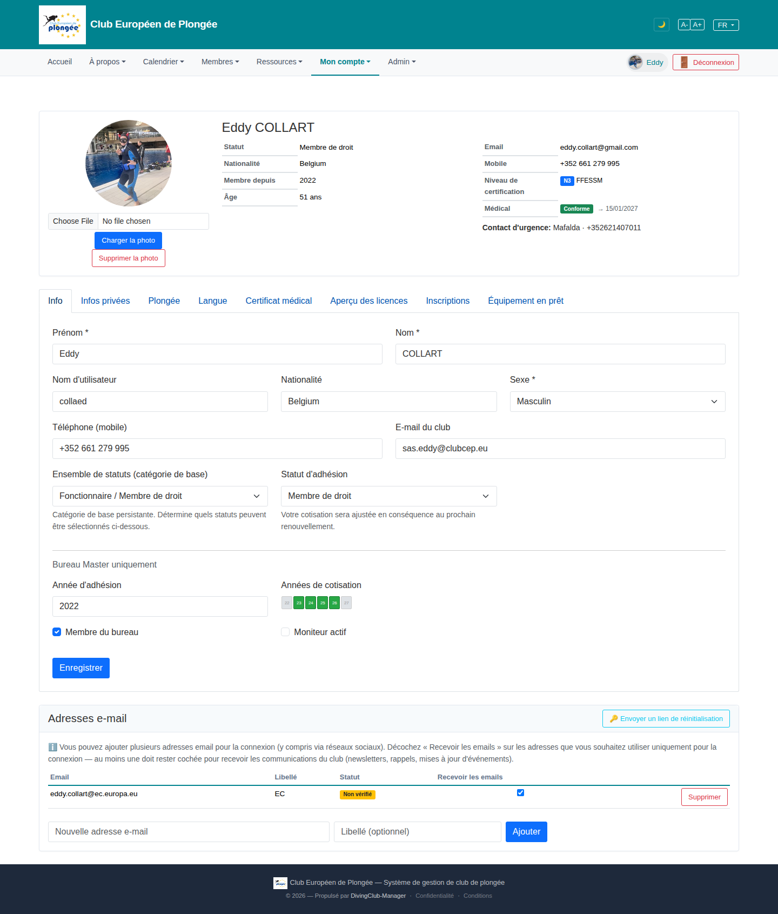

# 31 — Own profile ("Mon compte")

- **Screen** — `GET /profile`, logged in as Eddy (bureau_master), FR, tab "Info".
- **Reads as** — Identical layout to the admin member-edit view (11): same summary card, same 8 tabs, same "Info" form **including the "Bureau Master uniquement" block** (année d'adhésion, années de cotisation chips, "Membre du bureau" / "Moniteur actif" checkboxes), same "Adresses e-mail" card.

## Friction

*(Everything in review 11 applies. Additional issues specific to it being the user's **own** self-service profile:)*

1. **A member editing their own profile sees the same dense 8-tab admin form** as a bureau officer editing someone else. Most fields here (ensemble de statuts, statut d'adhésion, année d'adhésion, cotisation years, bureau/moniteur flags) are things a regular member cannot and should not change — but the layout gives them equal prominence.
2. **"Bureau Master uniquement" block renders for Eddy** because he *is* bureau_master — but for a regular member on this same route, either it's hidden (leaving a stray `
` and empty space) or shown disabled (confusing). Worth checking both states; a regular member's `/profile` should be visibly simpler, not the admin form with bits greyed out.
3. **No "this is you" framing.** The page is titled by the member's name with an admin-style summary card; nothing says "Votre profil" or orients it as self-service.
4. **The high-value self-service actions are buried.** What a member actually comes here to do — change photo, phone, language, emergency contact, manage login emails, upload a medical certificate — are spread across the summary card, the "Info" tab, the "Langue" tab, the "Certificat médical" tab, and the bottom email card.

## Restructure

- **Two distinct renderings of `/profile`:**
  - **Regular member**: a short, friendly self-service page — "Votre profil": photo, name, contact details, language, emergency contact, login emails, medical certificate upload. No membership-classification fields. 2–3 tabs max ("Coordonnées" / "Plongée & médical" / "Connexion").
  - **Bureau/admin viewing themselves**: keep access to the fuller form, but reached the same way as editing any member (via `/admin/members/{id}/profile`), not bolted onto the self-service route.
- **Title it "Votre profil"** with a light "Ces informations sont visibles par le bureau" note.
- **Lead with the common edits**; put classification/history behind an "Adhésion" tab that's read-only for members ("Statut : Membre de droit — géré par le bureau").
- Apply the 11 recommendations (photo out of the summary card, cotisation-years as real toggles, tab regrouping, standardised country control).

## Effort

M–L — needs a member-vs-bureau branch on the profile view (partly exists for the "Bureau Master uniquement" block). Trimming the member-facing version to self-service essentials is the main work; the bureau version can keep today's form short-term.
