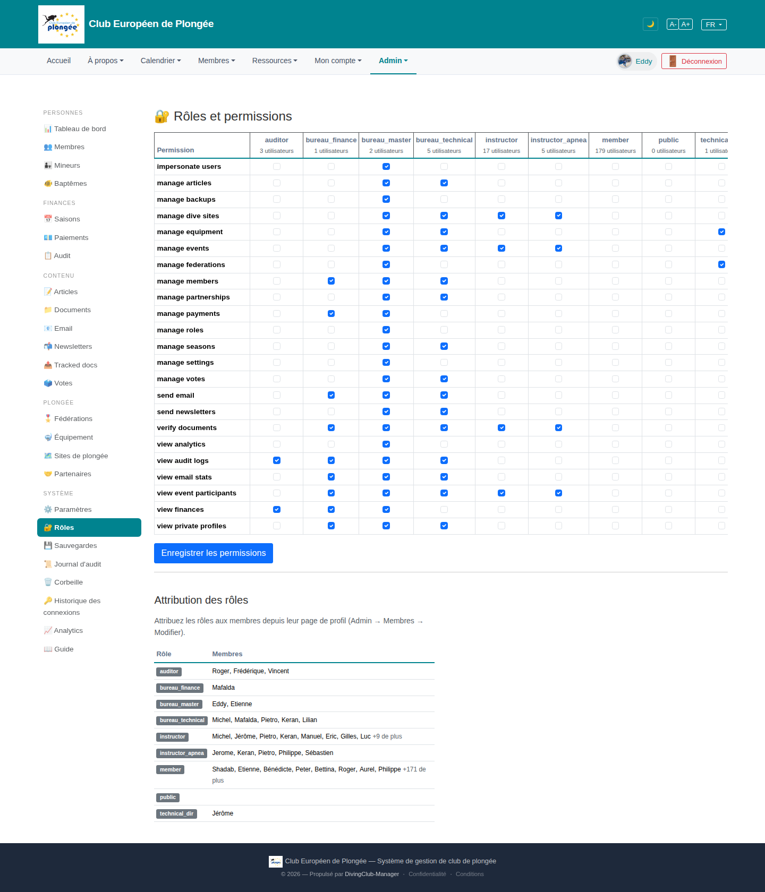

# 32 — Roles & permissions

- **Screen** — `GET /admin/roles` (route `roles.index`), bureau_master, FR.
- **Reads as** — Title "🔒 Rôles et permissions", a big matrix: rows = ~26 permissions ("impersonate users", "manage articles", …, "view private profiles"), columns = 9 roles (auditor / bureau_finance / bureau_master / bureau_technical / instructor / instructor_apnea / member / public / technical_dir), cells = checkboxes. "Enregistrer les permissions" button. Then "Attribution des rôles" — a second table listing each role and its member names.

## Friction

1. **The matrix overflows horizontally.** 9 role columns don't fit 1440px — "technical_dir" is clipped at the right edge (the very role added recently, so its column is the one you can't see). Horizontal scroll on a settings screen.
2. **26 × 9 = 234 checkboxes, no visual grouping.** Permissions are an alphabetical flat list ("manage articles / manage backups / manage dive sites / manage equipment / manage events / manage federations / manage members / manage partnerships / manage payments / manage roles / manage seasons / manage settings / manage votes / send email / send newsletters / verify documents / view analytics / view audit logs / view email stats / view event participants / view finances / view private profiles"). No sections (Content / Finance / Diving / People / System), no zebra banding visible, so tracing a row across 9 columns is error-prone.
3. **All permission names are in English** ("manage equipment", "view private profiles") in a FR admin — and they're the raw Spatie permission strings, not human labels.
4. **"public" is a role column with 0 users** and (correctly) almost nothing checked — it's a technical construct sitting between "member" and "technical_dir", widening the matrix for little day-to-day value.
5. **No row/column context.** Hovering "manage federations" doesn't say what it unlocks; column headers show "N utilisateurs" but not a description of the role.
6. **Single global "Enregistrer les permissions"** for a 234-checkbox form — no indication of what changed, no per-role save, easy to lose edits or save an accidental toggle.
7. **The two tables are unrelated in layout** — the matrix (edit permissions per role) and "Attribution des rôles" (which members have which role, read-only, "assign via profile") are stacked with just an `<h2>`. The second one's real message is one sentence ("assign roles from the member's profile").
8. **"+9 de plus" / "+171 de plus"** truncation in the attribution table with no expand — you can't actually see who's a member from here.

## Restructure

- **Group permissions into labelled sections** (Contenu · Finances · Plongée · Personnes · Système), collapsible, matching the admin's own IA. Zebra-band rows.
- **Human labels + descriptions.** "manage federations" → "Gérer les fédérations et niveaux" with a `?` tooltip ("Accès à /admin/federations : ajouter/éditer fédérations et niveaux de certification"). Keep the raw key as small muted text if devs need it.
- **Fix the overflow.** Freeze the permission-name column, let role columns scroll *within* the table (not the page); or pivot to "one role at a time" — pick a role from a selector, edit its permission checklist in a single readable column.
- **Drop or de-emphasise the "public" column** (show it only behind an "afficher les rôles système" toggle).
- **Per-role save** or a sticky "modifications non enregistrées (3)" bar with a diff summary.
- **Separate the attribution table** onto its own tab/section with a clear heading and a working "voir tous" expansion (or just link each role to `/admin/roles/{role}/members`).

## Effort

M–L — sectioning + labels + tooltips + freezing the first column are M. Pivoting to a per-role editor is L but resolves the overflow and the 234-checkbox overwhelm at once. Attribution-table cleanup is S.
