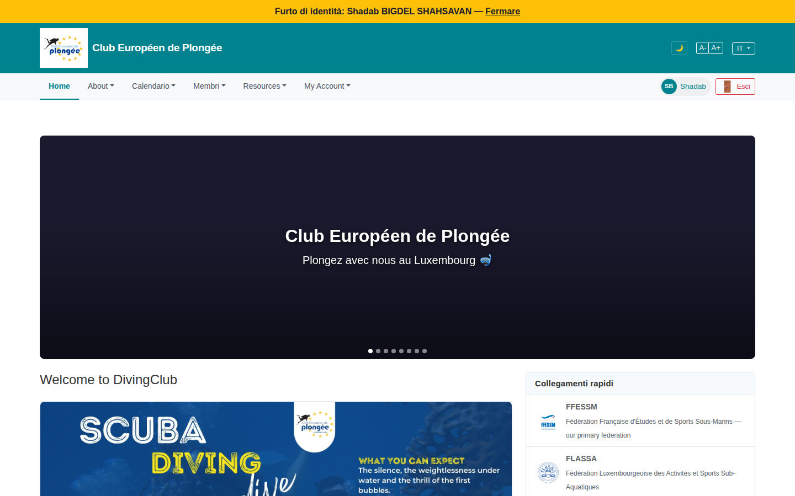

# 40 — Member home (logged-in landing)

- **Screen** — `GET /` as a regular member (impersonating Shadab, locale = IT), FR/EN/IT content mixed.
- **Reads as** — Yellow impersonation banner, then a tall dark **empty hero carousel** (just "Club Européen de Plongée" / "Plongez avec nous au Luxembourg 🤿" centered on near-black, 8 carousel dots, no image loaded), then "Welcome to DivingClub" + a "SCUBA DIVING" promo image on the left and a "Collegamenti rapidi" (federation links) card on the right.

## Friction

1. **Four languages on one screen.** Nav: "Home / About / Calendario / Membri / Resources / My Account" (EN + IT). Hero: "Plongez avec nous au Luxembourg" (FR). Body heading: "Welcome to DivingClub" (EN). Sidebar: "Collegamenti rapidi" (IT). The member set their language to Italian and gets a patchwork. This is the single worst issue in the member experience.
2. **The hero carousel is empty and enormous.** ~400px of near-black with only a title and tagline, plus 8 pager dots for slides that show nothing. It's the first thing a logged-in member sees and it's a dead zone.
3. **"Welcome to DivingClub"** — generic product name, not the club, and not useful to an existing member who logs in ~weekly. A member's home should lead with *their* next thing: next session they're registered for, unpaid dues, an open vote, a pending medical.
4. **No personalised content at all.** For a logged-in member the page is the same marketing home a guest sees (minus the splash). No "your next dive", no "you're on the waitlist for…", no quick links to *their* registrations.
5. **"Collegamenti rapidi" is federation homepages** (FFESSM, FLASSA…) — useful once a year. It occupies the prime right-rail slot where "your upcoming events" should be.
6. **The impersonation banner is good** (clear, "Fermare" link) — no issue, noted as a positive.

## Restructure

- **Fix localisation first.** Every string on this page must respect the user's locale. Audit the layout partial, the home view, and the federation-links card — the nav mixing EN and IT suggests some labels aren't wrapped in `__()` at all.
- **Replace the empty carousel** with either a real rotating set of club photos (with the club name overlaid) or, better for a logged-in member, a compact personalised strip: "Votre prochaine séance : mer. 16 sept, 17:00 Merl" + a "voir mes inscriptions" link.
- **Lead with the member's dashboard**, not the marketing hero:
  - Row 1: next registered session · dues status · open votes · medical validity.
  - Row 2: latest 2–3 club news items.
  - Right rail: "Mes inscriptions à venir", then federation links below the fold.
- **Keep a link to the public/marketing home** for members who want it, but it shouldn't *be* their home.
- **Rename "Welcome to DivingClub"** to the club name, or drop it in favour of "Bonjour Shadab" / "Ciao Shadab".

## Effort

M–L — the localisation sweep is M and mandatory. A personalised member home is L (new queries + layout) but high value; an interim quick win is the "next session" strip + moving news up.
