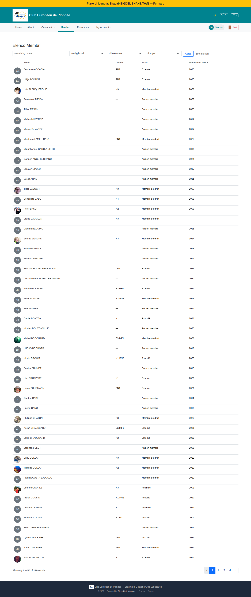

# 41 — Members directory (member view)

- **Screen** — `GET /members` (route `members.directory`), regular member, IT locale, 50/page of 199.
- **Reads as** — "Elenco Membri", a filter row (Search / "Tutti gli stati" / "All Members" / "All Ages" / Cerca / "199 membri"), then a very long table: avatar · Nome · Livello (N3 / PN1 / E3/MF1 / —) · Stato (Externe / Ancien membre / Membre de droit / Assimilé…) · "Membro da allora" (year).

## Friction

1. **Language mix in the filters and data.** UI: "Elenco Membri", "Tutti gli stati", "Membro da allora" (IT); but filter options "All Members" / "All Ages" (EN) and every "Stato" value in French ("Ancien membre", "Membre de droit", "Externe", "Assimilé"). Three languages in one table.
2. **50 rows, no grouping, thin data.** Each row is name + level + status + join-year. At 50/page and 199 members it's 4 pages of near-identical rows. "Livello" is "—" for ~40% (non-divers / no cert recorded).
3. **"Ancien membre" (former member) rows are mixed in with active members.** Roughly half the visible list is "Ancien membre" — former members shown by default alongside current ones, diluting the directory's usefulness ("who's in my club now?").
4. **Row height is generous** (~33px + padding) for a single line of text — the list is much taller than it needs to be.
5. **No sort headers** — can't sort by name, level, or join year (`AGENTS.md` requires sortable headers).
6. **"Membro da allora" (member since)** is the only temporal column and it's oddly specific for a directory; "1984" next to "2026" with no other context.
7. **Avatars are mostly grey initials** — the column adds width for little value when few members have photos (the trombinoscope view, 42, is the photo-forward one).
8. **No contact affordance in the row.** To message a member you have to open their profile first (there's a `contact.member` route).

## Restructure

- **Localisation sweep** — status values must translate ("Ex-membre" / "Ex socio"…), filter options too.
- **Default to current members.** "Ancien membre" hidden behind a filter toggle ("Inclure les anciens membres"), like the admin members list's "Historique complet".
- **Denser rows** — reduce vertical padding; drop the avatar column here (it's the trombinoscope's job) or shrink it to 20px.
- **Sortable headers** on Nome, Livello, Membre depuis; default Nome asc.
- **Add a quick "contacter" icon** per row (opens `contact.member`) so the directory is actionable.
- **Consider grouping** by first letter or by status, with sticky sub-headers, so 199 names are navigable.
- **Merge with the trombinoscope** as two view-modes (list / photos) of one page, toggled by a segmented control, sharing the same filters — rather than two separate menu items.

## Effort

M — localisation + default filter + sortable headers + row density are S–M each. Merging list/trombinoscope into one page with a view toggle is M.
