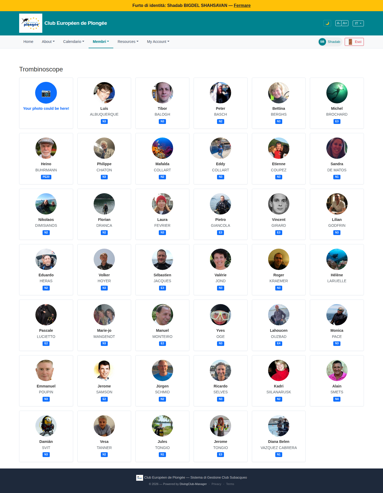

# 42 — Trombinoscope (member photo grid)

- **Screen** — `GET /members/trombinoscope`, regular member, IT locale.
- **Reads as** — Title "Trombinoscope", then a 6-column grid of cards: circular avatar, first name (bold), LAST NAME (caps), a blue cert-level badge (N3 / E3 / PE20 / N2 …). First card is a "Your photo could be here!" upload prompt. No filters, no search, no pagination visible.

## Friction

1. **No filters or search** — unlike the list view (41) which has status/age/name filters. To find one person in a 6-wide grid of ~199 you scroll and scan faces. The two views of the same data have inconsistent controls.
2. **No pagination or count** — it appears to dump a large chunk (or all) of members as cards in one very long page.
3. **"Your photo could be here!" card is always card #1**, in the top-left (highest-priority) slot, every visit, even after you've uploaded a photo (for this impersonated user it shows because Shadab has no photo — fine — but it should disappear once set, and not occupy the prime position).
4. **Cert badge with no legend.** "PE20", "E3", "E3/MF1", "N3", "PN1" — a member who isn't FFESSM-fluent can't decode these. No tooltip, no key.
5. **Card content is minimal** — name + one badge. No status, no "since", no contact action. Clicking a card presumably opens the profile, but there's no visible affordance (no hover state shown, no "voir le profil").
6. **"Ancien membre" filtering** — same as the list, former members are likely included with no way to exclude them; a wall of faces of people who left.
7. **Fixed 6-column grid** — on a 1440 viewport the cards are wide with lots of internal whitespace around a small avatar.
8. **Localisation** — "Trombinoscope" (FR word) as the IT-locale page title; "Your photo could be here!" in EN.

## Restructure

- **Share the filter bar with the list view** (41): same search + status + level filters, applied to whichever view mode is active. Make list/grid a toggle on one page.
- **Paginate or lazy-load** the grid; show "199 membres" and page controls.
- **Move the "add your photo" prompt** out of the grid — a dismissible banner above it, shown only when the current user has no photo.
- **Add a cert-level legend** (a "?" that expands "N1–N4 = niveaux plongeur FFESSM, E1–E4 = encadrants, P… = PADI équivalents") or spell the level on hover.
- **Richer card**: name · level (with tooltip) · status chip · a "contacter" icon on hover.
- **Default to current members**, "anciens" behind a toggle.
- **Responsive grid** (`auto-fill, minmax(150px, 1fr)`) so cards tighten up and the avatar can be larger relative to the card.
- **Localise** the title and the upload prompt.

## Effort

M — biggest win is unifying with the list view (shared controls + a view toggle). Legend, pagination, card enrichment, and the photo-prompt relocation are S each.
