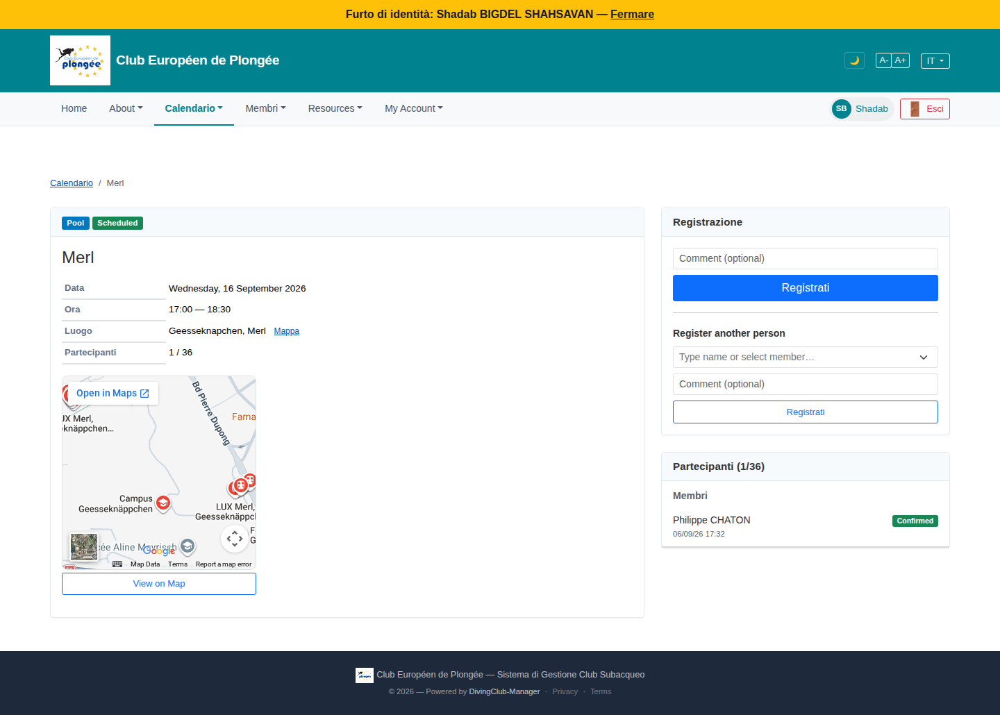

# 44 — Event detail (member view)

- **Screen** — `GET /events/{id}` (route `events.show`), regular member, IT locale, a "Merl" pool session.
- **Reads as** — Breadcrumb "Calendario / Merl", left card: Pool/Scheduled pills, "Merl" title, a mini table (Data / Ora / Luogo + "Mappa" link / Partecipanti "1 / 36"), then an **embedded Google map** with "Open in Maps" + "View on Map" button. Right column: "Registrazione" card (Comment field + "Registrati" button, then "Register another person" with a member picker + comment + a second "Registrati"), then "Partecipanti (1/36)" card listing one confirmed member.

## Friction

1. **Language mix.** "Registrazione", "Partecipanti" (IT); "Scheduled", "Register another person", "Comment (optional)", "Open in Maps", "View on Map" (EN); "Mappa" (IT) vs "View on Map" (EN) as two labels for the same map on the same card; breadcrumb "Calendario" IT.
2. **The map is oversized and duplicated in affordance.** A ~250px embedded map, plus a "Mappa" text link in the detail table, plus an "Open in Maps" overlay button, plus a full-width "View on Map" button below — **four** ways to interact with the location on one card, for a routine weekly pool session everyone already knows.
3. **"Register another person" is as prominent as registering yourself.** Two near-identical "Registrati" buttons stacked; a member's primary action (register me) doesn't stand out from the secondary (register a friend). The second block should be collapsed by default.
4. **"Comment (optional)" appears twice** — once for self-registration, once for the other-person registration — stacked, visually confusing which comment goes with which action.
5. **"Partecipanti 1 / 36"** shown in three places (detail table, right-card header, participants-card header) with the same value.
6. **The left card's mini-table** ("Data / Ora / Luogo / Partecipanti") uses the same bordered-row style as the profile summary card — fine — but "Partecipanti" as a table row *and* a section header below is redundant.
7. **No "you are registered" / "you are not registered" state** visible at a glance — the member has to infer it from whether their name is in the participants list.
8. **Cancelled-event state** isn't shown here (this one's scheduled) but per the calendar (12/43) the "Annullato" treatment is weak — worth checking this page's cancelled rendering too.

## Restructure

- **Localisation sweep** — one language per member.
- **Shrink the location block.** One small static map thumbnail (~120px) that opens Maps on click, plus one "Itinéraire" link. Drop the other two map controls.
- **Lead with the member's own registration state + action.** A clear banner: "Vous n'êtes pas inscrit·e" + a single prominent "S'inscrire" button (with the optional comment inline). If already registered: "Inscrit·e le 06/09 — [Se désinscrire]".
- **Collapse "Inscrire une autre personne"** into a link/disclosure below the primary action.
- **Show participants once** — the "1 / 36" in the participants card header is enough; drop it from the detail table (or keep it in the table and make the card just "Participants").
- **Right column order**: registration state/action → participants list → (waitlist if any). Left column: essentials + small map.

## Effort

M — event show view. Localisation + map de-duplication + registration-state banner + collapsing the "another person" block are S–M each and independently shippable.
