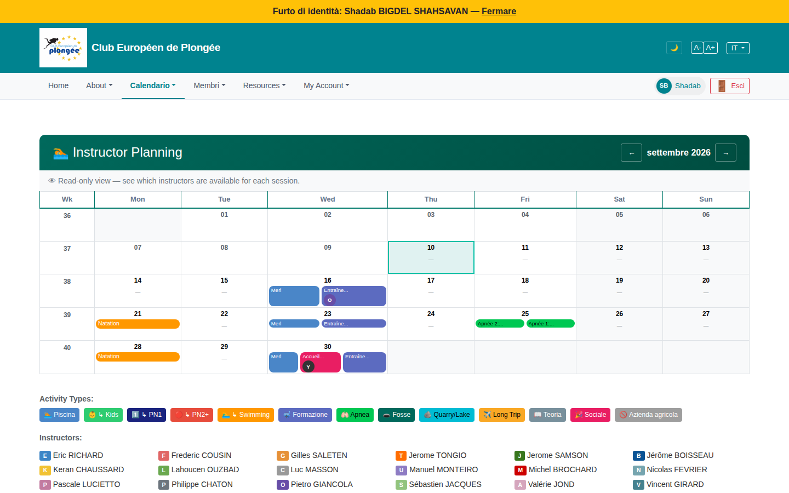

# 45 — Instructor planning (read-only member view)

- **Screen** — `GET /availability` as a regular (non-instructor) member, IT locale.
- **Reads as** — Same "Instructor Planning" month grid as the bureau view (14), but with a "Read-only view — see which instructors are available for each session." banner instead of the buffer-mode instructor picker. Empty cells show "—"; sessions show coloured chips with an instructor-initial avatar; below the grid: a 15-chip "Activity Types" legend and an "Instructors:" name+initial legend.

## Friction

*(The structural points from review 14 apply — colour overload, "—" noise in empty cells, 15-chip legend far from the grid, EN month title + weekday headers on a non-EN page. Points specific to the **read-only member** view:)*

1. **A regular member sees the full instructor-planning UI** — a dense staffing calendar built for instructors/bureau — with only a one-line banner signalling it's not for them. For a member, the useful question is "is my session covered by an instructor?", not "which of 22 instructors stamped which slot".
2. **The two legends (activity types ×15, instructors ×22) are mostly irrelevant to a member** but take up as much space as they do in the editable view.
3. **"Instructor Planning" title** stays English; "Read-only view — see which instructors are available…" English on an IT-locale session.
4. **No member-relevant framing** — e.g. "Vos séances à venir sont-elles encadrées ?" A member can't tell which rows are sessions *they're registered for*.
5. **The read-only view still renders every empty day with a big "—"**, so a member scanning for "which sessions have an instructor" wades through dashes.

## Restructure

- **Give members a simplified read-only mode:** collapse the instructor-initials to a single "✓ encadré (2)" / "⚠ non encadré" badge per session; drop the 22-name instructor legend (or make it a "?" popover); keep the activity-type colours but move the legend to a popover.
- **Highlight the member's own registered sessions** (a ring/marker) so "is *my* dive covered?" is answerable at a glance.
- **Localise** the title and banner.
- **Quiet the empty cells** (no "—") — same as 14.
- Apply 14's colour/legend/month-localisation fixes globally so both views benefit.

## Effort

S–M — a member variant of the availability view that swaps the per-instructor chips for a coverage badge and hides the instructor legend. The shared fixes (localisation, empty cells, legend-to-popover) are in 14's scope.
