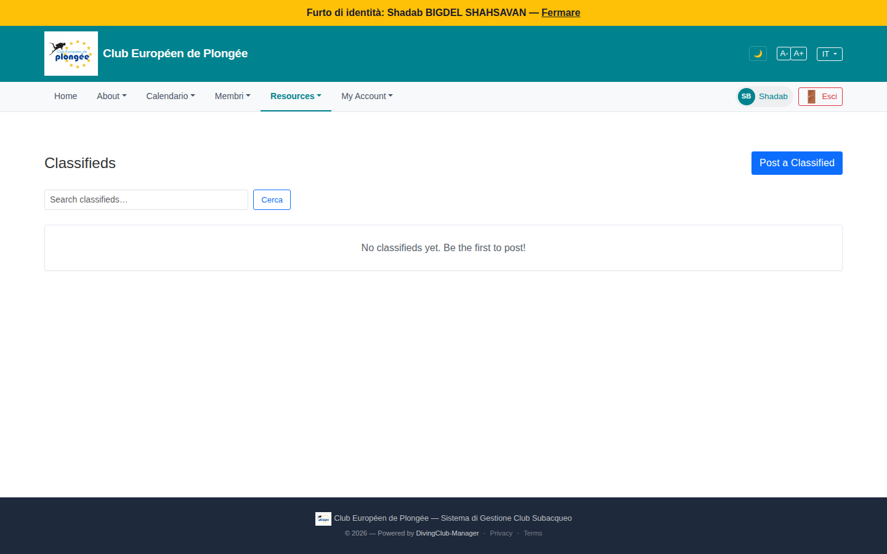

# 46 — Classifieds (member view)

- **Screen** — `GET /classifieds`, regular member, IT locale, empty.
- **Reads as** — "Classifieds" title + "Post a Classified" button top-right, a search box + "Cerca" button, then a bordered box: "No classifieds yet. Be the first to post!" Large empty page.

## Friction

1. **All-English page on an IT-locale session** — "Classifieds", "Post a Classified", "Search classifieds…", "No classifieds yet. Be the first to post!" — only "Cerca" is localised.
2. **A search box over an empty list.** When there are zero items, the search field + button are pure noise — nothing to search.
3. **Empty state is a bare sentence in a box** with no visual or guidance — no illustration, no "what goes here" ("Vendez ou cherchez du matériel de plongée d'occasion entre membres"), and the only CTA is the small top-right button, not in the empty region.
4. **No categories / no sense of what a classified is** — matériel? covoiturage? For a feature a member may never have used, the empty state is the one chance to explain it and it doesn't.
5. **Title + button layout** is the same pattern as every other list header — consistent, no issue — but with no content the page is 90% whitespace.

## Restructure

- **Localise everything.**
- **Hide the search box when the list is empty** (or disable it with a hint).
- **Real empty state:** a short line explaining classifieds ("Petites annonces entre membres — matériel d'occasion, covoiturage vers les sorties…"), and a prominent "Publier une annonce" button *in* the empty area.
- **Add category chips** (Matériel / Covoiturage / Autre) once there's content, and show them (disabled) in the empty state as a preview of the structure.
- When populated, cards should carry: title, category, price (if any), poster, date, and an expiry indicator (classifieds have an `extend` route → they expire).

## Effort

S — view-only: localisation, conditional search, a proper empty state, category scaffolding.
